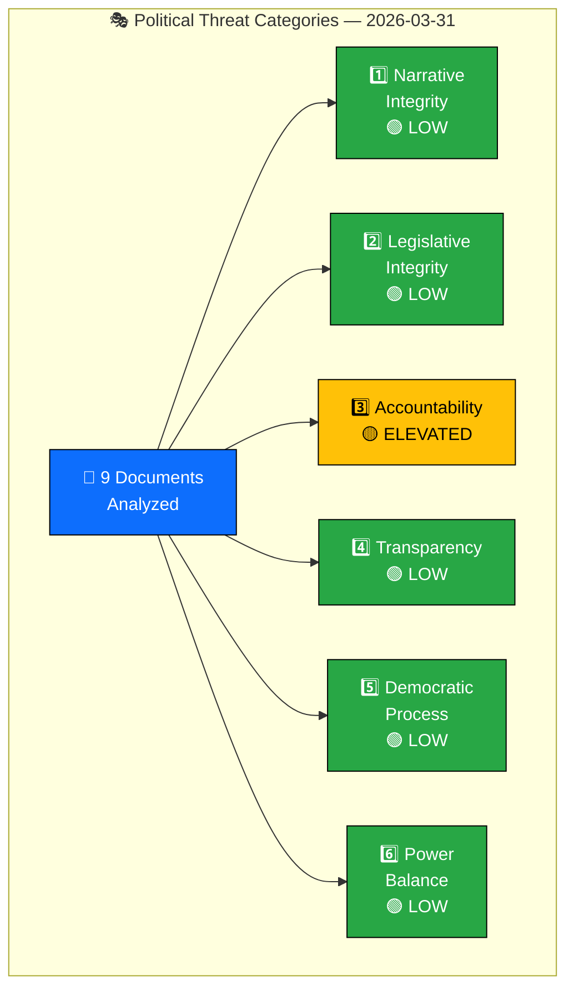
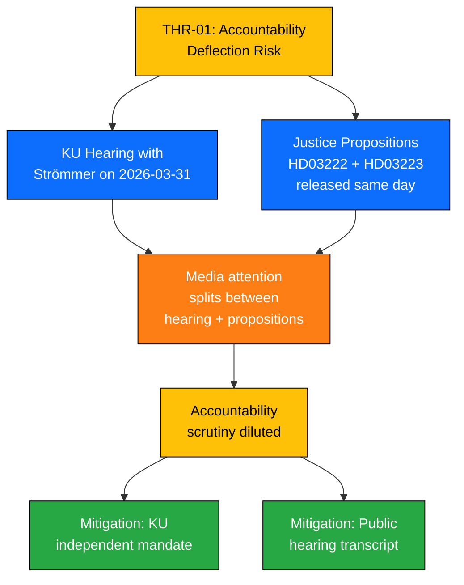

  

<h1 align="center">🎭 Political Threat Analysis</h1>

  <strong>📊 Threat Landscape Assessment — 2026-03-31</strong> 
  <em>🎯 Narrative · Legislative · Accountability · Transparency · Democracy · Power</em>

**Document Owner**: CEO | **Version**: 2.0 | **Last Updated**: 2026-03-31 | **Org.nr**: 559432-2196 | **Classification**: PUBLIC

---

## 📋 Threat Analysis Context

| Field | Value |
|-------|-------|
| **Threat ID** | `THR-2026-03-31-001` |
| **Analysis Date** | `2026-03-31 06:00 UTC` |
| **Riksmöte** | 2025/26 |
| **Documents Analyzed** | 9 |
| **Threat Framework** | STRIDE-adapted for Political Intelligence |
| **Overall Threat Level** | 🟢 **LOW** |
| **Produced By** | Copilot Political Intelligence Agent |
| **Confidence** | HIGH (multi-source corroboration via riksdag-regering-mcp) |

---

## 🎯 Political Threat Taxonomy

---

## 📊 Threat Register

| Threat ID | Category | Description | Severity (1-5) | Evidence (dok_id) | Mitigation |
|-----------|----------|-------------|:-:|----------------|------------|
| THR-01 | Accountability | KU hearing with Justice Minister Strömmer — simultaneous with 2 justice propositions raises timing-deflection risk | 2 | `HD03222`, `HD03223` | KU has independent mandate; hearing is public record |
| THR-02 | Narrative Integrity | Dual migration propositions may be framed as coordinated narrative — different ministers, same day | 2 | `HD03229`, `HD03215` | Multiple departments involved provides institutional check |
| THR-03 | Power Balance | 96% motion denial rate concentrates legislative agenda in government coalition | 2 | `HD10424`, `HD10425` | Committee system and interpellation rights preserved |
| THR-04 | Legislative Integrity | Consumer credit law (HD03223) and crime victim reform (HD03222) packaged on same day as migration — potential attention dilution | 1 | `HD03222`, `HD03223` | Each proposition follows standard remiss process |
| THR-05 | Transparency | Written question on Muslim Brotherhood report (HD11670) may test government disclosure boundaries | 1 | `HD11670` | Written questions require formal ministerial response |
| THR-06 | Democratic Process | Regional infrastructure interpellations reflect centralisation concerns | 1 | `HD10424`, `HD10425` | Interpellation debate ensures parliamentary visibility |

---

## 🌳 Attack Tree — Top Threat: Accountability Deflection

---

## 📋 Threat Evidence Table

| # | Threat | dok_id | Source | Actor | Confidence | Severity |
|:-:|--------|--------|--------|-------|:----------:|:--------:|
| 1 | KU hearing timing coincides with justice propositions | `HD03222` | Prop 2025/26:148 — Ersättningsregler med brottsoffret i fokus | Gunnar Strömmer (M) | HIGH | 2/5 |
| 2 | KU hearing timing coincides with justice propositions | `HD03223` | Prop 2025/26:149 — En ny konsumentkreditlag | Gunnar Strömmer (M) | HIGH | 2/5 |
| 3 | Dual-department migration push | `HD03229` | Prop 2025/26:144 — En ny mottagandelag | Johan Forssell (M), Ebba Busch (PM) | HIGH | 2/5 |
| 4 | Dual-department migration push | `HD03215` | Prop 2025/26:146 — Tidsbegränsat boende | Simona Mohamsson (L) | MEDIUM | 2/5 |
| 5 | Opposition channels constrained | `HD10424` | Interpellation — Flyglinjen Torsby/Hagfors–Arlanda | Mikael Dahlqvist (S) | MEDIUM | 1/5 |
| 6 | Disclosure boundary test | `HD11670` | Skr. fråga — Fransk rapport om Muslimska brödraskapet | Markus Wiechel (SD) | MEDIUM | 1/5 |

---

## 🔑 Key Findings

1. **Accountability is the only elevated threat category** — The coincidence of a KU hearing with Justice Minister Strömmer and two justice propositions on the same day creates potential media-attention dilution.
2. **No HIGH or CRITICAL threats detected** — All threat severities are 1-2 on a 5-point scale.
3. **Institutional safeguards are intact** — KU independence, public hearing records, mandatory ministerial responses to written questions, and interpellation debate rights provide effective mitigations.
4. **Narrative integrity threat is low** — While migration propositions span two departments, multi-ministerial coordination is standard procedure for cross-cutting policy.
5. **Power balance concern is structural, not acute** — The 96% motion denial rate is a session-long pattern, not an escalation.

---

## 📎 Document Control

| Field | Value |
|-------|-------|
| **Template** | `analysis/templates/threat-analysis.md` |
| **Version** | 2.0 |
| **Analyst** | Copilot Political Intelligence Agent |
| **Classification** | PUBLIC |
| **Next Review** | 2026-06-30 |
| **MCP Data Sources** | riksdag-regering-mcp (9 documents, 2 interpellations) |

