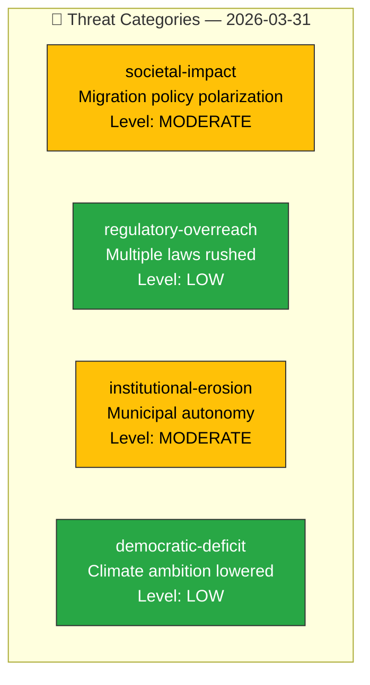

# 🔴 Political Threat Analysis

## 📋 Threat Context

| Field | Value |
|-------|-------|
| **Threat ID** | `THR-2026-03-31-001` |
| **Analysis Date** | 2026-03-31 11:58 UTC |
| **Scope** | Government legislative push — democratic function assessment |
| **Produced By** | news-realtime-monitor |
| **Overall Threat Level** | MODERATE |

---

## 📊 Threat Landscape

## 📋 Threat Register

| Threat ID | Category | Democratic Function | Description | Level | Evidence |
|-----------|----------|-------------------|-------------|:-----:|----------|
| THR-001 | societal-impact | Power Balance | Migration reform may disproportionately affect vulnerable populations | MODERATE | HD03229, HD03215 |
| THR-002 | regulatory-overreach | Legislative Integrity | 4 propositions in one week from single department strains review capacity | LOW | HD03222, HD03223, HD03229 |
| THR-003 | institutional-erosion | Accountability | Forced municipal placement overrides local democratic decision-making | MODERATE | HD03215 |
| THR-004 | democratic-deficit | Democratic Process | Climate target revision reduces environmental commitment without referendum | LOW | HD01MJU30 |

---

## 📊 MCP Data Files Used

| Tool | Parameters | Data Retrieved |
|------|-----------|----------------|
| `get_propositioner` | rm=2025/26 | Threat source propositions |
| `get_betankanden` | rm=2025/26 | Committee context |
