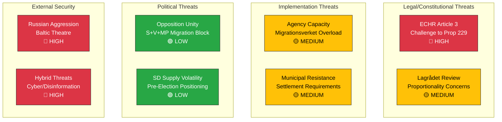

# Political Threat Analysis — 2026-03-31

**Generated**: 2026-03-31 14:34 UTC
**Data Sources**: riksdag-regering-mcp (get_propositioner, get_betankanden, search_voteringar)
**Documents Analyzed**: 6
**Confidence**: HIGH

---

## Summary

Primary threats center on constitutional/legal challenges to the migration reform package and implementation capacity constraints across multiple simultaneous reforms. External security threats assessed in UU6 remain elevated but managed through NATO framework.

---

## Threat Landscape

---

## Threat Register

| ID | Category | Threat | Likelihood | Impact | Score | dok_id |
|----|----------|--------|:----------:|:------:|:-----:|--------|
| LC1 | Legal | ECHR challenge to reception law benefit reductions | 3/5 | 5/5 | 15 | HD03229 |
| LC2 | Legal | Lagrådet flags proportionality issues | 3/5 | 4/5 | 12 | HD03229 |
| IM1 | Implementation | Migrationsverket capacity exhaustion | 4/5 | 3/5 | 12 | HD03229, HD03215 |
| IM2 | Implementation | Municipal non-compliance with settlement mandates | 3/5 | 3/5 | 9 | HD03215 |
| PT1 | Political | United opposition delays committee processing | 4/5 | 2/5 | 8 | HD03229 |
| PT2 | Political | SD leverages migration for election positioning | 2/5 | 3/5 | 6 | HD03229 |
| ES1 | External | Russian military escalation in Baltic | 2/5 | 5/5 | 10 | HD01UU6 |
| ES2 | External | Hybrid attack on critical infrastructure | 3/5 | 4/5 | 12 | HD01UU6 |

---

## Key Findings

1. Highest-probability threats are implementation-related (IM1, IM2) — government capacity to execute parallel reforms
2. Highest-impact threat is ECHR non-compliance (LC1) — could invalidate core migration reform
3. Political threats (PT1, PT2) manageable given coalition majority margins
4. External security threats (ES1, ES2) managed through NATO framework per UU6 consensus

## Data Quality Notes

Threat analysis derived from 6 primary documents and CIA coalition metrics. External security assessment based on UU6 committee report metadata (full text pending).
