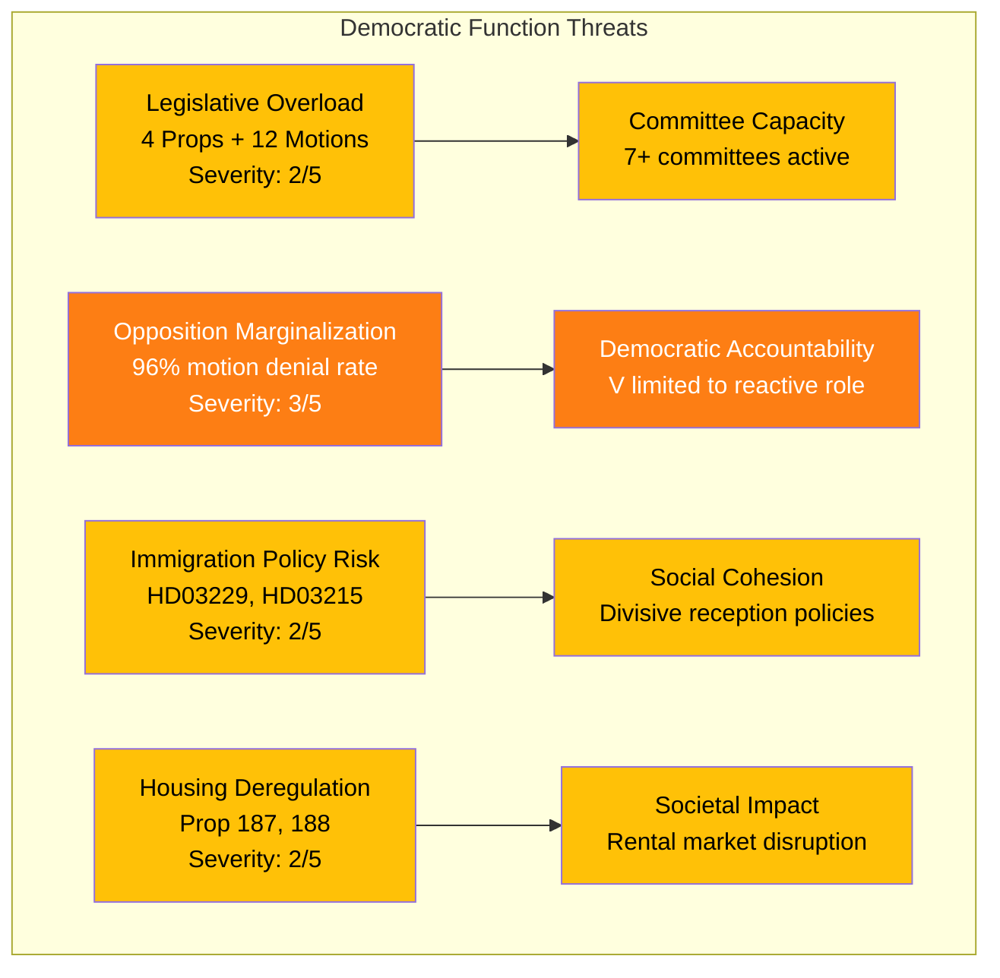

# Political Threat Analysis — 2026-03-31

**THR-ID**: THR-2026-03-31-001
**Generated**: 2026-03-31T16:15:00Z
**Riksmöte**: 2025/26
**Data Sources**: get_propositioner, get_motioner, get_betankanden, search_anforanden
**Documents Analyzed**: 25
**Confidence**: MEDIUM

## Threat Taxonomy Network

## Threat Assessment

| Category | Threat | Severity (1-5) | Likelihood | Evidence |
|----------|--------|----------------|------------|----------|
| Democratic Process | Opposition marginalization via systematic motion denial | 3 | HIGH | 96% denial rate; 12 V motions likely rejected |
| Societal Impact | Immigration reception changes affect vulnerable groups | 2 | MEDIUM | HD03229 (new reception law), HD03215 (temporary housing) |
| Societal Impact | Housing deregulation increases tenant vulnerability | 2 | MEDIUM | V motions HD023995, HD024004 opposing Props 187, 188 |
| Power Balance | Legislative concentration in government hands | 2 | MEDIUM | 4 propositions in one day; committee review pending |
| Economic Disruption | Consumer credit reform transition costs | 1 | LOW | HD03223 — implementation period mitigates disruption |
| External Security | Security policy environment requires continued adaptation | 2 | MEDIUM | HD01UU6, HD024006 (Ukraine military support) |

## Threat Actor Mapping

| Actor | Motivation | Capability | Threat Level |
|-------|-----------|------------|-------------|
| Government Coalition | Policy implementation at pace | HIGH — legislative majority | 🟢 LOW (democratic norm) |
| Left Party (V) | Electoral positioning via opposition | MEDIUM — 24 seats, coordinated motions | 🟡 MEDIUM |
| External factors | Security environment pressure | Variable — dependent on geopolitics | 🟡 MEDIUM |

## Escalation Decision

**Current threat level**: 🟡 MEDIUM — elevated opposition activity but within democratic norms. No escalation required.

**Watch items**:
- Committee responses to immigration propositions (HD03229, HD03215) — timeline: 4-8 weeks
- V party conference motions — potential escalation of housing/education critique
- Security policy debate outcomes (UU6) — cross-party alignment indicator

## MCP Data Sources Used

| Tool | Threat Category | Key Findings |
|------|----------------|--------------|
| get_propositioner | Policy risk | 4 new propositions — immigration and justice dominant |
| get_motioner | Opposition mobilization | 12 V motions — coordinated response |
| get_betankanden | Committee processing | 4 reports — normal pipeline function |
| search_anforanden | Political tensions | Interpellation debates on economy, transport, hunting |