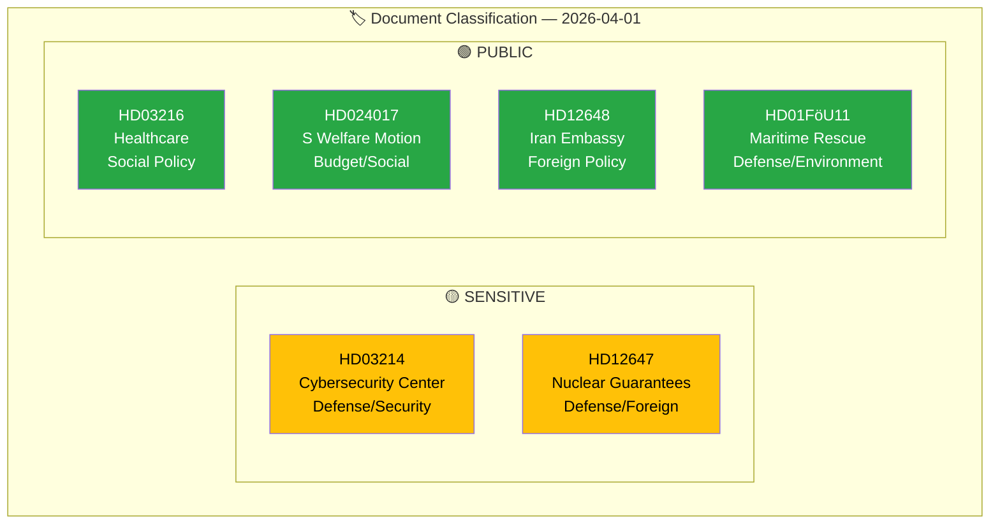

# 🏷️ Political Classification Results — 2026-04-01

## 📋 Classification Context

| Field | Value |
|-------|-------|
| **Classification ID** | CLS-2026-04-01-001 |
| **Date** | 2026-04-01 10:30 UTC |
| **Documents Classified** | 6 |
| **Produced By** | news-realtime-monitor |

---

## 📊 Classification Summary

### Batch Classification Table

| dok_id | Title | Type | Domain | Sensitivity | Urgency | Score |
|--------|-------|------|--------|:-----------:|:-------:|:-----:|
| HD03214 | Cybersecurity Center | prop | Defense | 🟡 SENSITIVE | 🟠 URGENT | 7/10 |
| HD024017 | S motion vs bidragstak | mot | Social/Budget | 🟢 PUBLIC | 🔵 ELEVATED | 5/10 |
| HD03216 | Municipal healthcare | prop | Healthcare | 🟢 PUBLIC | 🔵 ELEVATED | 4/10 |
| HD12647 | Nuclear guarantees | frs | Defense/Foreign | 🟡 SENSITIVE | 🔵 ELEVATED | 4/10 |
| HD12648 | Iran embassy cluster | frs | Foreign Policy | 🟢 PUBLIC | ⚪ ROUTINE | 3/10 |
| HD01FöU11 | Maritime rescue audit | bet | Defense/Env | 🟢 PUBLIC | ⚪ ROUTINE | 3/10 |

---

## 📋 Document Control

| **Created** | 2026-04-01 10:30 UTC | **Framework** | Classification v2.1 |
