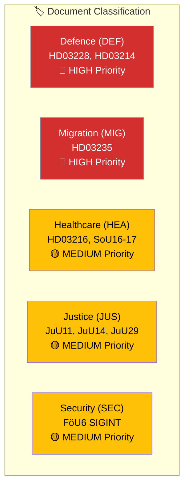

# Political Classification Results — 2026-04-01

**Generated**: 2026-04-01 14:42 UTC
**Documents Analyzed**: 66
**Confidence**: HIGH

---

## 📊 Classification Dashboard

## Classification Matrix

| dok_id | Title | Domain | Sensitivity | Significance | Action |
|--------|-------|--------|:-----------:|:------------:|--------|
| HD03235 | Skärpta utvisningsregler | MIG+JUS | 🟡 SENSITIVE | 8/10 | ⚡ Breaking |
| HD03228 | Regelverk för krigsmateriel | DEF+FOR | 🟡 SENSITIVE | 8/10 | ⚡ Breaking |
| HD03214 | Nationellt cybersäkerhetscenter | DEF+DIG | 🟡 SENSITIVE | 8/10 | ⚡ Breaking |
| HD03216 | Medicinsk kompetens kommunal sjukvård | HEA | 🟢 PUBLIC | 6/10 | 📰 Standard |
| HDC320260401JuU14 | Beslut: Terrorism | JUS+SEC | 🟡 SENSITIVE | 7/10 | 📰 Standard |
| HDC320260401FöU6 | SIGINT integritetsskydd | SEC+DEF | 🟡 SENSITIVE | 7/10 | 📰 Standard |
| HDC320260401JuU29 | Säkerhetsskydd fastighet | SEC+JUS | 🟡 SENSITIVE | 6/10 | 📋 Monitor |
| HD01FöU11 | Miljöräddning till sjöss | DEF+ENV | 🟢 PUBLIC | 4/10 | 📋 Monitor |

## Domain Distribution

- **Defence/Security**: 5 documents (HD03228, HD03214, FöU6, JuU29, FöU11)
- **Migration/Justice**: 3 documents (HD03235, JuU14, JuU11)
- **Healthcare/Social**: 6 documents (HD03216, SoU16, SoU17, SoU19, SoU22, SoU26)
- **Other**: Education (UbU10), Culture (KrU6, KrU7), International (UU7), Public Admin (KU29)
