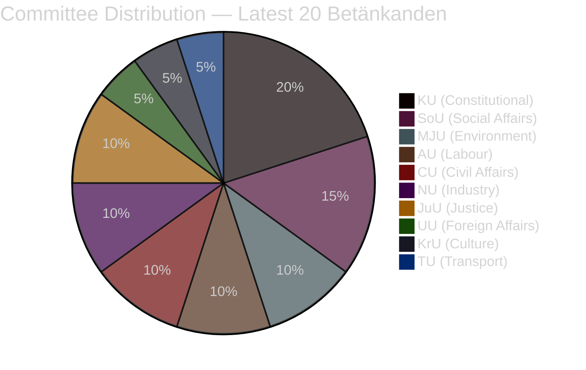

# Political Classification Results — 2026-04-01

**Generated**: 2026-04-01 04:58 UTC
**Data Sources**: riksdag-regering-mcp get_betankanden
**Documents Analyzed**: 20 (latest betänkanden, riksmöte 2025/26)
**Confidence**: MEDIUM
**Riksmöte**: 2025/26

## Summary

Classified 20 parliamentary committee reports by sensitivity, policy domain, and significance. Reports span 8 committees (AU, CU, JuU, KrU, KU, MJU, NU, SoU, TU, UU) covering defence, climate, social welfare, constitutional, and regulatory domains.

## Classification Table

| dok_id | Committee | Title | Domain | Sensitivity | Significance |
|--------|-----------|-------|--------|-------------|-------------|
| HD01UU6 | UU | Säkerhetspolitik | Defence & Foreign Affairs | HIGH | 7/10 |
| HD01MJU30 | MJU | Sveriges klimatmål – EU-anpassade etappmål till 2030 | Environment & Climate | MEDIUM | 7/10 |
| HD01JuU29 | JuU | Stärkt säkerhetsskydd vid överlåtelse av fast egendom | National Security | HIGH | 6/10 |
| HD01SoU37 | SoU | Subsidiaritetsprövning – genetiskt modifierade mikroorganismer | EU Affairs & Health | MEDIUM | 5/10 |
| HD01KU38 | KU | Den parlamentariska processen med ledamoten i fokus | Constitutional Affairs | MEDIUM | 5/10 |
| HD01KU31 | KU | Riksrevisionens rapport om nationella minoritetsspråken | Minority Rights | MEDIUM | 5/10 |
| HD01AU11 | AU | Jämställdhet och åtgärder mot diskriminering | Equality & Labour | LOW | 4/10 |
| HD01AU12 | AU | Arbetsmiljö | Work Environment | LOW | 4/10 |
| HD01MJU18 | MJU | Förbättrat genomförande av UTP-direktivets förbud | Consumer Protection | LOW | 4/10 |
| HD01JuU16 | JuU | Polisfrågor | Law Enforcement | MEDIUM | 4/10 |
| HD01SoU18 | SoU | Socialtjänstens arbete | Social Services | LOW | 3/10 |
| HD01SoU19 | SoU | Barn och unga inom socialtjänsten | Child Welfare | LOW | 3/10 |
| HD01CU17 | CU | Konsumenträtt m.m. | Consumer Rights | LOW | 3/10 |
| HD01CU18 | CU | Bostadspolitik | Housing Policy | LOW | 3/10 |
| HD01NU17 | NU | Elmarknadsfrågor | Energy Markets | MEDIUM | 3/10 |
| HD01NU15 | NU | Regelförenkling för företag | Business Regulation | LOW | 3/10 |
| HD01KU30 | KU | Författningsfrågor | Constitutional Law | MEDIUM | 3/10 |
| HD01KU29 | KU | Offentlig förvaltning | Public Administration | LOW | 3/10 |
| HD01KrU10 | KrU | Kommissionens meddelande om kulturkompass | EU Cultural Policy | LOW | 3/10 |
| HD01TU14 | TU | Yrkestrafik och taxi | Transport Regulation | LOW | 2/10 |

## Key Findings

1. **HIGH sensitivity**: UU6 (security policy) and JuU29 (property security) — both touch national security
2. **MEDIUM sensitivity**: Climate targets, EU subsidiarity, constitutional reform, police matters, energy markets
3. **Policy domain breadth**: 8 committees active in a single week signals end-of-session committee workload acceleration
4. **Dominant theme**: Security (UU6 + JuU29) and governance reform (4 KU reports) are the session's defining topics

## Implications

Classification drives article prioritisation. HIGH-significance documents (UU6, MJU30, JuU29) receive primary analytical focus. Constitutional committee's 4 reports (KU29, KU30, KU31, KU38) form a governance reform cluster warranting thematic treatment.

## Data Quality Notes

- Classification based on committee metadata, titles, and available summaries
- Full-text classification not available for most documents
- Sensitivity assessment based on committee tier and policy domain mapping
- **MCP tools used**: riksdag-regering-mcp get_betankanden (rm: 2025/26, limit: 20)