# Cross-Reference Map — 2026-04-01

**Generated**: 2026-04-01 04:58 UTC
**Data Sources**: riksdag-regering-mcp get_betankanden
**Documents Analyzed**: 20 (latest betänkanden, riksmöte 2025/26)
**Confidence**: MEDIUM
**Riksmöte**: 2025/26

## Summary

Detected 5 cross-document relationship clusters across 20 committee reports.

```mermaid
%%{init: {'theme': 'dark'}}%%
graph TD
    style SEC fill:#ff006e,stroke:#333,color:#fff
    style CLI fill:#00d9ff,stroke:#333,color:#000
    style SOC fill:#ffbe0b,stroke:#333,color:#000
    style CON fill:#00d9ff,stroke:#333,color:#000
    style REG fill:#ffbe0b,stroke:#333,color:#000

    SEC[Security Cluster] --> UU6[Bet. UU6<br/>Security Policy]
    SEC --> JuU29[Bet. JuU29<br/>Property Security]
    SEC --> JuU16[Bet. JuU16<br/>Police Matters]

    CLI[Climate & Environment] --> MJU30[Bet. MJU30<br/>Climate Targets 2030]
    CLI --> MJU18[Bet. MJU18<br/>UTP Directive]

    SOC[Social Welfare] --> SoU18[Bet. SoU18<br/>Social Services]
    SOC --> SoU19[Bet. SoU19<br/>Children & Youth]
    SOC --> SoU37[Bet. SoU37<br/>EU Subsidiarity]

    CON[Constitutional Governance] --> KU29[Bet. KU29<br/>Public Administration]
    CON --> KU30[Bet. KU30<br/>Constitutional Issues]
    CON --> KU31[Bet. KU31<br/>Minority Languages]
    CON --> KU38[Bet. KU38<br/>Parliamentary Process]

    REG[Market Regulation] --> NU15[Bet. NU15<br/>Business Rules]
    REG --> NU17[Bet. NU17<br/>Electricity Market]
    REG --> CU17[Bet. CU17<br/>Consumer Rights]
    REG --> CU18[Bet. CU18<br/>Housing Policy]
```

## Relationship Clusters

### 1. Security Cluster (UU6 ↔ JuU29 ↔ JuU16)
- **Connection**: National security from foreign policy (UU6) through property protection (JuU29) to domestic policing (JuU16)
- **Significance**: Comprehensive security approach spanning international, economic, and law enforcement dimensions

### 2. Climate & Consumer Protection (MJU30 ↔ MJU18)
- **Connection**: Both from Miljö- och jordbruksutskottet, linking climate targets with EU consumer directive implementation
- **Significance**: Environmental committee addressing both macro climate policy and micro consumer protection

### 3. Social Welfare Triad (SoU18 ↔ SoU19 ↔ SoU37)
- **Connection**: Social services (SoU18) + child welfare (SoU19) + EU health regulation subsidiarity (SoU37)
- **Significance**: Social committee managing domestic welfare reform alongside EU competence boundary questions

### 4. Constitutional Governance (KU29 ↔ KU30 ↔ KU31 ↔ KU38)
- **Connection**: Four KU reports forming comprehensive governance review — administration, constitutional law, minority rights, parliamentary process
- **Significance**: Largest single-committee cluster; signals systematic constitutional housekeeping

### 5. Market Regulation (NU15 ↔ NU17 ↔ CU17 ↔ CU18)
- **Connection**: Business simplification and energy markets cross-referenced with consumer rights and housing
- **Significance**: Regulatory landscape covering business, energy, consumer, and housing — 371 motions rejected across this cluster

## Key Findings

1. **5** inter-document relationship clusters mapped across 16 of 20 documents
2. Security cluster (3 docs) has highest political significance
3. Constitutional cluster (4 docs from KU) is largest single-committee grouping
4. Market regulation cluster accounts for 371 rejected motions

## Implications

Cross-references enrich article narratives by linking related legislative developments. The security and constitutional clusters provide the strongest analytical threads for article structure.

## Data Quality Notes

- Cross-references based on shared committee, policy domain, and thematic overlap
- **MCP tools used**: riksdag-regering-mcp get_betankanden (rm: 2025/26, limit: 20)
- Temporal proximity (all reports from March 26–31) strengthens cluster relevance