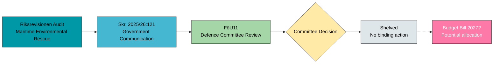

# Document Analysis: FöU11 — Riksrevisionen Report on Maritime Environmental Rescue

**Generated**: 2026-04-02 04:45 UTC
**dok_id**: HD01FöU11
**Document Type**: committeeReports (betänkande)
**Committee**: FöU (Defence Committee)
**Date**: 2026-04-01
**Riksmöte**: 2025/26
**Betänkande**: 2025/26:FöU11
**Significance**: 🟡 Medium (5/10)
**Confidence**: **[MEDIUM]** (65%)

---

## 🎯 Executive Summary

The Defence Committee (FöU) processed the government's response (Skr. 2025/26:121) to the Swedish National Audit Office's (Riksrevisionen) report on maritime environmental rescue during major maritime accidents. The committee recommended that the Riksdag shelve the government communication ("lägger skrivelsen till handlingarna"), indicating broad consensus on the report's findings. The absence of reservations signals cross-party agreement that current maritime environmental rescue capabilities require strengthening, making this an unusual case of implicit government self-criticism accepted without opposition challenge. **[MEDIUM]**

---

## 📊 SWOT Analysis

### Strengths
| # | Statement | Evidence (dok_id) | Confidence | Impact |
|---|-----------|-------------------|------------|--------|
| S1 | Cross-party consensus on maritime safety — zero reservations indicates unified defence priorities | HD01FöU11 (0 reservations) | **[HIGH]** | Medium |
| S2 | Government transparency in accepting Riksrevisionen critique on environmental rescue gaps | Skr. 2025/26:121, HD01FöU11 | **[HIGH]** | Medium |

### Weaknesses
| # | Statement | Evidence (dok_id) | Confidence | Impact |
|---|-----------|-------------------|------------|--------|
| W1 | "Shelving" action suggests no binding corrective measures mandated by parliament | HD01FöU11 decision: "lägger skrivelse till handlingarna" | **[HIGH]** | High |
| W2 | Maritime environmental rescue capability gaps remain unaddressed by concrete legislation | HD01FöU11 (no legislative proposal attached) | **[MEDIUM]** | High |

### Opportunities
| # | Statement | Evidence (dok_id) | Confidence | Impact |
|---|-----------|-------------------|------------|--------|
| O1 | Riksrevisionen findings could drive defence budget allocation for maritime environmental capabilities in Budget Bill 2027 | HD01FöU11 linked to defence spending priorities | **[MEDIUM]** | High |
| O2 | Baltic Sea environmental cooperation with NATO allies could leverage Riksrevisionen findings | HD01FöU11 context: Sweden's NATO membership | **[LOW]** | Medium |

### Threats
| # | Statement | Evidence (dok_id) | Confidence | Impact |
|---|-----------|-------------------|------------|--------|
| T1 | Without binding commitments, maritime environmental rescue gaps may persist through 2026/27 | HD01FöU11 shelved without concrete action | **[MEDIUM]** | High |
| T2 | Growing Baltic maritime traffic increases environmental incident risk | HD01FöU11 environmental rescue context | **[MEDIUM]** | High |

---

## 🔴 Risk Assessment (5×5 Matrix)

| Risk | Likelihood (1-5) | Impact (1-5) | Score | Level |
|------|:-:|:-:|:-:|:---:|
| Maritime environmental rescue response failure | 3 | 4 | **12** | 🟠 HIGH |
| Policy inaction after shelving Riksrevisionen report | 4 | 3 | **12** | 🟠 HIGH |
| Budget prioritization away from environmental maritime defence | 2 | 4 | **8** | 🟡 MEDIUM |

---

## 📊 Mermaid: Legislative Pipeline

---

## 👥 Stakeholder Impact

| Stakeholder Group | Impact | Assessment | Confidence |
|---|---|---|---|
| **Citizens** | 🟡 Neutral | Environmental rescue gaps affect coastal communities; no immediate action mandated | **[MEDIUM]** |
| **Government Coalition** | 🟢 Positive | Accepted Riksrevisionen critique without opposition challenge — maintains reform narrative | **[HIGH]** |
| **Opposition Bloc** | 🟡 Neutral | No reservations filed — missed opportunity to demand binding maritime safety commitments | **[MEDIUM]** |
| **Business/Industry** | 🟡 Neutral | Maritime shipping sector unaffected short-term; future regulations possible | **[LOW]** |
| **Civil Society** | 🟡 Neutral | Environmental groups may pressure for stronger maritime environmental protections | **[MEDIUM]** |
| **International/EU** | 🟡 Neutral | Baltic maritime cooperation context; NATO membership creates new coordination opportunities | **[LOW]** |
| **Judiciary/Constitutional** | ⚪ None | No constitutional implications identified | **[HIGH]** |
| **Media/Public Opinion** | 🟡 Neutral | Low public salience unless major maritime environmental incident occurs | **[MEDIUM]** |

---

## 🔮 Forward Indicators

1. **Budget Bill 2027 defence allocation** — watch for maritime environmental rescue line items by September 2026. If absent, signals continued policy gap. **[MEDIUM]**
2. **FöU scheduling of follow-up debate** — if committee schedules additional hearing on maritime safety within 6 months, signals escalation. **[LOW]**
3. **Baltic maritime incident** — any environmental rescue activation before year-end would amplify Riksrevisionen findings politically. **[MEDIUM]**

---

## 📋 Classification

| Dimension | Score (0-10) | Rationale |
|-----------|:---:|-----------|
| Parliamentary Impact | 3 | Shelved without binding action |
| Policy Impact | 5 | Identifies real capability gaps |
| Public Interest | 4 | Environmental safety concerns |
| Urgency | 3 | No immediate legislative deadline |
| Cross-Party Significance | 6 | Unusual cross-party consensus (0 reservations) |
| **Overall** | **5/10** | 🟡 Medium significance |
