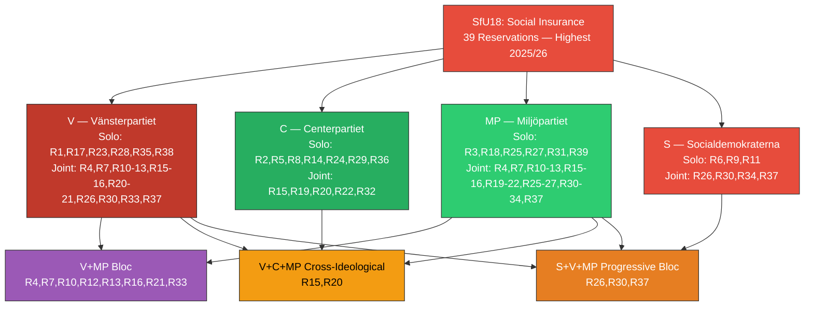

# Document Analysis: SfU18 — Social Insurance Questions

**Generated**: 2026-04-02 04:45 UTC
**dok_id**: HD01SfU18
**Document Type**: committeeReports (betänkande)
**Committee**: SfU (Social Insurance Committee)
**Date**: 2026-04-01
**Riksmöte**: 2025/26
**Betänkande**: 2025/26:SfU18
**Significance**: 🔴 Very High (8/10)
**Confidence**: **[HIGH]** (85%)

---

## 🎯 Executive Summary

The Social Insurance Committee produced the most contested betänkande of the April 1 batch with a remarkable 39 reservations — the highest reservation count of any 2025/26 committee report to date. Opposition parties V, C, MP, and S filed reservations across virtually every social insurance policy domain: sickness benefits, parental leave, child allowances, pension reform, and disability insurance. The volume of reservations (39) from 4 distinct parties with 16 different party combinations signals that social insurance is a critical political fault line. Triple-bloc reservations (S, V, MP at R26, R30, R37) and V-C-MP cross-ideological coordination (R15, R20) demonstrate sophisticated opposition tactics ahead of the 2026 election. **[HIGH]**

---

## 📊 SWOT Analysis

### Strengths
| # | Statement | Evidence (dok_id) | Confidence | Impact |
|---|-----------|-------------------|------------|--------|
| S1 | Government coalition maintained committee majority on all 39 contested points | HD01SfU18 (all motions rejected) | **[HIGH]** | High |
| S2 | Coalition discipline held — zero government-side reservations despite extreme opposition pressure | HD01SfU18 | **[HIGH]** | High |

### Weaknesses
| # | Statement | Evidence (dok_id) | Confidence | Impact |
|---|-----------|-------------------|------------|--------|
| W1 | 39 reservations — highest count this session — reveals massive policy discontent | HD01SfU18 R1-R39 | **[HIGH]** | Very High |
| W2 | 16 different party combinations show opposition cooperating across ideological lines | HD01SfU18 (V solo, C solo, MP solo, S solo, V+MP, C+MP, S+V+MP, V+C+MP, S+MP) | **[HIGH]** | High |
| W3 | S-V-MP triple reservations (R26, R30, R37) signal coordinated progressive bloc social policy platform | HD01SfU18 | **[HIGH]** | High |

### Opportunities
| # | Statement | Evidence (dok_id) | Confidence | Impact |
|---|-----------|-------------------|------------|--------|
| O1 | Social insurance reform as 2026 election differentiator — opposition can point to 39 rejected proposals | HD01SfU18 | **[HIGH]** | Very High |
| O2 | V-C-MP cross-ideological reservations (R15, R20) could indicate new governing coalition social insurance consensus | HD01SfU18 R15, R20 | **[MEDIUM]** | High |

### Threats
| # | Statement | Evidence (dok_id) | Confidence | Impact |
|---|-----------|-------------------|------------|--------|
| T1 | Social insurance adequacy gaps risk increased inequality and public dissatisfaction | HD01SfU18 (39 reservations on benefits, pensions, parental leave) | **[HIGH]** | Very High |
| T2 | Opposition fragmentation (39 reservations in 16 party combos) may dilute unified reform message | HD01SfU18 | **[MEDIUM]** | Medium |
| T3 | Economic slowdown could amplify social insurance gaps, increasing political pressure | HD01SfU18 context | **[MEDIUM]** | High |

---

## 🔴 Risk Assessment (5×5 Matrix)

| Risk | Likelihood (1-5) | Impact (1-5) | Score | Level |
|------|:-:|:-:|:-:|:---:|
| Social insurance adequacy crisis before 2026 election | 4 | 5 | **20** | 🔴 CRITICAL |
| Opposition unified social insurance platform undermining government | 4 | 4 | **16** | 🟠 HIGH |
| Pension system reform pressure escalation | 3 | 5 | **15** | 🟠 HIGH |
| Parental leave adequacy becoming election-defining issue | 4 | 3 | **12** | 🟠 HIGH |
| Economic downturn exposing social safety net gaps | 3 | 5 | **15** | 🟠 HIGH |
| V-C-MP cross-ideological cooperation threatening governing alternatives | 3 | 4 | **12** | 🟠 HIGH |

---

## 📊 Mermaid: Reservation Intensity by Party

---

## 👥 Stakeholder Impact

| Stakeholder Group | Impact | Assessment | Confidence |
|---|---|---|---|
| **Citizens** | 🔴 Negative | 39 rejected proposals on sickness benefits, pensions, parental leave directly affect household welfare | **[HIGH]** |
| **Government Coalition** | 🟢 Positive | Maintained policy line despite record opposition pressure | **[HIGH]** |
| **Opposition Bloc** | 🟠 Mixed | Demonstrated commitment but 39 reservations in 16 configurations shows fragmentation risk | **[HIGH]** |
| **Business/Industry** | 🟡 Neutral | Employer social insurance contribution levels stable | **[MEDIUM]** |
| **Civil Society** | 🔴 Negative | Trade unions, pensioner organizations, family policy groups see reform demands rejected | **[HIGH]** |
| **International/EU** | 🟡 Neutral | EU social policy coordination unaffected | **[LOW]** |
| **Judiciary/Constitutional** | ⚪ None | No constitutional implications | **[HIGH]** |
| **Media/Public Opinion** | 🟠 Mixed | Social insurance high-salience; 39-reservation narrative is politically powerful | **[HIGH]** |

---

## 🔮 Forward Indicators

1. **S-V-MP social insurance coalition platform** — watch for coordinated social insurance policy documents ahead of 2026 election. R26, R30, R37 coordination suggests emerging platform. **[HIGH]**
2. **V-C-MP cross-ideological social insurance reform** — R15, R20 coordination is unusual. If V-C-MP file joint motion in autumn 2026/27, signals new governing alternative. **[MEDIUM]**
3. **SfU spring follow-up debates** — if committee schedules extraordinary healthcare debates, signals escalation. **[LOW]**
4. **Economic indicators (Q2 2026)** — GDP and unemployment data may amplify or dampen social insurance political salience. Watch SCB Q2 release. **[MEDIUM]**
5. **LO/TCO pension reform demands** — if trade unions escalate pension reform demands, government may face budget negotiation pressure. **[HIGH]**

---

## 📋 Classification

| Dimension | Score (0-10) | Rationale |
|-----------|:---:|-----------|
| Parliamentary Impact | 9 | 39 reservations — highest of session |
| Policy Impact | 8 | Social insurance affects millions of beneficiaries |
| Public Interest | 9 | Pensions, sickness benefits, parental leave top concerns |
| Urgency | 7 | Pre-election period, economic uncertainty |
| Cross-Party Significance | 9 | 4 parties, 16 combinations, cross-ideological cooperation |
| **Overall** | **8/10** | 🔴 Very High significance |
