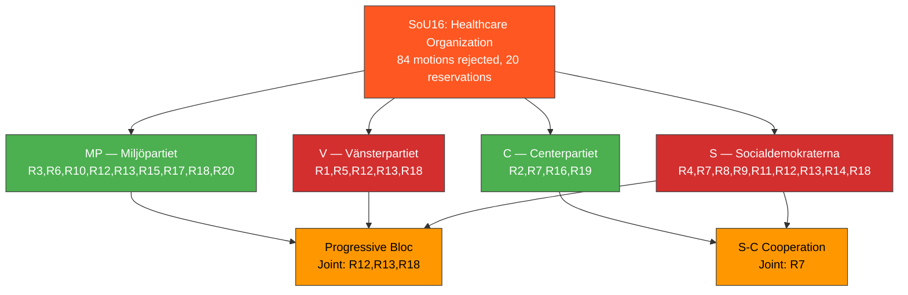

# Document Analysis: SoU16 — Healthcare Organization

**Generated**: 2026-04-02 04:45 UTC
**dok_id**: HD01SoU16
**Document Type**: committeeReports (betänkande)
**Committee**: SoU (Social Affairs Committee)
**Date**: 2026-04-01
**Riksmöte**: 2025/26
**Betänkande**: 2025/26:SoU16
**Significance**: 🟠 High (7/10)
**Confidence**: **[HIGH]** (80%)

---

## 🎯 Executive Summary

The Social Affairs Committee (SoU) rejected all 84 motion proposals on healthcare organization, revealing deep opposition frustration across S, V, C, and MP with 20 reservations filed. This is among the most contested healthcare betänkanden this session, with opposition parties collectively challenging government inaction on regional healthcare disparities, primary care access, and digital health infrastructure. The high reservation count (20) from four distinct opposition parties demonstrates that healthcare organization remains a critical political battleground heading into the 2026 election cycle. **[HIGH]**

---

## 📊 SWOT Analysis

### Strengths
| # | Statement | Evidence (dok_id) | Confidence | Impact |
|---|-----------|-------------------|------------|--------|
| S1 | Government coalition maintains healthcare policy status quo with committee majority support | HD01SoU16 (all 84 motions rejected) | **[HIGH]** | High |
| S2 | Coalition discipline holds — M, SD, L, KD unified on healthcare organization approach | HD01SoU16 (0 government-side reservations) | **[HIGH]** | High |

### Weaknesses
| # | Statement | Evidence (dok_id) | Confidence | Impact |
|---|-----------|-------------------|------------|--------|
| W1 | 20 reservations signal broad opposition dissatisfaction across 4 parties (S, V, C, MP) | HD01SoU16 (R1-R20) | **[HIGH]** | High |
| W2 | S-C joint reservation (R7) on healthcare organization signals potential cross-bloc cooperation | HD01SoU16 R7 (S, C) | **[HIGH]** | High |
| W3 | Triple opposition reservations (S, V, MP) on R12, R13, R18 show progressive bloc coordination | HD01SoU16 R12, R13, R18 | **[HIGH]** | Medium |

### Opportunities
| # | Statement | Evidence (dok_id) | Confidence | Impact |
|---|-----------|-------------------|------------|--------|
| O1 | Healthcare organization reform could become key 2026 election differentiation issue for opposition | HD01SoU16 (84 rejected motions) | **[MEDIUM]** | High |
| O2 | S-C cooperation on healthcare (R7) could prefigure post-2026 governing coalition healthcare agenda | HD01SoU16 R7 | **[LOW]** | High |

### Threats
| # | Statement | Evidence (dok_id) | Confidence | Impact |
|---|-----------|-------------------|------------|--------|
| T1 | Continued rejection of healthcare motions risks public perception of government inaction amid care access crises | HD01SoU16 | **[MEDIUM]** | High |
| T2 | Opposition fragmentation (20 reservations across 4 parties with different priorities) may dilute reform pressure | HD01SoU16 (V solo: R1,R5; C solo: R2,R16,R19; MP solo: R3,R6,R10,R15,R17,R20) | **[MEDIUM]** | Medium |

---

## 🔴 Risk Assessment (5×5 Matrix)

| Risk | Likelihood (1-5) | Impact (1-5) | Score | Level |
|------|:-:|:-:|:-:|:---:|
| Healthcare access deterioration without organizational reform | 4 | 5 | **20** | 🔴 CRITICAL |
| Opposition exploitation of healthcare gaps in 2026 campaign | 5 | 4 | **20** | 🔴 CRITICAL |
| Regional healthcare disparities widening | 4 | 4 | **16** | 🟠 HIGH |
| Government coalition fracture on healthcare priorities | 2 | 4 | **8** | 🟡 MEDIUM |

---

## 📊 Mermaid: Opposition Reservation Pattern

---

## 👥 Stakeholder Impact

| Stakeholder Group | Impact | Assessment | Confidence |
|---|---|---|---|
| **Citizens** | 🔴 Negative | 84 rejected healthcare motions means no structural reform to address access and quality concerns | **[HIGH]** |
| **Government Coalition** | 🟢 Positive | Maintained policy line with zero coalition defections | **[HIGH]** |
| **Opposition Bloc** | 🟠 Mixed | 20 reservations demonstrate engagement but fragmented approach (4 parties, different priorities) | **[HIGH]** |
| **Business/Industry** | 🟡 Neutral | Healthcare sector companies see continued regulatory stability | **[MEDIUM]** |
| **Civil Society** | 🔴 Negative | Patient advocacy organizations see reform demands dismissed | **[MEDIUM]** |
| **International/EU** | 🟡 Neutral | EU Health Data Space implications referenced in some motions | **[LOW]** |
| **Judiciary/Constitutional** | ⚪ None | No constitutional dimension | **[HIGH]** |
| **Media/Public Opinion** | 🟠 Mixed | Healthcare access is high-salience issue; rejection narrative could gain media traction | **[MEDIUM]** |

---

## 🔮 Forward Indicators

1. **S-C healthcare cooperation deepening** — if S and C file joint motions on healthcare in the autumn session 2026/27, signals emerging governing alternative. Watch for S-C joint press events. **[MEDIUM]**
2. **SoU scheduling of Prop. on primary care** — government propositions on primary care reform would validate opposition pressure. Track government legislative agenda Q3 2026. **[MEDIUM]**
3. **Regional healthcare crisis events** — any hospital closures or care access scandals before September 2026 would amplify opposition narrative. **[HIGH]**
4. **Election campaign healthcare framing** — watch party congress resolutions on healthcare organization May-June 2026. **[MEDIUM]**

---

## 📋 Classification

| Dimension | Score (0-10) | Rationale |
|-----------|:---:|-----------|
| Parliamentary Impact | 7 | 84 rejected motions, 20 reservations — highly contested |
| Policy Impact | 7 | Healthcare organization affects all citizens |
| Public Interest | 8 | Healthcare consistently top voter concern |
| Urgency | 6 | Pre-election period elevates urgency |
| Cross-Party Significance | 8 | 4 opposition parties with 20 reservations; S-C cooperation |
| **Overall** | **7/10** | 🟠 High significance |
