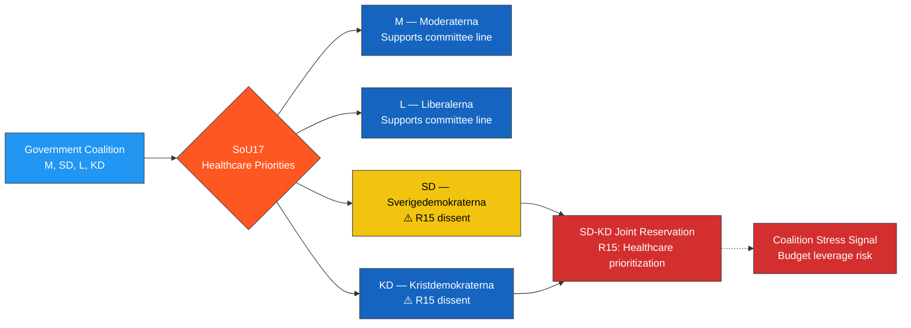

# Document Analysis: SoU17 — Healthcare Priorities

**Generated**: 2026-04-02 04:45 UTC
**dok_id**: HD01SoU17
**Document Type**: committeeReports (betänkande)
**Committee**: SoU (Social Affairs Committee)
**Date**: 2026-04-01
**Riksmöte**: 2025/26
**Betänkande**: 2025/26:SoU17
**Significance**: 🟠 High (7/10)
**Confidence**: **[HIGH]** (80%)

---

## 🎯 Executive Summary

The Social Affairs Committee's report on healthcare priorities rejected all opposition motions, generating 18 reservations from S, V, C, MP, and notably SD and KD (R15). The SD-KD joint reservation is politically significant as it reveals rare fractures within the government's support base on healthcare prioritization. The triple opposition bloc (S, V, MP at R9) and cross-ideological C-MP cooperation (R10) signal broader political realignment on healthcare priorities. This report, combined with SoU16, demonstrates healthcare as the dominant policy battleground of the spring 2026 session. **[HIGH]**

---

## 📊 SWOT Analysis

### Strengths
| # | Statement | Evidence (dok_id) | Confidence | Impact |
|---|-----------|-------------------|------------|--------|
| S1 | Committee majority maintained on all points despite 18 reservations | HD01SoU17 (all motions rejected) | **[HIGH]** | High |
| S2 | Government healthcare prioritization framework survives scrutiny | HD01SoU17 | **[MEDIUM]** | Medium |

### Weaknesses
| # | Statement | Evidence (dok_id) | Confidence | Impact |
|---|-----------|-------------------|------------|--------|
| W1 | SD-KD joint reservation (R15) signals dissatisfaction WITHIN government support base | HD01SoU17 R15 (SD, KD) | **[HIGH]** | Very High |
| W2 | 18 reservations from 5 different party configurations show broad policy disagreement | HD01SoU17 R1-R18 | **[HIGH]** | High |
| W3 | Progressive bloc coordination (S, V, MP at R9) presents unified alternative narrative | HD01SoU17 R9 | **[HIGH]** | High |

### Opportunities
| # | Statement | Evidence (dok_id) | Confidence | Impact |
|---|-----------|-------------------|------------|--------|
| O1 | SD-KD reservation creates leverage point for healthcare policy concessions | HD01SoU17 R15 | **[MEDIUM]** | Very High |
| O2 | Cross-ideological C-MP healthcare cooperation (R10) could expand reform coalition | HD01SoU17 R10 (C, MP) | **[MEDIUM]** | High |

### Threats
| # | Statement | Evidence (dok_id) | Confidence | Impact |
|---|-----------|-------------------|------------|--------|
| T1 | SD-KD dissent could escalate to broader budget negotiations leverage | HD01SoU17 R15 | **[MEDIUM]** | Very High |
| T2 | Healthcare priority failures could dominate 2026 election debate | HD01SoU17 (18 reservations, all rejected) | **[HIGH]** | High |

---

## 🔴 Risk Assessment (5×5 Matrix)

| Risk | Likelihood (1-5) | Impact (1-5) | Score | Level |
|------|:-:|:-:|:-:|:---:|
| Coalition cohesion fracture on healthcare (SD-KD dissent) | 3 | 5 | **15** | 🟠 HIGH |
| Healthcare priority misalignment with public demand | 4 | 4 | **16** | 🟠 HIGH |
| Opposition unity on healthcare forcing government concessions | 3 | 4 | **12** | 🟠 HIGH |
| Healthcare becoming defining 2026 election issue | 5 | 3 | **15** | 🟠 HIGH |

---

## 📊 Mermaid: Coalition Stress Test — SD-KD Dissent

---

## 👥 Stakeholder Impact

| Stakeholder Group | Impact | Assessment | Confidence |
|---|---|---|---|
| **Citizens** | 🔴 Negative | Healthcare priority motions rejected; prioritization gaps persist | **[HIGH]** |
| **Government Coalition** | 🟠 Mixed | Maintained majority but SD-KD R15 dissent is a warning signal | **[HIGH]** |
| **Opposition Bloc** | 🟢 Positive | 18 reservations demonstrate active challenge; S-V-MP coordination on R9 | **[HIGH]** |
| **Business/Industry** | 🟡 Neutral | Pharmaceutical and health tech sectors watching prioritization signals | **[LOW]** |
| **Civil Society** | 🔴 Negative | Patient groups see healthcare priority reforms delayed | **[MEDIUM]** |
| **International/EU** | 🟡 Neutral | EU health policy coordination unaffected | **[LOW]** |
| **Judiciary/Constitutional** | ⚪ None | No constitutional implications | **[HIGH]** |
| **Media/Public Opinion** | 🟠 Mixed | SD-KD dissent is politically newsworthy; healthcare polls as top voter issue | **[HIGH]** |

---

## 🔮 Forward Indicators

1. **SD-KD healthcare demands in budget negotiations** — watch for SD/KD press releases on healthcare funding demands before Budget Bill 2027 (September 2026). If demands escalate, signals coalition friction. **[HIGH]**
2. **S-V-MP joint healthcare policy platform** — if progressive bloc formalizes healthcare priorities ahead of 2026 election, signals coordinated opposition strategy. Watch party congresses. **[MEDIUM]**
3. **C-MP cross-ideological healthcare cooperation (R10)** — if Centre and Green parties announce joint healthcare initiative, could reshape coalition arithmetic. **[LOW]**

---

## 📋 Classification

| Dimension | Score (0-10) | Rationale |
|-----------|:---:|-----------|
| Parliamentary Impact | 7 | 18 reservations, SD-KD government-side dissent |
| Policy Impact | 7 | Healthcare priorities directly affect care delivery |
| Public Interest | 8 | Healthcare consistently #1 voter concern |
| Urgency | 7 | Pre-election period + coalition stress signals |
| Cross-Party Significance | 9 | 5 parties with reservations including SD-KD |
| **Overall** | **7/10** | 🟠 High significance |
