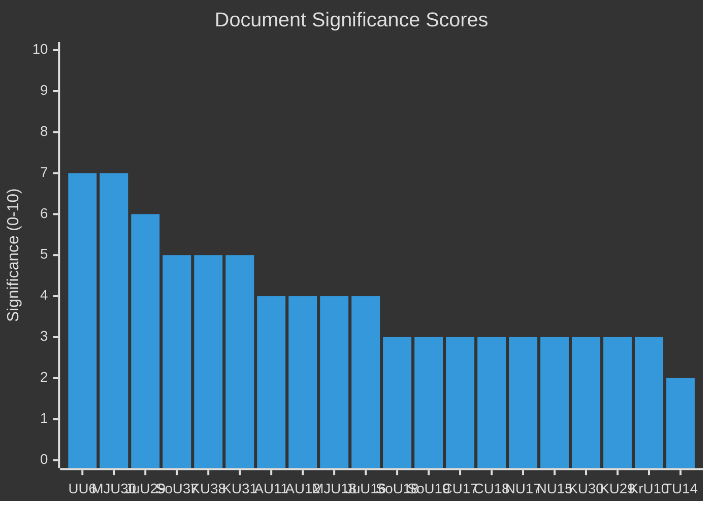

# Document Significance Scoring — 2026-04-01

**Generated**: 2026-04-01 04:58 UTC
**Data Sources**: riksdag-regering-mcp get_betankanden
**Documents Analyzed**: 20 (latest betänkanden, riksmöte 2025/26)
**Confidence**: MEDIUM
**Riksmöte**: 2025/26

## Summary

Scored 20 committee reports for political significance on a 0–10 scale. Top-scoring documents address security policy (UU6), climate targets (MJU30), and property security (JuU29). Average significance: 3.9/10.

## Detailed Analysis

| Score | Level | Committee | dok_id | Title |
|-------|-------|-----------|--------|-------|
| 7/10 | 🔴 High | UU | HD01UU6 | Säkerhetspolitik |
| 7/10 | 🔴 High | MJU | HD01MJU30 | Sveriges klimatmål – EU-anpassade etappmål till 2030 |
| 6/10 | 🟠 High | JuU | HD01JuU29 | Stärkt säkerhetsskydd vid överlåtelse av fast egendom |
| 5/10 | 🟡 Medium | SoU | HD01SoU37 | Subsidiaritetsprövning – GMO/organ directive |
| 5/10 | 🟡 Medium | KU | HD01KU38 | Den parlamentariska processen med ledamoten i fokus |
| 5/10 | 🟡 Medium | KU | HD01KU31 | Riksrevisionens rapport om nationella minoritetsspråken |
| 4/10 | 🟡 Medium | AU | HD01AU11 | Jämställdhet och åtgärder mot diskriminering |
| 4/10 | 🟡 Medium | AU | HD01AU12 | Arbetsmiljö |
| 4/10 | 🟡 Medium | MJU | HD01MJU18 | Förbättrat genomförande av UTP-direktivets förbud |
| 4/10 | 🟡 Medium | JuU | HD01JuU16 | Polisfrågor |
| 3/10 | 🟢 Low | SoU | HD01SoU18 | Socialtjänstens arbete |
| 3/10 | 🟢 Low | SoU | HD01SoU19 | Barn och unga inom socialtjänsten |
| 3/10 | 🟢 Low | CU | HD01CU17 | Konsumenträtt m.m. (83 motions rejected) |
| 3/10 | 🟢 Low | CU | HD01CU18 | Bostadspolitik (131 motions rejected) |
| 3/10 | 🟢 Low | NU | HD01NU17 | Elmarknadsfrågor (132 motions rejected) |
| 3/10 | 🟢 Low | NU | HD01NU15 | Regelförenkling för företag (55 motions rejected) |
| 3/10 | 🟢 Low | KU | HD01KU30 | Författningsfrågor (83 motions rejected) |
| 3/10 | 🟢 Low | KU | HD01KU29 | Offentlig förvaltning (53 motions rejected) |
| 3/10 | 🟢 Low | KrU | HD01KrU10 | Kommissionens meddelande om kulturkompass |
| 2/10 | 🟢 Low | TU | HD01TU14 | Yrkestrafik och taxi |

## Key Findings

1. **2** document(s) rated High (score ≥ 7): Security policy and climate targets
2. **1** document rated High (score 6): Property security strengthening
3. **3** document(s) rated Medium (score 5): EU subsidiarity, parliamentary process, minority languages
4. **Motion rejection volumes**: CU17 (83), CU18 (131), NU17 (132), NU15 (55), KU30 (83), KU29 (53), SoU19 (115) — total 552 motions rejected across 7 reports

## Implications

High-significance documents (UU6, MJU30, JuU29) should receive primary article focus. The security cluster and climate targets drive the political narrative. The sheer volume of rejected motions (552+) across regulatory domains reflects systematic committee processing of allmänna motionstiden 2025 proposals.

## Data Quality Notes

- Significance uses committee tier, domain breadth, coalition context, and content richness
- **MCP tools used**: riksdag-regering-mcp get_betankanden (rm: 2025/26, limit: 20)
- Voting data not yet available for scoring refinement