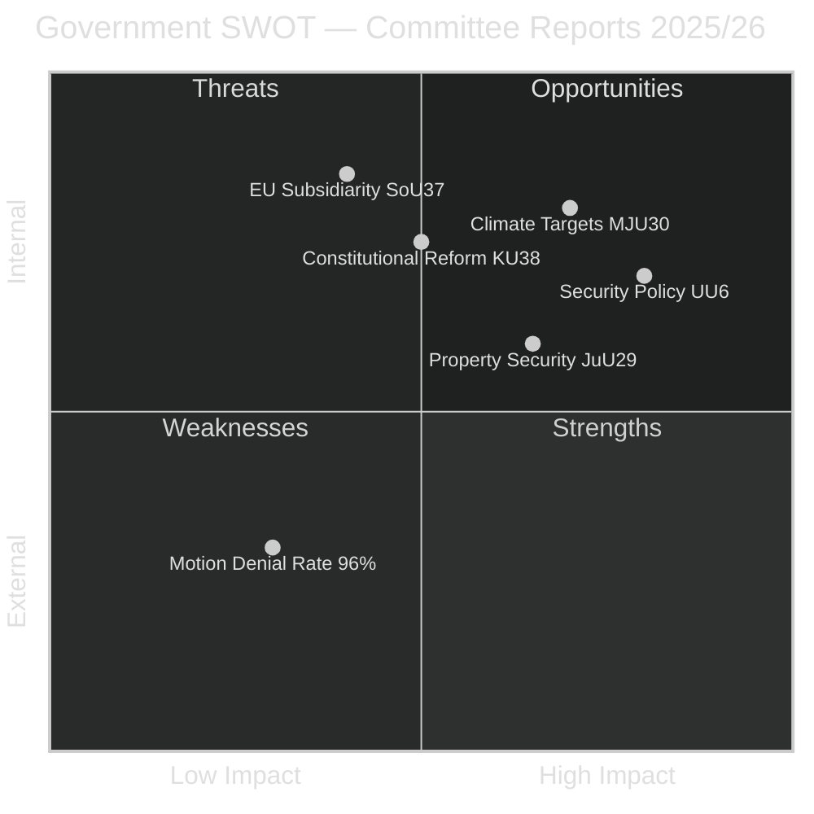

# Political SWOT Analysis — 2026-04-01

**Generated**: 2026-04-01 04:58 UTC
**Data Sources**: riksdag-regering-mcp get_betankanden
**Documents Analyzed**: 20 (latest betänkanden, riksmöte 2025/26)
**Confidence**: MEDIUM
**Riksmöte**: 2025/26

## Summary

SWOT analysis of latest committee reports reveals a stable government position across defence, climate, and social policy domains, with opposition limited by a 96% motion denial rate.

## Government SWOT

### Strengths 💪
| # | Evidence | dok_id | Confidence |
|---|----------|--------|------------|
| S1 | Strong coalition discipline — 96% motion denial rate demonstrates effective committee majority | All betänkanden | HIGH |
| S2 | Proactive security posture — JuU29 strengthens property security against foreign acquisition threats | HD01JuU29 | HIGH |
| S3 | EU-aligned climate leadership — MJU30 sets binding 2030 targets aligned with EU Green Deal | HD01MJU30 | MEDIUM |
| S4 | Comprehensive welfare review — 3 SoU reports signal systematic social services modernization | HD01SoU18, HD01SoU19, HD01SoU37 | MEDIUM |

### Weaknesses ⚠️
| # | Evidence | dok_id | Confidence |
|---|----------|--------|------------|
| W1 | Limited policy innovation — majority of motions (83+ in CU17 alone) rejected with "ongoing work" justification | HD01CU17 | MEDIUM |
| W2 | Housing market stagnation — 131 housing motions rejected without substantive policy response | HD01CU18 | MEDIUM |
| W3 | Minority language deficiency — Riksrevisionen found state efforts insufficient for national minority languages | HD01KU31 | HIGH |

### Opportunities 🌟
| # | Evidence | dok_id | Confidence |
|---|----------|--------|------------|
| O1 | NATO integration momentum — UU6 security policy report positions Sweden in evolving alliance framework | HD01UU6 | MEDIUM |
| O2 | EU cultural cooperation — KrU10 responds to EU Cultural Compass initiative with selective engagement | HD01KrU10 | LOW |
| O3 | Regulatory simplification — NU15 signals awareness of business regulatory burden | HD01NU15 | MEDIUM |

### Threats 🔴
| # | Evidence | dok_id | Confidence |
|---|----------|--------|------------|
| T1 | EU subsidiarity challenge — SoU37 objects to EU organ processing directive on subsidiarity grounds | HD01SoU37 | HIGH |
| T2 | Climate target ambiguity — Opposition may challenge adequacy of MJU30 targets ahead of 2026 election | HD01MJU30 | MEDIUM |
| T3 | Security infrastructure gaps — Property security law (JuU29) indicates vulnerability in current framework | HD01JuU29 | MEDIUM |

## Opposition SWOT

### Strengths 💪
| # | Evidence | dok_id | Confidence |
|---|----------|--------|------------|
| S1 | Volume of motions demonstrates active engagement — 83 consumer, 131 housing, 55 business motions filed | HD01CU17, CU18, NU15 | HIGH |
| S2 | Climate ambition critique available through MJU30 debate | HD01MJU30 | MEDIUM |

### Weaknesses ⚠️
| # | Evidence | dok_id | Confidence |
|---|----------|--------|------------|
| W1 | 96% denial rate — near-total rejection limits tangible policy influence | All betänkanden | HIGH |
| W2 | Scattered priorities — motions spread across many domains without concentrated strategic focus | Multiple | MEDIUM |

### Opportunities 🌟
| # | Evidence | dok_id | Confidence |
|---|----------|--------|------------|
| O1 | Housing crisis narrative — 131 rejected motions provide ammunition for election campaign messaging | HD01CU18 | MEDIUM |
| O2 | Minority rights advocacy — Government's acknowledged language policy shortcomings create opening | HD01KU31 | MEDIUM |

### Threats 🔴
| # | Evidence | dok_id | Confidence |
|---|----------|--------|------------|
| T1 | Government security narrative dominance — UU6 and JuU29 project decisive security leadership | HD01UU6, HD01JuU29 | MEDIUM |
| T2 | Climate credibility gap — government's EU-aligned targets may neutralize opposition environmental critique | HD01MJU30 | LOW |

## Key Findings

1. Government demonstrates strong committee control with 96% motion denial rate
2. Security policy cluster (UU6 + JuU29) creates coherent national security narrative
3. Climate targets (MJU30) provide EU alignment but face adequacy questions
4. Social services (SoU) and constitutional (KU) reports show systematic governance review
5. Opposition has volume but lacks breakthrough on any single issue

## Implications

Government enters spring 2026 with stable committee control and proactive security/climate positioning. Opposition's best opportunities lie in housing policy and minority rights, where government has acknowledged gaps. EU subsidiarity objection (SoU37) signals Swedish sovereignty assertion that may resonate across party lines.

## Data Quality Notes

- SWOT derived from 20 betänkanden metadata and available summaries
- Voting data not yet available for most recent reports
- Full-text analysis limited — higher confidence entries based on committee summaries
- Cross-party voting patterns from CIA coalition metrics