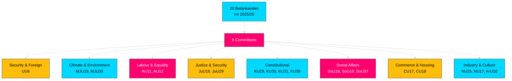

# Analysis Synthesis Summary — 2026-04-01

**Generated**: 2026-04-01 04:58 UTC
**Data Sources**: riksdag-regering-mcp get_betankanden, get_sync_status
**Documents Analyzed**: 20 (latest betänkanden from riksmöte 2025/26)
**Article Coverage**: 10 committee reports in generated article
**Confidence**: MEDIUM
**Riksmöte**: 2025/26

## Summary

Committee reports analysis for 2026-04-01 covers the latest betänkanden from 8 different parliamentary committees spanning March 26–31, 2026. Key policy domains include security policy (UU6), climate targets (MJU30), equality and anti-discrimination (AU11), work environment (AU12), consumer protection (MJU18, CU17), housing policy (CU18), social services (SoU18, SoU19), electricity markets (NU17), and constitutional affairs (KU29, KU30, KU38). Overall political risk is LOW with stable coalition dynamics.

## Key Findings

1. **Security policy in focus**: Bet. 2025/26:UU6 (Säkerhetspolitik) from Utrikesutskottet addresses security policy — high international significance given Sweden's NATO membership
2. **Climate milestones**: Bet. 2025/26:MJU30 sets EU-aligned climate targets to 2030 — significant for Sweden's environmental commitments
3. **National security**: Bet. 2025/26:JuU29 strengthens security protection for real estate transfers — directly addresses foreign acquisition risks
4. **Social welfare breadth**: SoU committee produced 3 reports covering social services, child welfare, and EU genetic regulation subsidiarity
5. **Constitutional debate**: KU committee produced 4 reports covering constitutional questions, public administration, minority languages, and parliamentary process reform
6. Coalition risk level: LOW (score: 4/100) — strong coalition discipline
7. Motion denial rate: 96% — opposition motions overwhelmingly rejected in committee phase

## Top Documents by Significance

| Score | Committee | dok_id | Title | Policy Domain |
|-------|-----------|--------|-------|---------------|
| 7/10 | UU | HD01UU6 | Säkerhetspolitik | Defence & Foreign Affairs |
| 7/10 | MJU | HD01MJU30 | Sveriges klimatmål – EU-anpassade etappmål till 2030 | Environment & Climate |
| 6/10 | JuU | HD01JuU29 | Stärkt säkerhetsskydd vid överlåtelse av fast egendom | National Security |
| 5/10 | SoU | HD01SoU37 | Subsidiaritetsprövning – genetiskt modifierade mikroorganismer | EU Affairs & Health |
| 5/10 | KU | HD01KU38 | Den parlamentariska processen med ledamoten i fokus | Constitutional Affairs |
| 4/10 | AU | HD01AU11 | Jämställdhet och åtgärder mot diskriminering | Equality & Labour |
| 4/10 | AU | HD01AU12 | Arbetsmiljö | Work Environment |
| 4/10 | MJU | HD01MJU18 | Förbättrat genomförande av UTP-direktivets förbud | Consumer Protection |
| 3/10 | CU | HD01CU17 | Konsumenträtt m.m. | Consumer Rights |
| 3/10 | CU | HD01CU18 | Bostadspolitik | Housing Policy |

## Implications

- **Security & Defence**: UU6 and JuU29 form a dual security focus — foreign policy posture and domestic property security
- **Climate Policy**: MJU30 signals Sweden's commitment to EU Green Deal targets for 2030
- **Social Services**: Three SoU reports indicate comprehensive welfare review across social work, child protection, and EU health regulation
- **Constitutional Governance**: Four KU reports address foundational democratic questions (monarchy, lobbying, minority rights, parliamentary reform)
- **Market Regulation**: Consumer and business regulatory reports (CU17, NU15, NU17) reflect ongoing simplification and rights-balancing

Overall political risk level: **LOW** — routine committee business with no coalition-threatening divisions.

## Data Quality Notes

- **MCP source**: riksdag-regering-mcp get_betankanden (rm: 2025/26, limit: 20)
- **Voting data**: Not yet available for most recent reports (pending chamber debate)
- **Full-text**: Limited — most analyses based on metadata and committee summaries
- **Per-file analysis**: 4 documents (March 31) with detailed SWOT and stakeholder analysis in `../2026-03-31/committeeReports/documents/`
- Overall confidence: **MEDIUM** — good metadata coverage, limited full-text access