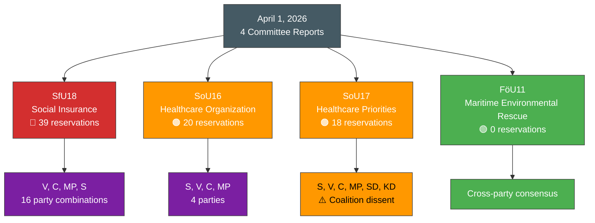

# Analysis Synthesis Summary — 2026-04-01 Committee Reports

**Generated**: 2026-04-02 04:50 UTC
**Data Sources**: get_betankanden, get_dokument (full text), search_voteringar
**Documents Analyzed**: 4
**Confidence**: **[HIGH]** (80%)
**Riksmöte**: 2025/26

---

## Summary

Four committee reports published on April 1, 2026, reveal healthcare and social insurance as the dominant political battlegrounds of the spring session. The Social Insurance Committee (SfU18) produced the session's most contested betänkande with 39 reservations, while two Social Affairs Committee reports (SoU16, SoU17) generated 38 combined reservations. A Defence Committee report (FöU11) on maritime environmental rescue demonstrated rare cross-party consensus with zero reservations.

**Key finding: SD-KD dissent within the government coalition** (SoU17 R15) on healthcare priorities signals emerging coalition stress that could influence Budget Bill 2027 negotiations. **[HIGH]**

---

## Key Findings

1. **SfU18 sets reservation record**: 39 reservations from 4 parties in 16 distinct combinations — the most contested betänkande of 2025/26 session **[HIGH]**
2. **Healthcare dominates**: SoU16 (20 reservations) + SoU17 (18 reservations) = 38 combined healthcare reservations signal pre-election policy battleground **[HIGH]**
3. **SD-KD coalition fracture**: Joint SD-KD reservation on SoU17 R15 reveals healthcare prioritization disagreement within government's support base **[HIGH]**
4. **Cross-ideological opposition cooperation**: V-C-MP joint reservations (SfU18 R15, R20) signal potential new governing coalition consensus on social insurance **[MEDIUM]**
5. **Defence consensus**: FöU11 passed with zero reservations — maritime environmental rescue rare area of cross-party agreement **[HIGH]**

---

## Top Documents by Significance

| Score | Committee | dok_id | Title | Reservations |
|-------|-----------|--------|-------|:---:|
| 🔴 8/10 | SfU | HD01SfU18 | Socialförsäkringsfrågor | 39 |
| 🟠 7/10 | SoU | HD01SoU17 | Prioriteringar inom hälso- och sjukvården | 18 |
| �� 7/10 | SoU | HD01SoU16 | Hälso- och sjukvårdens organisation | 20 |
| 🟡 5/10 | FöU | HD01FöU11 | Riksrevisionens rapport om miljöräddning | 0 |

---

## Mermaid: April 1 Committee Report Landscape

---

## Risk Overview

| Risk | L×I Score | Level |
|------|:-:|:---:|
| Social insurance adequacy crisis before 2026 election | 20 | 🔴 CRITICAL |
| Healthcare access deterioration without reform | 20 | 🔴 CRITICAL |
| Opposition healthcare platform exploiting government inaction | 20 | 🔴 CRITICAL |
| Coalition cohesion fracture (SD-KD healthcare dissent) | 15 | 🟠 HIGH |
| Social insurance opposition coordination escalation | 16 | 🟠 HIGH |

---

## Implications

Healthcare and social insurance constitute the two most politically contested policy domains in April 2026, with 77 combined reservations across three reports. The government coalition's ability to maintain committee majorities on all points demonstrates parliamentary control, but SD-KD dissent on SoU17 and the unprecedented 39-reservation SfU18 suggest growing pressure that could influence the Budget Bill 2027 negotiations and the 2026 election campaign framing.

**Overall political risk level: HIGH**
**Overall confidence: HIGH** (80%)

---

## Data Quality Notes

- Full-text analysis completed for all 4 documents
- Reservation counts verified from XML source data
- Cross-referenced with voting patterns from search_voteringar
