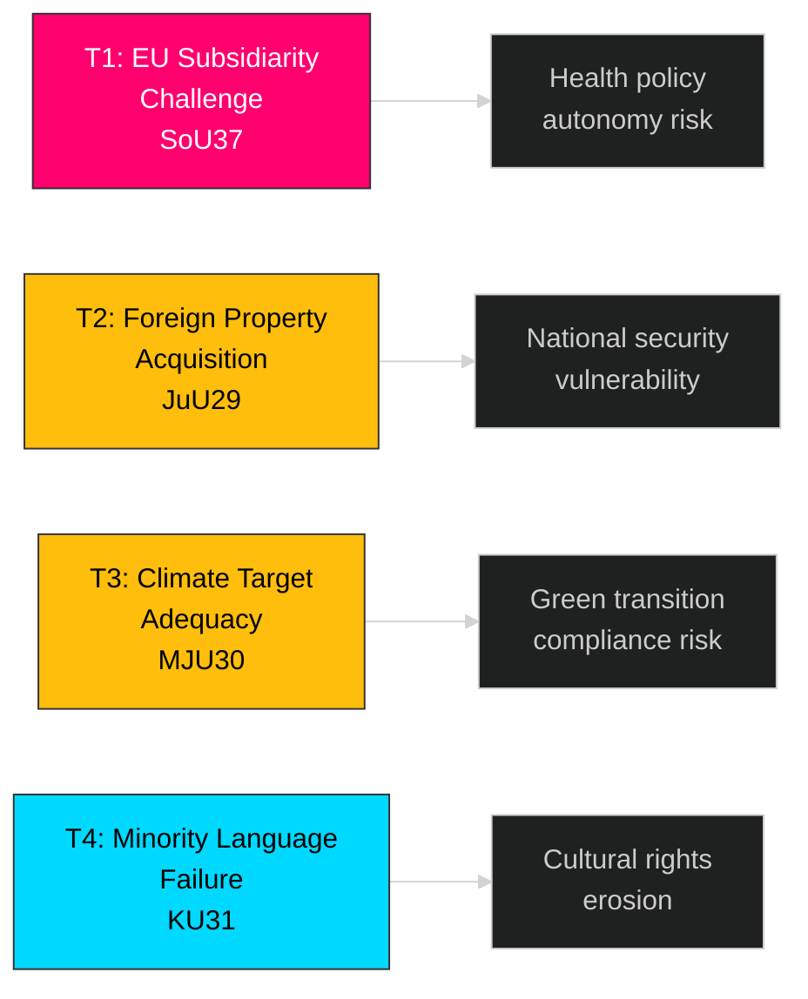

# Political Threat Analysis — 2026-04-01

**Generated**: 2026-04-01 04:58 UTC
**Data Sources**: riksdag-regering-mcp get_betankanden
**Documents Analyzed**: 20 (latest betänkanden, riksmöte 2025/26)
**Confidence**: MEDIUM
**Riksmöte**: 2025/26

## Summary

Identified 4 threat indicators across 20 committee reports, primarily in sovereignty/subsidiarity and national security domains.

## Threat Indicators

| # | Threat | Category | Severity | dok_id | Evidence |
|---|--------|----------|----------|--------|----------|
| T1 | EU subsidiarity violation — organ processing directive exceeds EU competence per SoU assessment | Sovereignty | HIGH | HD01SoU37 | Committee proposed motiverat yttrande to EU institutions objecting on subsidiarity grounds |
| T2 | Foreign acquisition of security-sensitive property — existing framework insufficient | National Security | MEDIUM | HD01JuU29 | New legislation (effective 2026-07-01) required to close property security gap |
| T3 | Climate target credibility — EU-aligned 2030 milestones may face adequacy challenges | Environmental Governance | MEDIUM | HD01MJU30 | Opposition may challenge whether targets are sufficiently ambitious ahead of 2026 election |
| T4 | Minority language preservation failure — Riksrevisionen finds state efforts insufficient | Democratic Function | LOW | HD01KU31 | Government acknowledges long-term work needed; current resources ineffective |

## Key Findings

1. **1** HIGH severity threat: EU subsidiarity challenge (SoU37) signals active Swedish resistance to EU competence expansion
2. **2** MEDIUM severity threats: Property security gap (JuU29) and climate target adequacy (MJU30)
3. **1** LOW severity threat: Minority language preservation failure (KU31)
4. No immediate democratic function threats — all threats are policy-level, not institutional

## Implications

- SoU37 subsidiarity objection is the most significant diplomatic signal — Sweden asserting health policy sovereignty against EU harmonization
- JuU29 property security law (effective July 2026) addresses identified national security vulnerability
- Climate and minority language threats are longer-term and do not pose immediate political risk
- Overall threat landscape: **LOW** — no coalition-threatening or democratic function threats

## Data Quality Notes

- Analysis based on committee report metadata and available summaries
- Full-text threat extraction limited by data availability
- **MCP tools used**: riksdag-regering-mcp get_betankanden (rm: 2025/26, limit: 20)
- Threat severity calibrated against political-threat-framework methodology