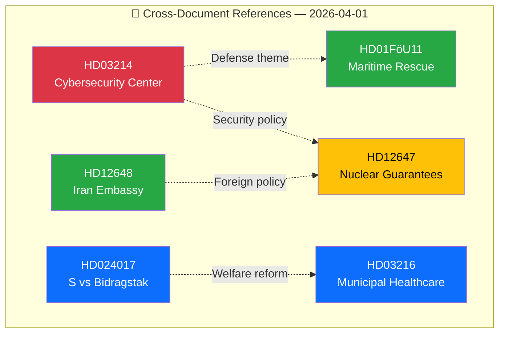

# 🔗 Cross-Reference Map — 2026-04-01

## 📋 Context

| Field | Value |
|-------|-------|
| **Map ID** | XRF-2026-04-01-001 |
| **Date** | 2026-04-01 10:33 UTC |
| **Documents Mapped** | 6 |

---

## �� Reference Network

### Thematic Clusters

| Cluster | Documents | Theme |
|---------|-----------|-------|
| **Defense/Security** | HD03214, HD01FöU11, HD12647 | National security modernization |
| **Social Welfare** | HD024017, HD03216 | Welfare reform and healthcare |
| **Foreign Policy** | HD12648, HD12647 | Iran relations and nuclear policy |

---

## 📋 Document Control

| **Created** | 2026-04-01 10:33 UTC | **Framework** | Cross-Reference v2.1 |
