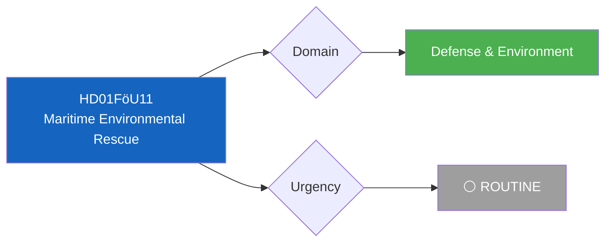

# 🔍 Per-File Political Intelligence Analysis: HD01FöU11

## 📋 Document Identity

| Field | Value |
|-------|-------|
| **Document ID** | `HD01FöU11` |
| **Document Type** | `committeeReports` |
| **Title** | Riksrevisionens rapport om miljöräddning vid stora olyckor till sjöss |
| **Date** | 2026-04-01 |
| **Riksmöte** | 2025/26 |
| **Source MCP Tool** | `get_betankanden` |
| **Analysis Timestamp** | 2026-04-01 10:33 UTC |
| **Analyst** | news-realtime-monitor |

---

## 🎯 Executive Summary

The Defense Committee (FöU) has published betänkande FöU11 on a Riksrevisionen audit report examining environmental rescue capabilities during major maritime accidents. This intersects defense preparedness with environmental protection — a topic with growing relevance given Baltic Sea security concerns and increased military activity post-NATO accession. The report likely recommends improved coordination between Kustbevakningen, Sjöfartsverket, and MSB. **Confidence: MEDIUM**

---

## 📊 Political Classification

| Field | Classification |
|-------|---------------|
| **Sensitivity** | 🟢 PUBLIC — Audit report review |
| **Domain** | Defense & Maritime Environment |
| **Significance Score** | 3/10 |

---

## 💼 SWOT Analysis

| # | Strength | Evidence | Confidence | Impact |
|---|----------|----------|:----------:|:------:|
| S1 | Riksrevisionen audit provides evidence-based improvement path | HD01FöU11 | H | M |

| # | Weakness | Evidence | Confidence | Impact |
|---|----------|----------|:----------:|:------:|
| W1 | Maritime rescue coordination fragmented across multiple agencies | HD01FöU11 context | M | M |

| # | Opportunity | Evidence | Confidence | Impact |
|---|------------|----------|:----------:|:------:|
| O1 | NATO membership creates framework for Baltic maritime cooperation | HD01FöU11 + NATO context | M | M |

| # | Threat | Evidence | Confidence | Impact |
|---|--------|----------|:----------:|:------:|
| T1 | Baltic environmental risks increasing with military activity | HD01FöU11 context | M | H |

---

## 📋 Document Control

| **Created** | 2026-04-01 10:33 UTC | **Framework** | Per-File v2.1 |
