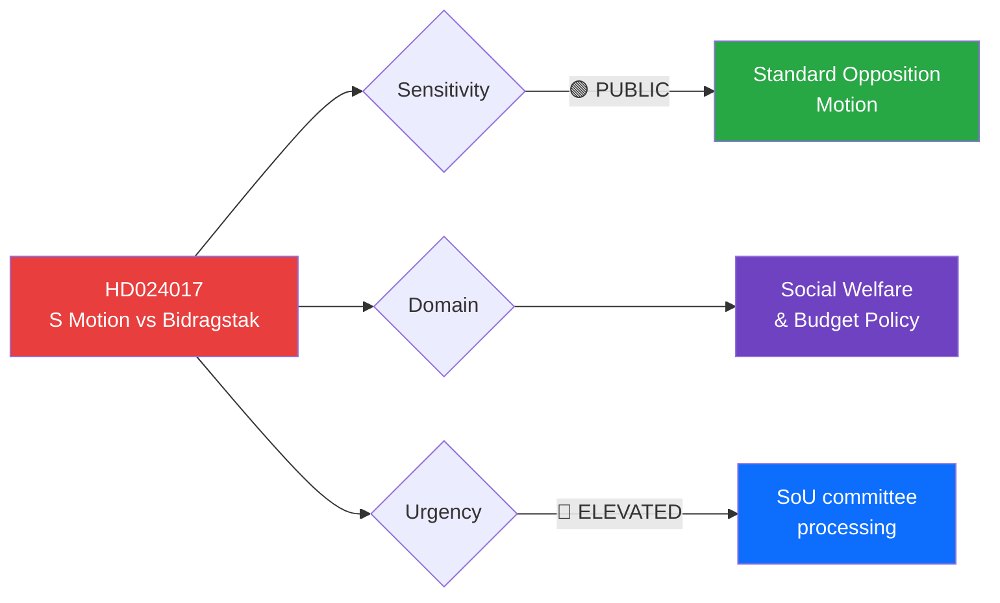

# 🔍 Per-File Political Intelligence Analysis: HD024017

## 📋 Document Identity

| Field | Value |
|-------|-------|
| **Document ID** | `HD024017` |
| **Document Type** | `motions` |
| **Title** | med anledning av prop. 2025/26:201 Reformerat försörjningsstöd – bidragstak och ökade möjligheter till arbete |
| **Date** | 2026-04-01 |
| **Riksmöte** | 2025/26 |
| **Source MCP Tool** | `search_dokument` |
| **Analysis Timestamp** | 2026-04-01 10:31 UTC |
| **Analyst** | news-realtime-monitor |

---

## 🎯 Executive Summary

The Social Democrats (S) have filed a committee motion (mot. 2025/26:4017) by Fredrik Lundh Sammeli et al. opposing key parts of the government's welfare reform proposition (prop. 2025/26:201), specifically targeting the proposed benefit cap ("bidragstak") and changes to social assistance calculation. This represents a significant ideological battleground — S argues the cap disproportionately affects vulnerable families while the Tidö coalition frames it as necessary work incentive reform. Combined with the parallel S motion HD024016 on activity requirements, this signals S is mounting a coordinated opposition campaign against the government's social welfare agenda ahead of the 2026 election. **Confidence: HIGH**

---

## 📊 Political Classification

| Field | Classification |
|-------|---------------|
| **Sensitivity** | 🟢 PUBLIC — Standard parliamentary opposition |
| **Domain** | Social Welfare & Budget |
| **Urgency** | 🔵 ELEVATED — Active committee processing |
| **Significance Score** | 5/10 |

---

## 💼 SWOT Analysis

### ✅ Strengths (S Opposition Perspective)

| # | Statement | Evidence (dok_id) | Confidence | Impact |
|---|-----------|-------------------|:----------:|:------:|
| S1 | S frames opposition as protecting vulnerable families — strong electoral messaging | HD024017 (motion text) | H | H |
| S2 | Coordinated with parallel motion HD024016 on activity requirements — comprehensive counter-narrative | HD024017 + HD024016 | H | M |

### ⚠️ Weaknesses (S Opposition Perspective)

| # | Statement | Evidence (dok_id) | Confidence | Impact |
|---|-----------|-------------------|:----------:|:------:|
| W1 | S lacks Riksdag majority to block — M+KD+L+SD coalition will likely pass reform | Parliamentary arithmetic (176 vs 173) | H | H |
| W2 | Public opinion divided on welfare reform — S risks being seen as defending status quo | HD024017 context | M | M |

### 🔄 Opportunities

| # | Statement | Evidence (dok_id) | Confidence | Impact |
|---|-----------|-------------------|:----------:|:------:|
| O1 | Electoral positioning for 2026 — welfare policy is S core competence area | HD024017 + HD024016 | H | H |
| O2 | Potential to attract V, MP support for unified opposition bloc | HD024017 referral to SoU | M | M |

### 🔴 Threats

| # | Statement | Evidence (dok_id) | Confidence | Impact |
|---|-----------|-------------------|:----------:|:------:|
| T1 | Government narrative on work incentives resonates with swing voters | HD024017 vs prop 2025/26:201 | M | H |
| T2 | SD support for government position on welfare tightening is firm | Parliamentary dynamics | H | M |

---

## 👥 Stakeholder Impact

| Stakeholder | Impact | Direction | Key Concern |
|------------|:------:|:---------:|-------------|
| **Citizens (low-income)** | H | ❓ Contested | Benefit cap affects vulnerable families |
| **Government (M, KD, L)** | M | ↔ Expected | Standard opposition to key reform |
| **Opposition (S)** | H | 📢 Electoral | Core welfare messaging platform |
| **Business** | L | ↔ Indirect | Work incentive implications |

---

## 🔮 Forward Indicators

1. **Watch SoU committee vote** — margin and any government-side defections
2. **Monitor V, MP, C positions** — potential for broader opposition coalition
3. **Track public opinion polls** — welfare reform popularity as election approaches
4. **Watch for SD position specifics** — any conditions or reservations

---

## 📋 Document Control

| Field | Value |
|-------|-------|
| **Created** | 2026-04-01 10:31 UTC |
| **Framework** | Per-File Political Intelligence v2.1 |
| **MCP Tools Used** | search_dokument, get_dokument_innehall |
