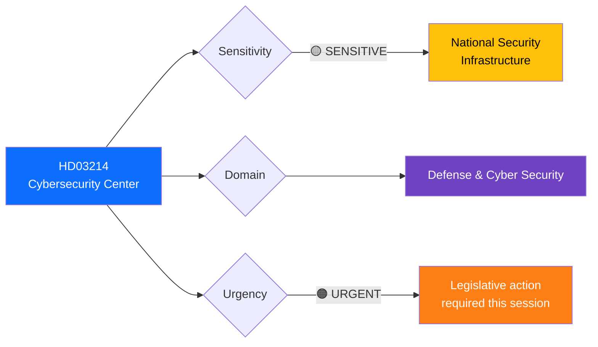
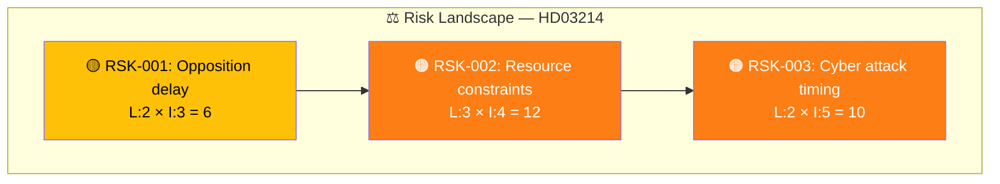

# 🔍 Per-File Political Intelligence Analysis: HD03214

## 📋 Document Identity

| Field | Value |
|-------|-------|
| **Document ID** | `HD03214` |
| **Document Type** | `propositions` |
| **Title** | Lagändringar för ett stärkt nationellt cybersäkerhetscenter |
| **Date** | 2026-04-01 |
| **Riksmöte** | 2025/26 |
| **Source MCP Tool** | `get_propositioner`, `search_dokument` |
| **Analysis Timestamp** | 2026-04-01 10:28 UTC |
| **Analyst** | news-realtime-monitor |

---

## 🎯 Executive Summary

The government has submitted Proposition 2025/26:214 proposing legislative changes to strengthen Sweden's National Cybersecurity Center (NCSC). This defense-sector proposition, signed by Finance Minister Elisabeth Svantesson and Defense Minister Carl-Oskar Bohlin (M), represents a significant expansion of Sweden's cyber defense capabilities through statutory framework reforms. The bill is referred to the Defense Committee (FöU) and carries major implications for national security infrastructure, inter-agency coordination, and Sweden's NATO interoperability posture. Given the current geopolitical environment and Sweden's recent NATO membership, this proposition signals the Tidö coalition's continued prioritization of defense modernization. **Confidence: HIGH**

---

## 📊 Political Classification

| Field | Classification |
|-------|---------------|
| **Sensitivity** | 🟡 SENSITIVE — National security infrastructure |
| **Domain** | Defense & Cybersecurity |
| **Urgency** | 🟠 URGENT — Requires committee processing this session |
| **Significance Score** | 7/10 |

---

## 💼 SWOT Analysis

### ✅ Strengths

| # | Statement | Evidence (dok_id) | Confidence | Impact |
|---|-----------|-------------------|:----------:|:------:|
| S1 | Government demonstrates proactive cybersecurity posture aligned with NATO requirements | HD03214 (prop 2025/26:214) | H | H |
| S2 | Cross-ministry coordination — Försvarsdepartementet leads with whole-of-government approach | HD03214 (signed by Svantesson + Bohlin) | H | M |
| S3 | Builds on existing NCSC framework rather than creating new bureaucracy — pragmatic approach | HD03214 (lagändringar, not new institution) | M | M |

### ⚠️ Weaknesses

| # | Statement | Evidence (dok_id) | Confidence | Impact |
|---|-----------|-------------------|:----------:|:------:|
| W1 | Opposition parties (S, V, MP) may challenge scope or demand broader civilian protection mandate | HD024017 (S opposition pattern on gov proposals) | M | M |
| W2 | Cybersecurity talent shortage in Sweden could limit implementation effectiveness | General context + HD03214 scope | M | H |

### 🔄 Opportunities

| # | Statement | Evidence (dok_id) | Confidence | Impact |
|---|-----------|-------------------|:----------:|:------:|
| O1 | NATO membership creates framework for international cyber defense cooperation and intelligence sharing | HD12647 (security guarantees question) + HD03214 | H | H |
| O2 | Potential for cross-party consensus — cybersecurity is less politically divisive than migration/welfare | HD03214 defense committee referral | M | M |

### 🔴 Threats

| # | Statement | Evidence (dok_id) | Confidence | Impact |
|---|-----------|-------------------|:----------:|:------:|
| T1 | Geopolitical cyber threats intensifying — legislation may be overtaken by events before implementation | General context + HD03214 | H | H |
| T2 | Risk of scope creep or bureaucratic inertia in inter-agency NCSC coordination | HD03214 structural reform | M | M |

---

## ⚠️ Risk Assessment

| Risk ID | Description | Likelihood | Impact | Score | Trend |
|---------|-------------|:----------:|:------:|:-----:|:-----:|
| RSK-001 | Opposition delays committee processing | 2 | 3 | 6 | → |
| RSK-002 | Implementation faces resource constraints | 3 | 4 | 12 | ↑ |
| RSK-003 | Cyber attack during legislative process undermines credibility | 2 | 5 | 10 | → |

---

## 👥 Stakeholder Impact

| Stakeholder | Impact | Direction | Key Concern |
|------------|:------:|:---------:|-------------|
| **Citizens** | M | ✅ Positive | Improved national cyber resilience protects critical infrastructure |
| **Government (M, KD, L)** | H | ✅ Positive | Demonstrates defense modernization commitment ahead of 2026 election |
| **Opposition (S)** | M | ↔ Neutral | Likely to support in principle but may demand amendments |
| **Business** | H | ✅ Positive | Clearer regulatory framework for cybersecurity compliance |
| **Military/Defense** | H | ✅ Positive | Statutory mandate strengthens NCSC authority and resources |
| **International (NATO)** | M | ✅ Positive | Signals Sweden's commitment to alliance cyber defense standards |

---

## 🔮 Forward Indicators

1. **Watch FöU committee scheduling** — fast-track processing indicates government priority
2. **Monitor S, V, MP committee positions** — opposition stance determines consensus potential
3. **Track related EU NIS2 implementation** — cybersecurity legislation interacts with EU requirements
4. **Watch for SD position** — as supply partner, SD support is essential for passage

---

## 📋 Document Control

| Field | Value |
|-------|-------|
| **Created** | 2026-04-01 10:28 UTC |
| **Framework** | Per-File Political Intelligence v2.1 |
| **MCP Tools Used** | get_propositioner, search_dokument, get_dokument_innehall |
