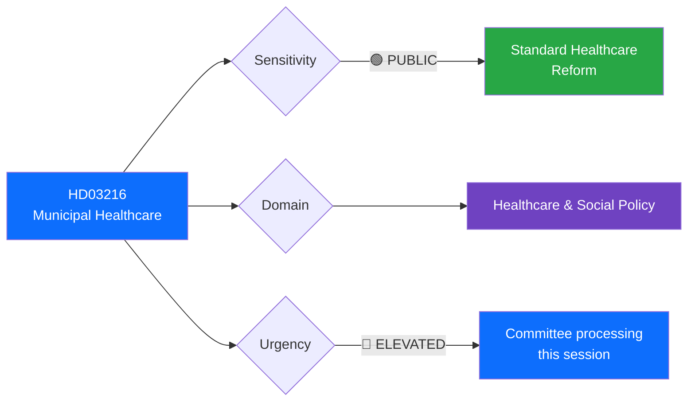

# 🔍 Per-File Political Intelligence Analysis: HD03216

## 📋 Document Identity

| Field | Value |
|-------|-------|
| **Document ID** | `HD03216` |
| **Document Type** | `propositions` |
| **Title** | Stärkt medicinsk kompetens i kommunal hälso- och sjukvård |
| **Date** | 2026-04-01 |
| **Riksmöte** | 2025/26 |
| **Source MCP Tool** | `get_propositioner` |
| **Analysis Timestamp** | 2026-04-01 10:30 UTC |
| **Analyst** | news-realtime-monitor |

---

## 🎯 Executive Summary

Proposition 2025/26:216 proposes strengthening medical competence in municipal healthcare, addressing a critical gap in Sweden's decentralized health system. Signed by Finance Minister Svantesson and Social Insurance Minister Anna Tenje (M), this bill targets the qualification and availability of medical expertise in municipalities — crucial for elderly care, home healthcare, and primary care outside hospital settings. The reform responds to repeated Riksrevisionen findings about quality disparities between regional and municipal healthcare. **Confidence: MEDIUM**

---

## 📊 Political Classification

| Field | Classification |
|-------|---------------|
| **Sensitivity** | 🟢 PUBLIC — Standard healthcare reform |
| **Domain** | Healthcare & Social Policy |
| **Urgency** | 🔵 ELEVATED — SoU committee processing |
| **Significance Score** | 4/10 |

---

## 💼 SWOT Analysis

### ✅ Strengths

| # | Statement | Evidence (dok_id) | Confidence | Impact |
|---|-----------|-------------------|:----------:|:------:|
| S1 | Addresses well-documented quality gap in municipal vs regional healthcare | HD03216 (prop 2025/26:216) | H | H |
| S2 | Supports aging population needs — politically uncontroversial welfare investment | HD03216 + demographic context | H | M |

### ⚠️ Weaknesses

| # | Statement | Evidence (dok_id) | Confidence | Impact |
|---|-----------|-------------------|:----------:|:------:|
| W1 | Municipal autonomy concerns — may face implementation resistance from kommuner | HD03216 (municipal competence mandate) | M | M |
| W2 | Funding mechanism unclear — unfunded mandates risk political backlash | HD03216 scope | M | H |

### 🔄 Opportunities

| # | Statement | Evidence (dok_id) | Confidence | Impact |
|---|-----------|-------------------|:----------:|:------:|
| O1 | Cross-party consensus likely — S, V, MP have historically supported healthcare strengthening | General + HD03216 | H | M |

### 🔴 Threats

| # | Statement | Evidence (dok_id) | Confidence | Impact |
|---|-----------|-------------------|:----------:|:------:|
| T1 | Healthcare staffing crisis may limit practical implementation regardless of legislation | HD03216 context | H | H |

---

## 👥 Stakeholder Impact

| Stakeholder | Impact | Direction | Key Concern |
|------------|:------:|:---------:|-------------|
| **Citizens** | H | ✅ Positive | Better quality municipal healthcare |
| **Government** | M | ✅ Positive | Demonstrates welfare commitment |
| **Municipalities** | H | ↔ Mixed | New requirements vs autonomy |
| **Healthcare workers** | M | ✅ Positive | Career development paths |

---

## 🔮 Forward Indicators

1. **Watch SoU committee hearings** — municipal representative input critical
2. **Monitor SKR (Swedish Association of Local Authorities) response** — implementation feasibility
3. **Track opposition motions** — S may push for stronger funding mechanisms

---

## 📋 Document Control

| Field | Value |
|-------|-------|
| **Created** | 2026-04-01 10:30 UTC |
| **Framework** | Per-File Political Intelligence v2.1 |
| **MCP Tools Used** | get_propositioner, get_dokument_innehall |
