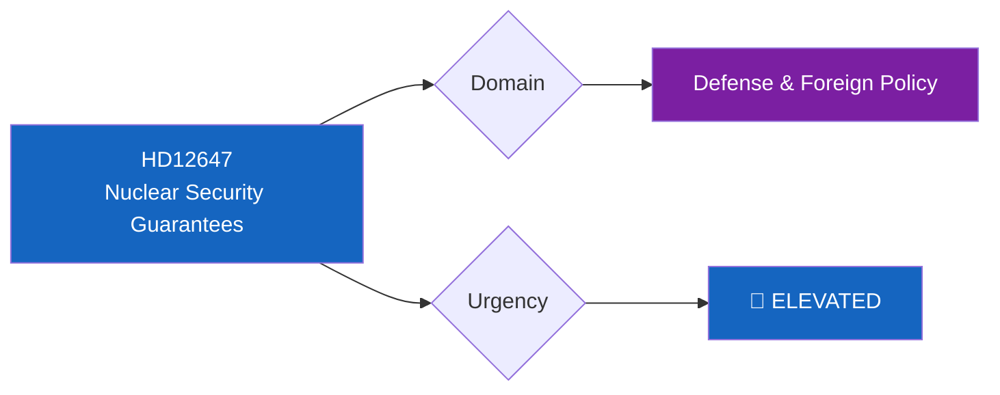

# 🔍 Per-File Political Intelligence Analysis: HD12647

## 📋 Document Identity

| Field | Value |
|-------|-------|
| **Document ID** | `HD12647` |
| **Document Type** | `questions` |
| **Title** | Negativa säkerhetsgarantier |
| **Date** | 2026-04-01 |
| **Riksmöte** | 2025/26 |
| **Source MCP Tool** | `search_dokument` |
| **Analysis Timestamp** | 2026-04-01 10:32 UTC |
| **Analyst** | news-realtime-monitor |

---

## 🎯 Executive Summary

S MP Laila Naraghi has questioned Foreign Minister Maria Malmer Stenergard (M) about negative security guarantees from nuclear weapon states. In the context of Sweden's NATO membership, this written question probes the government's nuclear policy posture and arms control diplomacy. The question signals ongoing S concern about nuclear weapons policy implications of NATO membership. **Confidence: MEDIUM**

---

## 📊 Political Classification

| Field | Classification |
|-------|---------------|
| **Sensitivity** | 🟡 SENSITIVE — Nuclear/defense policy |
| **Domain** | Foreign Policy & Arms Control |
| **Significance Score** | 4/10 |

---

## 💼 SWOT Analysis

| # | Strength | Evidence | Confidence | Impact |
|---|----------|----------|:----------:|:------:|
| S1 | S maintains nuclear disarmament profile consistent with historical position | HD12647 | H | M |

| # | Weakness | Evidence | Confidence | Impact |
|---|----------|----------|:----------:|:------:|
| W1 | Question may be symbolic — limited leverage on NATO nuclear policy | HD12647 context | M | L |

| # | Opportunity | Evidence | Confidence | Impact |
|---|------------|----------|:----------:|:------:|
| O1 | Links to broader peace/disarmament electoral messaging for S | HD12647 | M | M |

| # | Threat | Evidence | Confidence | Impact |
|---|--------|----------|:----------:|:------:|
| T1 | Government can deflect to NATO collective defense framework | HD12647 + NATO context | H | M |

---

## 📋 Document Control

| **Created** | 2026-04-01 10:32 UTC | **Framework** | Per-File v2.1 |
