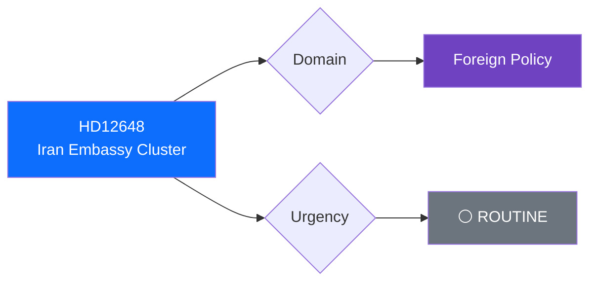

# 🔍 Per-File Political Intelligence Analysis: HD12648

## 📋 Document Identity

| Field | Value |
|-------|-------|
| **Document ID** | `HD12648` |
| **Document Type** | `questions` |
| **Title** | Deltagande vid firande av islamiska revolutionen i Iran |
| **Date** | 2026-04-01 |
| **Riksmöte** | 2025/26 |
| **Source MCP Tool** | `search_dokument` |
| **Analysis Timestamp** | 2026-04-01 10:32 UTC |
| **Analyst** | news-realtime-monitor |

---

## 🎯 Executive Summary

SD MP Björn Söder has submitted a cluster of questions (frs 2025/26:634, 635, 648) to Foreign Minister Maria Malmer Stenergard (M) regarding UD officials attending Iran's Islamic Revolution celebration and demanding expulsion of Iranian embassy personnel. This reveals SD using parliamentary questions to push a hawkish foreign policy line on Iran, testing the M-led government's willingness to take confrontational diplomatic action. The combined answer format suggests government is managing the sensitivity carefully. **Confidence: HIGH**

---

## 📊 Political Classification

| Field | Classification |
|-------|---------------|
| **Sensitivity** | 🟡 SENSITIVE — Diplomatic relations |
| **Domain** | Foreign Policy (Iran) |
| **Significance Score** | 3/10 |

---

## 💼 SWOT Analysis

| # | Strength | Evidence | Confidence | Impact |
|---|----------|----------|:----------:|:------:|
| S1 | SD effectively uses frs mechanism to set foreign policy agenda | HD12648+HD12634+HD12635 cluster | H | M |

| # | Weakness | Evidence | Confidence | Impact |
|---|----------|----------|:----------:|:------:|
| W1 | Government constrained between SD pressure and diplomatic norms | HD12648 combined answer | M | M |

| # | Opportunity | Evidence | Confidence | Impact |
|---|------------|----------|:----------:|:------:|
| O1 | Potential for hawkish Iran stance to gain cross-party support (S also critical of regime) | HD12648 context | M | L |

| # | Threat | Evidence | Confidence | Impact |
|---|--------|----------|:----------:|:------:|
| T1 | Diplomatic escalation risk if embassy expulsion demanded | HD12648 | L | H |

---

## 📋 Document Control

| **Created** | 2026-04-01 10:32 UTC | **Framework** | Per-File v2.1 |
