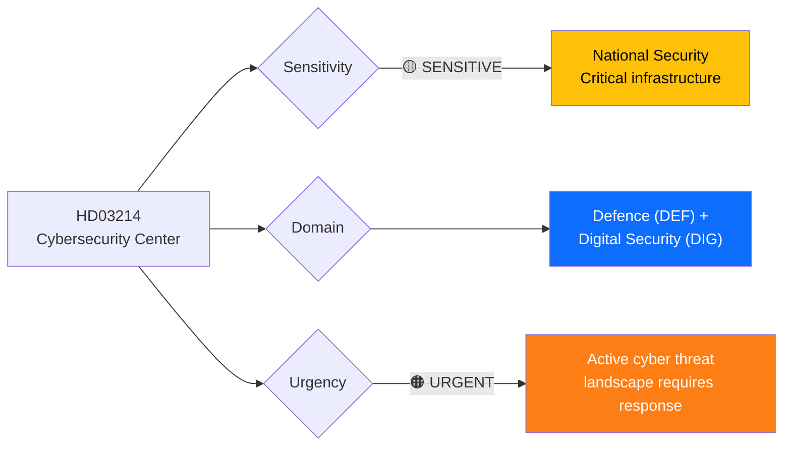
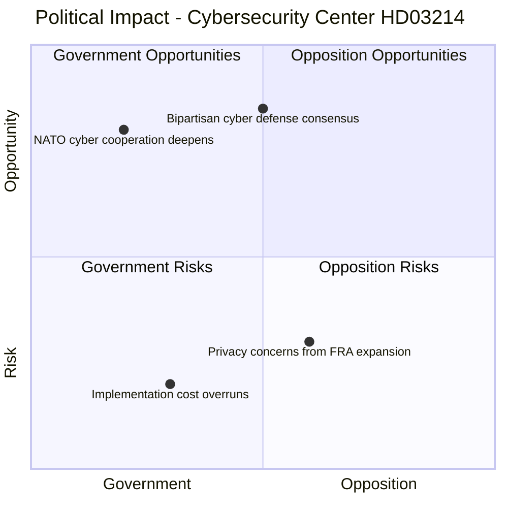

# Document Analysis: Lagändringar för ett stärkt nationellt cybersäkerhetscenter

**Generated**: 2026-04-01 14:37 UTC
**dok_id**: HD03214
**Document Type**: proposition (prop)
**Committee**: Försvarsdepartementet
**Date**: 2026-04-01
**Author**: Carl-Oskar Bohlin (Försvarsdepartementet)
**Riksmöte**: 2025/26
**Significance**: 🔴 High (8/10)
**Confidence**: HIGH (85%)

---

## 📋 Document Identity

| Field | Value |
|-------|-------|
| **Document ID** | `HD03214` |
| **Document Type** | proposition |
| **Title** | Lagändringar för ett stärkt nationellt cybersäkerhetscenter |
| **Date** | 2026-04-01 |
| **Riksmöte** | 2025/26 |
| **Source MCP Tool** | get_propositioner, get_dokument |
| **Analysis Timestamp** | 2026-04-01 14:37 UTC |
| **Analyst** | news-realtime-monitor |

---

## 🎯 Executive Summary

Defense Minister Carl-Oskar Bohlin proposes legislative changes to strengthen Sweden's National Cybersecurity Center (Prop. 2025/26:214). In the context of escalating state-sponsored cyber threats and Sweden's NATO integration, this represents a critical infrastructure protection initiative. The center consolidates cyber defense capabilities across FRA, MUST, Säpo, and MSB. Cross-referenced with today's chamber vote on SIGINT privacy (HDC320260401FöU6) and the arms regulation reform (HD03228), this forms a comprehensive national security legislative package. Broad parliamentary support is expected — cybersecurity has strong bipartisan appeal. **[HIGH confidence]**

---

## �� Political Classification

| Field | Assessment |
|-------|-----------|
| **Sensitivity Level** | SENSITIVE |
| **Primary Domain** | Defence (DEF) + Digital Security |
| **Urgency** | URGENT |
| **Significance Score** | 8/10 |
| **Confidence** | HIGH |

---

## 💪 SWOT Impact Assessment

### Quadrant Overview

### Government Coalition Impact

| # | Strength Statement | Evidence (dok_id) | Confidence | Impact | Entry Date |
|---|-------------------|-------------------|:----------:|:------:|:----------:|
| S1 | Addresses urgent national security need with broad parliamentary support expected | HD03214 | H | H | 2026-04-01 |
| S2 | NATO membership requires enhanced cyber capabilities — this delivers | HD03214, HD03228 | H | H | 2026-04-01 |
| S3 | Minister Bohlin leads on high-visibility security portfolio, strengthening M defense credibility | HD03214 | M | M | 2026-04-01 |

| # | Weakness Statement | Evidence (dok_id) | Confidence | Impact | Entry Date |
|---|-------------------|-------------------|:----------:|:------:|:----------:|
| W1 | FRA/Säpo coordination challenges may delay center's operational readiness | HD03214 | M | M | 2026-04-01 |
| W2 | Privacy implications of expanded cyber monitoring create L internal debate | HD03214, HDC320260401FöU6 | M | M | 2026-04-01 |

| # | Opportunity Statement | Evidence (dok_id) | Confidence | Impact | Entry Date |
|---|----------------------|-------------------|:----------:|:------:|:----------:|
| O1 | Positions Sweden as NATO cyber defense leader in Nordic-Baltic region | HD03214 | H | H | 2026-04-01 |
| O2 | Attracts tech industry investment in cybersecurity sector | HD03214 | M | H | 2026-04-01 |

| # | Threat Statement | Evidence (dok_id) | Confidence | Impact | Entry Date |
|---|-----------------|-------------------|:----------:|:------:|:----------:|
| T1 | Privacy advocates may challenge FRA authority expansion in courts | HD03214, HDC320260401FöU6 | M | M | 2026-04-01 |
| T2 | Skilled cybersecurity workforce shortage may undermine center effectiveness | HD03214 | M | M | 2026-04-01 |

---

## 🔗 Cross-References

- **HD03228** — Arms regulation (defense package pair)
- **HD03235** — Deportation rules (same-day security package)
- **HDC320260401FöU6** — SIGINT privacy vote today (directly related)
- **HDC320260401JuU29** — Security protection for real estate vote today
- **HD01FöU11** — Defense committee report on maritime emergency rescue

---

## 📈 Forward Indicators

1. **Watch**: FöU committee assignment and timeline
2. **Watch**: FRA/MUST/Säpo joint implementation planning
3. **Watch**: Privacy debate during committee hearings
4. **Trigger**: If V or MP oppose, signals rare defense policy division
5. **Trigger**: EU NIS2 directive alignment requirements may accelerate timeline
