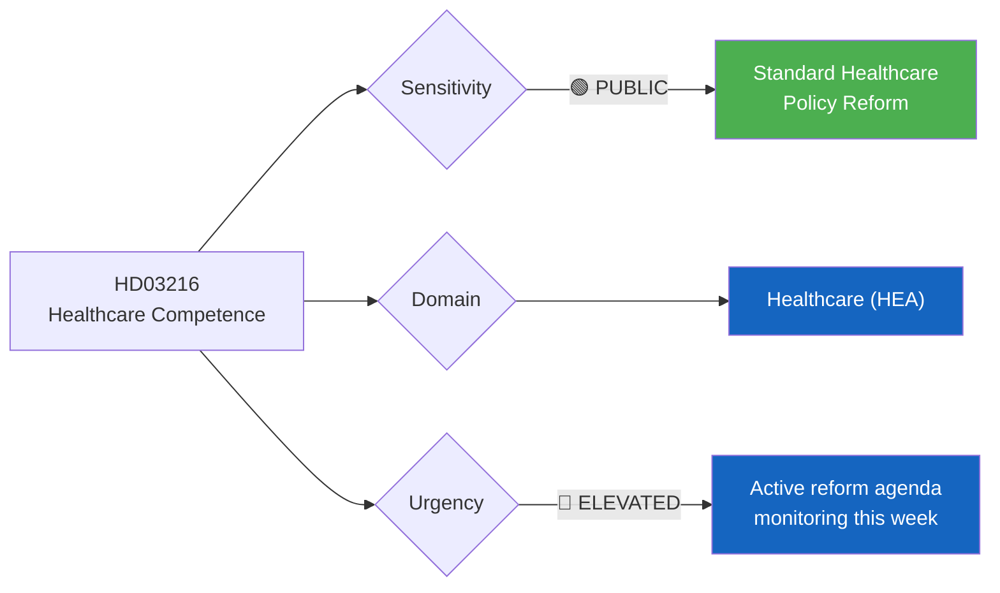
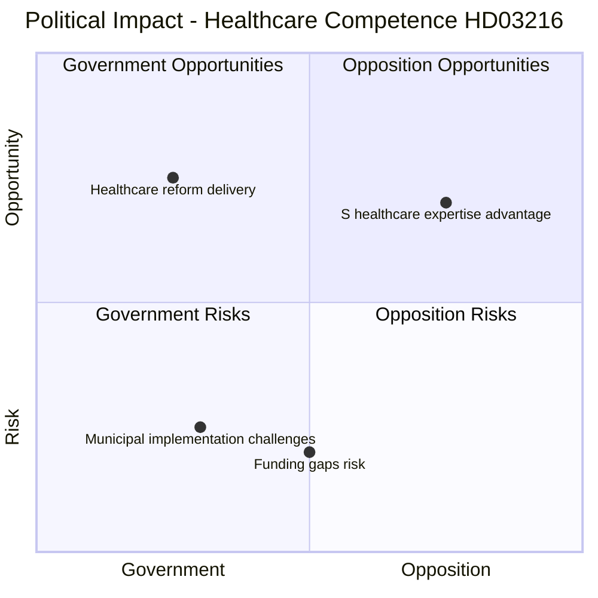

# Document Analysis: Stärkt medicinsk kompetens i kommunal hälso- och sjukvård

**Generated**: 2026-04-01 14:38 UTC
**dok_id**: HD03216
**Document Type**: proposition (prop)
**Committee**: Socialdepartementet
**Date**: 2026-04-01
**Author**: Anna Tenje (Socialdepartementet)
**Riksmöte**: 2025/26
**Significance**: 🟡 Medium (6/10)
**Confidence**: HIGH (80%)

---

## 📋 Document Identity

| Field | Value |
|-------|-------|
| **Document ID** | `HD03216` |
| **Document Type** | proposition |
| **Title** | Stärkt medicinsk kompetens i kommunal hälso- och sjukvård |
| **Date** | 2026-04-01 |
| **Riksmöte** | 2025/26 |
| **Source MCP Tool** | get_propositioner, get_dokument |
| **Analysis Timestamp** | 2026-04-01 14:38 UTC |
| **Analyst** | news-realtime-monitor |

---

## 🎯 Executive Summary

Social Affairs Minister Anna Tenje proposes strengthening medical competence in municipal healthcare (Prop. 2025/26:216). This addresses the structural challenge of Sweden's decentralized healthcare system where municipalities handle elderly care and home healthcare but often lack sufficient medical expertise. The proposition arrives amid active parliamentary debate on healthcare reform — today's chamber votes include SoU16 (healthcare organization) and SoU17 (healthcare priorities), while SoU22 (competence, e-health, preparedness) was also decided. Cross-referenced with today's SoU19 debate on children in social services, this signals a government healthcare reform push. **[HIGH confidence]**

---

## 📊 Political Classification

| Field | Assessment |
|-------|-----------|
| **Sensitivity Level** | PUBLIC |
| **Primary Domain** | Healthcare (HEA) |
| **Urgency** | ELEVATED |
| **Significance Score** | 6/10 |
| **Confidence** | HIGH |

---

## 💪 SWOT Impact Assessment

### Quadrant Overview

### Government Coalition Impact

| # | Strength Statement | Evidence (dok_id) | Confidence | Impact | Entry Date |
|---|-------------------|-------------------|:----------:|:------:|:----------:|
| S1 | Addresses well-documented municipal healthcare quality gaps, likely broad support | HD03216 | H | M | 2026-04-01 |
| S2 | Coordinated with SoU committee reports on healthcare reform (SoU16, SoU17, SoU22) | HD01SoU16, HD01SoU17, HDC320260401SoU22 | H | M | 2026-04-01 |

| # | Weakness Statement | Evidence (dok_id) | Confidence | Impact | Entry Date |
|---|-------------------|-------------------|:----------:|:------:|:----------:|
| W1 | Municipal funding for competence enhancement remains unclear — cost burden question | HD03216 | M | M | 2026-04-01 |
| W2 | Healthcare workforce shortage limits practical impact of competence requirements | HD03216 | M | H | 2026-04-01 |

| # | Opportunity Statement | Evidence (dok_id) | Confidence | Impact | Entry Date |
|---|----------------------|-------------------|:----------:|:------:|:----------:|
| O1 | Combined with SoU26 language requirements in elderly care, creates comprehensive quality framework | HD03216, HDC320260401SoU26 | H | M | 2026-04-01 |

| # | Threat Statement | Evidence (dok_id) | Confidence | Impact | Entry Date |
|---|-----------------|-------------------|:----------:|:------:|:----------:|
| T1 | Implementation costs may burden already strained municipalities, generating local pushback | HD03216 | M | M | 2026-04-01 |

---

## 🔗 Cross-References

- **HD01SoU16** — Healthcare organization committee report (today)
- **HD01SoU17** — Healthcare priorities committee report (today)
- **HDC320260401SoU22** — E-health and preparedness vote (today)
- **HDC320260401SoU26** — Language requirements in elderly care vote (today)
- **HDC320260401SoU19** — Children and youth in social services vote (today)

---

## 📈 Forward Indicators

1. **Watch**: SoU committee assignment and SKR (municipalities) response
2. **Watch**: Municipal budget impact assessments
3. **Trigger**: If municipalities oppose unfunded mandates, creates government-local conflict
