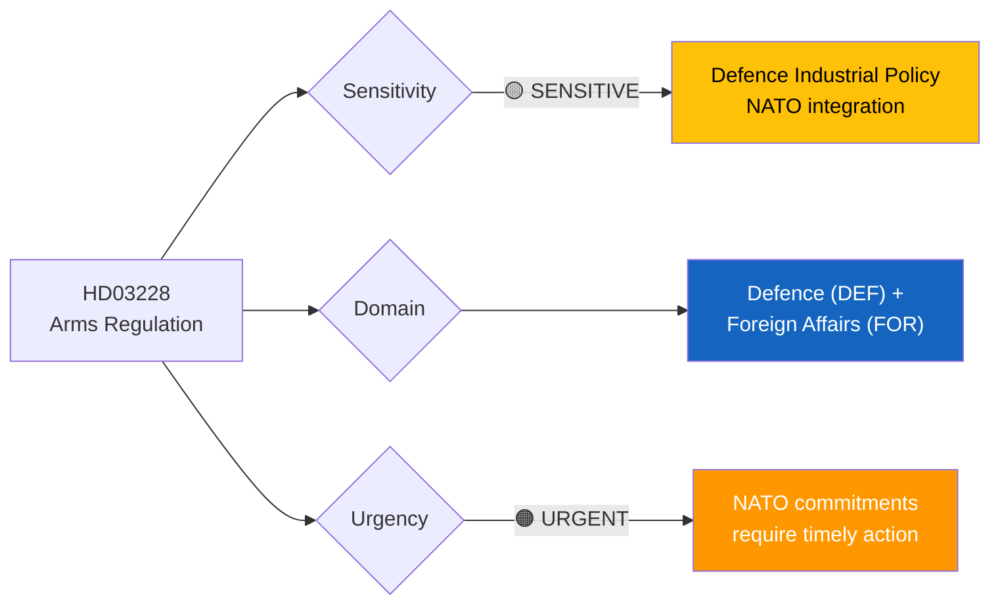
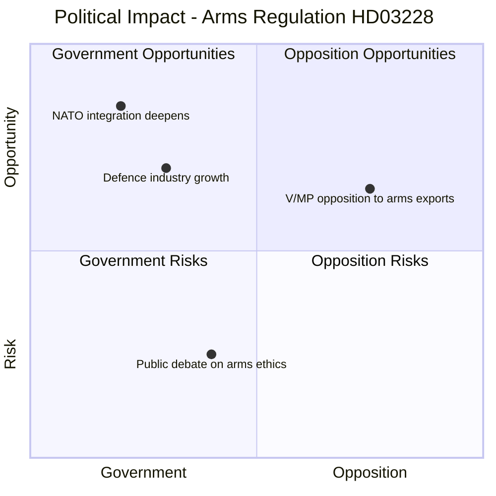

# Document Analysis: Ett modernt och anpassat regelverk för krigsmateriel

**Generated**: 2026-04-01 14:36 UTC
**dok_id**: HD03228
**Document Type**: proposition (prop)
**Committee**: Utrikesdepartementet
**Date**: 2026-04-01
**Author**: Benjamin Dousa (Utrikesdepartementet)
**Riksmöte**: 2025/26
**Significance**: 🔴 High (8/10)
**Confidence**: HIGH (85%)

---

## 📋 Document Identity

| Field | Value |
|-------|-------|
| **Document ID** | `HD03228` |
| **Document Type** | proposition |
| **Title** | Ett modernt och anpassat regelverk för krigsmateriel |
| **Date** | 2026-04-01 |
| **Riksmöte** | 2025/26 |
| **Source MCP Tool** | get_propositioner, get_dokument |
| **Analysis Timestamp** | 2026-04-01 14:36 UTC |
| **Analyst** | news-realtime-monitor |

---

## 🎯 Executive Summary

Foreign Affairs Minister Benjamin Dousa presents a comprehensive modernization of Sweden's arms export regulations (Prop. 2025/26:228). This is directly linked to Sweden's NATO membership — modernizing the regulatory framework for military equipment enables deeper defense industrial cooperation with NATO allies. The proposition reforms the Krigsmateriellagen to accommodate new alliance commitments while maintaining democratic oversight. Combined with HD03214 (cybersecurity center), this signals the government's accelerating defense policy transformation. Political significance is high: arms export policy has historically divided Swedish politics, with V and MP strongly opposing liberalization while S has shown pragmatic flexibility post-NATO accession. **[HIGH confidence]**

---

## 📊 Political Classification

| Field | Assessment |
|-------|-----------|
| **Sensitivity Level** | SENSITIVE |
| **Primary Domain** | Defence (DEF) + Foreign Affairs (FOR) |
| **Urgency** | URGENT |
| **Significance Score** | 8/10 |
| **Confidence** | HIGH |

---

## 💪 SWOT Impact Assessment

### Quadrant Overview

### Government Coalition Impact

| # | Strength Statement | Evidence (dok_id) | Confidence | Impact | Entry Date |
|---|-------------------|-------------------|:----------:|:------:|:----------:|
| S1 | Demonstrates Sweden's commitment to NATO obligations, strengthening alliance credibility | HD03228 | H | H | 2026-04-01 |
| S2 | Opens defense industrial cooperation opportunities worth billions SEK annually | HD03228 | H | H | 2026-04-01 |
| S3 | Cross-party support likely from S on defense given NATO consensus post-accession | HD03228, HD01UU6 | M | H | 2026-04-01 |

| # | Weakness Statement | Evidence (dok_id) | Confidence | Impact | Entry Date |
|---|-------------------|-------------------|:----------:|:------:|:----------:|
| W1 | Arms export liberalization risks reputation damage if equipment ends up in conflict zones | HD03228 | M | H | 2026-04-01 |
| W2 | Regulatory complexity may slow implementation, frustrating industry partners | HD03228 | L | M | 2026-04-01 |

| # | Opportunity Statement | Evidence (dok_id) | Confidence | Impact | Entry Date |
|---|----------------------|-------------------|:----------:|:------:|:----------:|
| O1 | Swedish defense industry (Saab, BAE Bofors) positioned for major NATO contracts | HD03228 | H | H | 2026-04-01 |
| O2 | Bipartisan defense consensus could extend to broader security cooperation | HD03228, HD03214 | M | M | 2026-04-01 |

| # | Threat Statement | Evidence (dok_id) | Confidence | Impact | Entry Date |
|---|-----------------|-------------------|:----------:|:------:|:----------:|
| T1 | V and MP will campaign against arms export liberalization in 2026 pre-election cycle | HD03228 | H | M | 2026-04-01 |
| T2 | International scrutiny of Swedish arms exports to non-democratic states | HD03228 | M | M | 2026-04-01 |

---

## 🔗 Cross-References

- **HD03214** — Cybersecurity center (defense package pair)
- **HD03235** — Deportation rules (same-day security package)
- **HD01UU6** — Committee report on security policy (2026-03-31)
- **HDC320260401UU7** — Today's vote on international relations
- **HDC320260401FöU6** — Today's vote on SIGINT privacy protection
- **HD03226** — Sida humanitarian aid audit (Utrikesdepartementet context)

---

## 📈 Forward Indicators

1. **Watch**: UU committee assignment and hearing schedule
2. **Watch**: S party position — will they support as they did NATO accession?
3. **Watch**: Saab/BAE Systems public statements on regulatory reform
4. **Trigger**: If V files constitutional challenge on export controls
5. **Trigger**: Arms exports to Ukraine debate as litmus test for new framework
