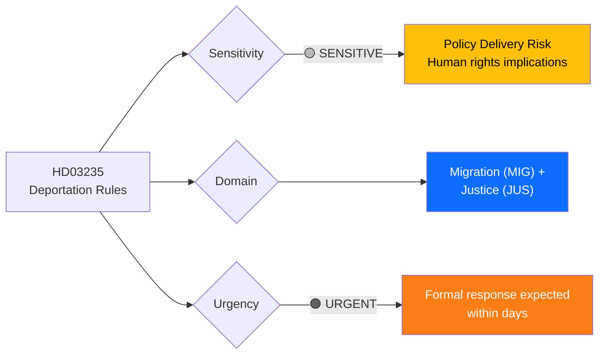
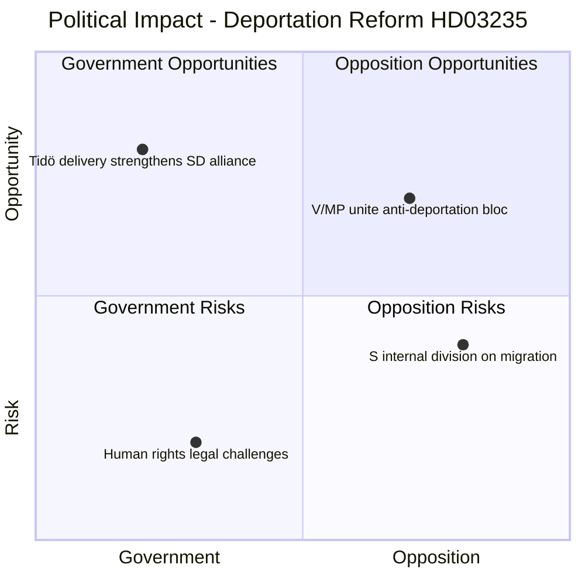

# Document Analysis: Skärpta regler om utvisning på grund av brott

**Generated**: 2026-04-01 14:35 UTC
**dok_id**: HD03235
**Document Type**: proposition (prop)
**Committee**: Justitiedepartementet
**Date**: 2026-04-01
**Author**: Johan Forssell (Justitiedepartementet)
**Riksmöte**: 2025/26
**Significance**: 🔴 High (8/10)
**Confidence**: HIGH (85%)

---

## 📋 Document Identity

| Field | Value |
|-------|-------|
| **Document ID** | `HD03235` |
| **Document Type** | proposition |
| **Title** | Skärpta regler om utvisning på grund av brott |
| **Date** | 2026-04-01 |
| **Riksmöte** | 2025/26 |
| **Source MCP Tool** | get_propositioner, get_dokument |
| **Analysis Timestamp** | 2026-04-01 14:35 UTC |
| **Analyst** | news-realtime-monitor |

---

## 🎯 Executive Summary

The government (M-KD-L with SD support) proposes stricter rules for deporting foreign nationals convicted of crimes (Prop. 2025/26:235). Presented by Justice Minister Johan Forssell on April 1, 2026, this proposition is a core Tidö Agreement deliverable that strengthens the coalition's law-and-order platform. The proposal lowers thresholds for deportation, reduces judicial discretion, and aligns with SD's longstanding demands for harsher immigration enforcement. This is politically significant as it tests opposition unity — S may face internal pressure between pragmatists accepting stricter migration rules and progressives opposing them. Cross-referenced with HD03228 (arms regulation) and HD03214 (cybersecurity), this forms part of a coordinated government "security package" release. **[HIGH confidence]**

---

## 📊 Political Classification

| Field | Assessment |
|-------|-----------|
| **Sensitivity Level** | SENSITIVE |
| **Primary Domain** | Migration (MIG) + Justice (JUS) |
| **Urgency** | URGENT |
| **Significance Score** | 8/10 |
| **Confidence** | HIGH |

---

## 💪 SWOT Impact Assessment

### Quadrant Overview

### Government Coalition Impact

| # | Strength Statement | Evidence (dok_id) | Confidence | Impact | Entry Date |
|---|-------------------|-------------------|:----------:|:------:|:----------:|
| S1 | Delivers core Tidö Agreement commitment on criminal deportation, strengthening SD cooperation | HD03235 | H | H | 2026-04-01 |
| S2 | Coordinated release with HD03228 (arms) and HD03214 (cyber) projects government as strong on security | HD03228, HD03214 | H | M | 2026-04-01 |
| S3 | Justice Minister Forssell leads from high-profile portfolio, boosting M visibility | HD03235 | M | M | 2026-04-01 |

| # | Weakness Statement | Evidence (dok_id) | Confidence | Impact | Entry Date |
|---|-------------------|-------------------|:----------:|:------:|:----------:|
| W1 | Potential EU Convention compliance risks may generate legal challenges from ECHR | HD03235 | M | H | 2026-04-01 |
| W2 | L faces internal tension between liberal values and coalition loyalty on migration | HD03235 | M | M | 2026-04-01 |

| # | Opportunity Statement | Evidence (dok_id) | Confidence | Impact | Entry Date |
|---|----------------------|-------------------|:----------:|:------:|:----------:|
| O1 | Migration reform package could lock in SD support through 2026 budget negotiations | HD03235 | H | H | 2026-04-01 |
| O2 | Public opinion polls consistently favor stricter criminal deportation — electoral advantage | HD03235 | M | H | 2026-04-01 |

| # | Threat Statement | Evidence (dok_id) | Confidence | Impact | Entry Date |
|---|-----------------|-------------------|:----------:|:------:|:----------:|
| T1 | Legal challenges from human rights organizations could delay implementation | HD03235 | M | M | 2026-04-01 |
| T2 | Opposition may frame as disproportionate, testing coalition messaging discipline | HD03235 | M | M | 2026-04-01 |

---

## 🔗 Cross-References

- **HD03228** — Arms regulation reform (same-day security package)
- **HD03214** — Cybersecurity center (same-day security package)
- **HD03215** — Temporary housing for immigrants (migration policy cluster, dated 2026-03-31)
- **HD03229** — New reception law (migration policy cluster, dated 2026-03-31)
- **HDC320260401JuU14** — Today's chamber vote on terrorism
- **HDC320260401JuU11** — Today's chamber vote on criminal law

---

## 📈 Forward Indicators

1. **Watch**: Committee assignment — will JuU handle this, and when is debate scheduled?
2. **Watch**: S response — will Magdalena Andersson's party support or oppose?
3. **Watch**: ECHR/EU Commission reaction to reduced judicial discretion
4. **Trigger**: If S supports, signals bipartisan migration consensus shift
5. **Trigger**: If V/MP file joint reservation, opposition bloc fractures on this issue
