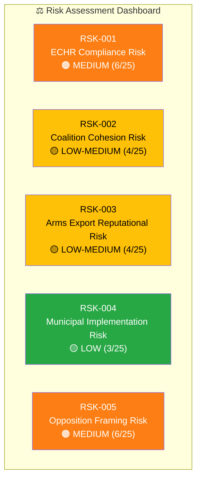
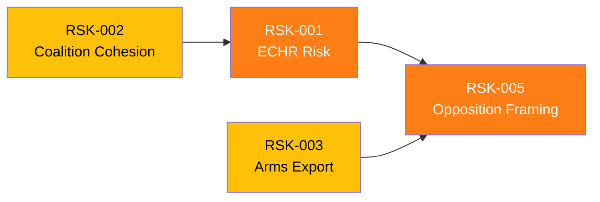

# Political Risk Assessment — 2026-04-01

**Generated**: 2026-04-01 14:41 UTC
**Documents Analyzed**: 66
**Confidence**: HIGH
**Overall Risk Level**: 🟠 MEDIUM

---

## 📊 Risk Dashboard

## Risk Register

| ID | Risk | Likelihood | Impact | Score | Mitigation | Evidence |
|----|------|:----------:|:------:|:-----:|------------|----------|
| RSK-001 | ECHR challenge to deportation reform delays implementation | 3/5 | 4/5 | 🟠 12/25 | Legal pre-screening; phased implementation | HD03235 |
| RSK-002 | L defections on migration vote weaken coalition | 2/5 | 4/5 | 🟡 8/25 | Coalition agreement binds parties | HD03235 |
| RSK-003 | Arms exports to controversial states damage credibility | 2/5 | 3/5 | 🟡 6/25 | End-use certificates; parliamentary oversight | HD03228 |
| RSK-004 | Municipalities resist unfunded healthcare mandate | 2/5 | 2/5 | 🟢 4/25 | SKR consultation; transitional funding | HD03216 |
| RSK-005 | Opposition frames security package as authoritarian | 3/5 | 3/5 | 🟠 9/25 | Bipartisan defense consensus as shield | HD03235, HD03228 |

## Risk Interconnections

**Key insight**: RSK-001 (ECHR) and RSK-005 (opposition framing) are linked — a successful legal challenge would validate the opposition narrative, compounding both risks.
