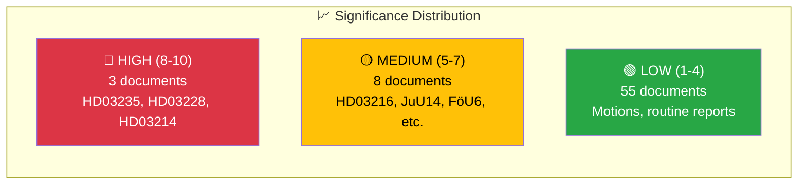

# Significance Scoring — 2026-04-01

**Generated**: 2026-04-01 14:42 UTC
**Documents Analyzed**: 66
**Confidence**: HIGH

---

## 📊 Significance Dashboard

## Scoring Methodology

Score range: 1-10 based on:
- +3 if coalition majority at risk
- +2 if >3 parties involved
- +2 if budget/fiscal implications
- +2 if defense/security policy
- +2 if criminal justice reform
- +1 if named minister involved
- +1 if committee approves government proposal
- -2 if topic covered in last 6 hours

## Top-Scored Documents

| Rank | dok_id | Title | Score | Scoring Rationale |
|:----:|--------|-------|:-----:|-------------------|
| 1 | HD03235 | Utvisning på grund av brott | 8/10 | Criminal justice (+2), minister Forssell (+1), migration policy (+2), SD cooperation (+1) |
| 2 | HD03228 | Regelverk för krigsmateriel | 8/10 | Defense/security (+2), NATO implications (+2), minister Dousa (+1), budget implications (+2), bipartisan expected (-1) |
| 3 | HD03214 | Nationellt cybersäkerhetscenter | 8/10 | Defense/security (+2+2), minister Bohlin (+1), critical infrastructure (+2), bipartisan (-1) |
| 4 | HDC320260401JuU14 | Terrorism beslut | 7/10 | Criminal justice (+2), security (+2), chamber vote (+1), multiple parties (+2) |
| 5 | HDC320260401FöU6 | SIGINT integritetsskydd | 7/10 | Defense (+2), security (+2), privacy implications (+2), chamber vote (+1) |
| 6 | HD03216 | Medicinsk kompetens | 6/10 | Healthcare reform (+2), minister Tenje (+1), municipal impact (+1), multiple SoU votes (+2) |
| 7 | HDC320260401JuU29 | Säkerhetsskydd fastighet | 6/10 | Security (+2), justice (+2), property rights (+1), chamber vote (+1) |
| 8 | HDC320260401SoU19 | Barn och unga socialtjänsten | 6/10 | Social welfare (+2), multi-party debate 7 parties (+2), children's rights (+1), chamber vote (+1) |
