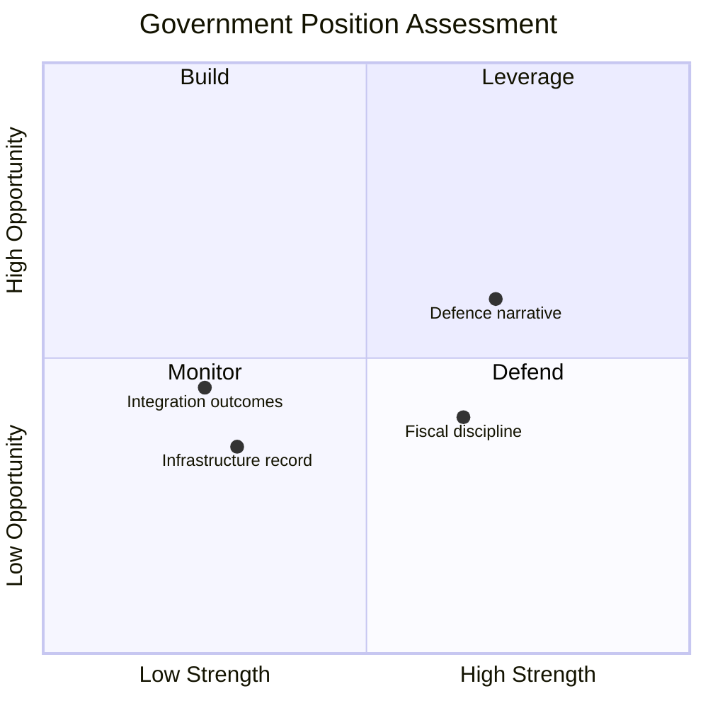

# SWOT Analysis — Interpellations 2026-04-01

**Generated**: 2026-04-01 07:30 UTC | **Improved**: 2026-04-01 (translation workflow)
**Methodology**: political-swot-framework.md v2.1
**Data Sources**: riksdag-regering-mcp get_interpellationer (rm=2025/26)
**Confidence**: MEDIUM

## Government (Tidöpartierna: M, KD, L, SD)

### Strengths
- **Budget control**: Government maintains fiscal discipline narrative [Confidence: HIGH]
- **Defence expansion**: Military build-up aligns with NATO narrative [Confidence: HIGH]

### Weaknesses
- **Infrastructure minister overexposed**: Carlson (KD) targeted by 6 of 16 interpellations [Confidence: HIGH]
- **Integration policy gaps**: ~500,000 foreign-born without employment (HD10421) [Confidence: MEDIUM]
- **Social welfare erosion**: Disability rights scrutiny (HD10411, HD10412, HD10416) [Confidence: MEDIUM]

### Opportunities
- **Datacenter strategy**: National plan (HD10414) as competitiveness narrative [Confidence: MEDIUM]
- **Defence-infrastructure integration**: Reframe military costs as security investment [Confidence: LOW]

### Threats
- **Pre-election coordination**: 12 of 16 interpellations from S [Confidence: HIGH]
- **Infrastructure failures**: Södertälje bridge (HD10419), riksväg 62 (HD10418) [Confidence: MEDIUM]

## Opposition (S, V, MP, C)

### Strengths
- **Coordinated scrutiny**: S (12), V (3), MP (1) parallel themes [Confidence: HIGH]
- **Concrete evidence**: Specific infrastructure failures provide tangible narratives [Confidence: HIGH]

### Weaknesses
- **Over-reliance on S**: 75% from single party [Confidence: HIGH]
- **Absence of C**: Centre Party absent from recent activity [Confidence: HIGH]

## MCP Data Files Used

- `get_interpellationer` (rm=2025/26, limit=16): Party distribution S:12, V:3, MP:1
