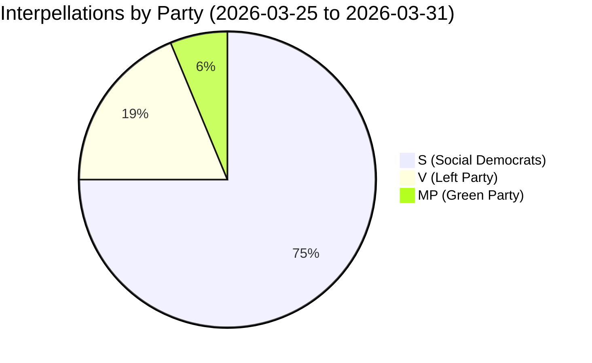

# Analysis Synthesis Summary — 2026-04-01

**Generated**: 2026-04-01 07:30 UTC | **Improved**: 2026-04-01 (translation workflow)
**Data Sources**: riksdag-regering-mcp get_interpellationer (rm=2025/26, limit=16)
**Documents Analyzed**: 16
**Confidence**: MEDIUM — based on 16 most recent interpellations (of 425 total in 2025/26)

## Summary

Analysis of 16 recent interpellations (2026-03-25 to 2026-03-31) reveals **opposition scrutiny concentrated on infrastructure, social policy, and integration**. The Social Democrats (S) dominate with 12 of 16 interpellations, supported by Left Party (V, 3) and Green Party (MP, 1). Key targets include Infrastructure Minister Carlson (KD, 6 interpellations) and Finance Minister Svantesson (M, 2).

## Key Findings

1. **Infrastructure dominance**: 7 of 16 interpellations target infrastructure/transport
2. **Social welfare scrutiny**: 4 interpellations focus on disability rights and social services
3. **Integration debate intensifying**: 3 interpellations challenge government integration policies
4. **Opposition coordination**: S, V, and MP showing parallel scrutiny patterns
5. **Defence-infrastructure nexus**: New scrutiny on military establishment costs (HD10425)

## Top Documents by Significance

| Score | Type | dok_id | Title |
|-------|------|--------|-------|
| 8/10 | Interpellation | HD10421 | Regeringens integrationspolitik |
| 7/10 | Interpellation | HD10422 | Regeringens arbetsmarknads- och integrationspolitik |
| 7/10 | Interpellation | HD10414 | Nationell plan för nya datacenter |
| 7/10 | Interpellation | HD10425 | Infrastrukturkostnader vid försvarsetableringar |
| 6/10 | Interpellation | HD10415 | Statligt säkerställande av bra vård |
| 6/10 | Interpellation | HD10419 | Motorvägsbron i Södertälje |

## Implications

Overall political risk level: **MEDIUM**. Opposition building pre-election narratives around government neglect of basic services and welfare.

## Data Quality Notes

Overall confidence: **MEDIUM**. Analysis covers 16 of 425 interpellations in rm 2025/26.
