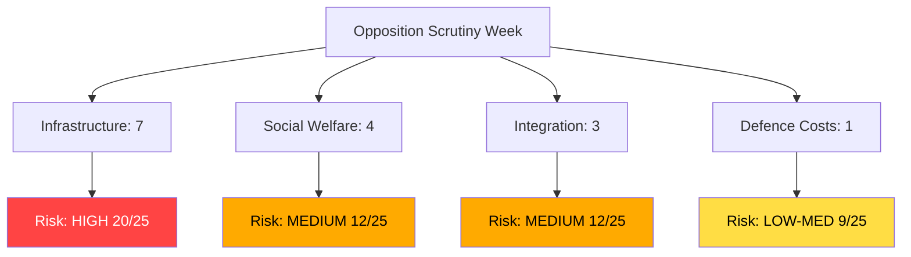

# Threat Analysis — Interpellations 2026-04-01

**Generated**: 2026-04-01 07:30 UTC | **Improved**: 2026-04-01 (translation workflow)
**Methodology**: political-threat-framework.md + political-risk-methodology.md (5×5 matrix)
**Data Sources**: riksdag-regering-mcp get_interpellationer (rm=2025/26)
**Confidence**: MEDIUM

## Threat Indicators

### 1. Pre-Election Opposition Coordination
- **Likelihood**: 4/5 | **Impact**: 3/5 | **Risk Score**: 12/25 — MEDIUM
- **Evidence**: HD10421, HD10422 (integration), HD10414 (datacenter), HD10425 (defence)

### 2. Infrastructure Vulnerability Exposure
- **Likelihood**: 5/5 | **Impact**: 4/5 | **Risk Score**: 20/25 — HIGH
- **Evidence**: HD10419 (Södertälje bridge), HD10418 (riksväg 62), HD10424 (Torsby flight)

### 3. Social Welfare Erosion Narrative
- **Likelihood**: 4/5 | **Impact**: 3/5 | **Risk Score**: 12/25 — MEDIUM
- **Evidence**: HD10411 (assistance), HD10412 (accessibility), HD10415 (healthcare)

### 4. Integration Policy Failure Risk
- **Likelihood**: 3/5 | **Impact**: 4/5 | **Risk Score**: 12/25 — MEDIUM
- **Evidence**: HD10421, HD10422, HD10423 (social dumping)

### 5. Defence-Civil Infrastructure Tension
- **Likelihood**: 3/5 | **Impact**: 3/5 | **Risk Score**: 9/25 — LOW-MEDIUM
- **Evidence**: HD10425 (military establishment infrastructure costs)

## Overall Assessment

Combined threat level: **MEDIUM-HIGH**. Infrastructure vulnerability cluster (20/25) most significant.

## MCP Data Files Used

- `get_interpellationer` (rm=2025/26, limit=16): Source data for all threat indicators
