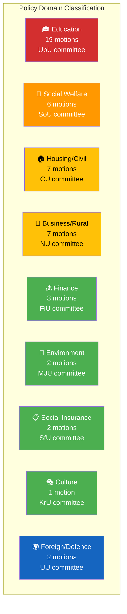

# Political Classification Results — 2026-04-01

**Generated**: 2026-04-02 06:30 UTC
**Classification ID**: CLS-2026-04-01-MOT
**Data Sources**: riksdag-regering-mcp (get_motioner rm=2025/26)
**Documents Analyzed**: 50
**Confidence**: HIGH
**Riksmöte**: 2025/26

---

## 📊 Classification Overview

## Party Distribution

| Party | Motions | Committee Coverage | Key Spokesperson |
|-------|---------|-------------------|-----------------|
| **S (Socialdemokraterna)** | 19 | UbU(7), CU(5), SoU(2), NU(2), FiU(2), MJU(1) | Anders Ygeman (edu), Joakim Järrebring (housing), Fredrik Lundh Sammeli (welfare) |
| **C (Centerpartiet)** | 14 | UbU(7), SoU(3), NU(2), FiU(1), CU(1) | Niels Paarup-Petersen (edu), Christofer Bergenblock (welfare), Anders Ådahl (business) |
| **MP (Miljöpartiet)** | 12 | UbU(5), CU(1), SoU(1), NU(2), SfU(1), KrU(1) | Emma Nohrén (environment) |
| **V (Vänsterpartiet)** | 3 | UU(1), MJU(1), SfU(1) | Maj Karlsson (welfare) |
| **SD (Sverigedemokraterna)** | 1 | NU(1) | Tobias Andersson (copyright) |
| **Unknown** | 1 | UU(1) | — (Nordic cooperation response) |

## Significance Classification

| Significance | Count | dok_ids | Rationale |
|-------------|-------|---------|-----------|
| 🔴 HIGH (8–10) | 2 | HD024017, HD024016 | Welfare reform with cross-party opposition — potential majority impact |
| 🟠 ELEVATED (6–7) | 8 | HD024019, HD024011, HD024047, HD024025, HD024024, HD024018, HD024028, HD024032 | Education/welfare motions with strong policy implications |
| 🟡 MEDIUM (4–5) | 15 | HD024008–015, HD024020–023, HD024038 | Standard opposition motions on housing, business, food safety |
| 🟢 LOW (1–3) | 25 | Remaining motions | Routine proposition responses with limited strategic impact |

## Key Findings

1. **Education dominance**: 19/50 motions (38%) target UbU committee — largest single-committee concentration
2. **Cross-party welfare alignment**: S, V, C, and MP all filed motions against welfare reform propositions
3. **S leads opposition**: 19 motions (38% of total) with broadest committee coverage (6 committees)
4. **SD minimal engagement**: Only 1 motion — effectively supports government on most issues
5. **V focused**: 3 motions but strong positioning on welfare and defence/foreign policy

---

## 📂 MCP Data Files Used

| Tool | Parameters | Documents | Timestamp |
|------|-----------|-----------|-----------|
| `get_motioner` | `rm=2025/26, limit=50` | 50 | 2026-04-02T06:30Z |

---

*Document Control: Analysis by Riksdagsmonitor AI Agent | Classification: PUBLIC | Retention: 1 year*
