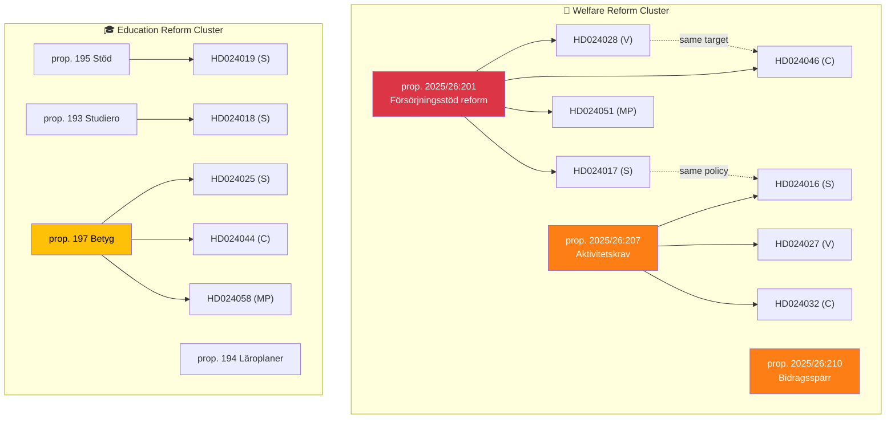

# Cross-Reference Map — 2026-04-01

**Generated**: 2026-04-02 06:30 UTC
**Map ID**: XRF-2026-04-01-MOT
**Data Sources**: riksdag-regering-mcp (get_motioner rm=2025/26)
**Documents Analyzed**: 50
**Confidence**: HIGH

---

## 🔗 Cross-Document Reference Network

## Reference Clusters

### Cluster 1: Welfare Reform (prop. 201 + 207 + 210)
| Motion | Party | Target Proposition | Relationship |
|--------|-------|-------------------|-------------|
| HD024017 | S | prop. 201 | Rejects benefit cap calculation |
| HD024016 | S | prop. 207 | Demands organized crime exclusion |
| HD024028 | V | prop. 201 | Full rejection — "devastating deterioration" |
| HD024027 | V | prop. 207 | Full rejection |
| HD024032 | C | prop. 207 | Demands monitoring provisions |
| HD024046 | C | prop. 201 | Demands impact assessment |
| HD024051 | MP | prop. 201 | Environmental/social justice opposition |
| HD024031 | V | prop. 210 | Opposes benefit lock sanctions |
| HD024052 | MP | prop. 210 | Opposes sanction fees |
| HD024045 | C | prop. 190 | National investigation function for prevention |

### Cluster 2: Education Package (props. 191–198)
| Motion | Party | Target Proposition | Relationship |
|--------|-------|-------------------|-------------|
| HD024019 | S | prop. 195 (school support) | Demands resource guarantees |
| HD024018 | S | prop. 193 (studiero) | Resources must accompany discipline |
| HD024025 | S | prop. 197 (grading) | Transition protections for students |
| HD024024 | S | prop. 191 (transparency) | Full offentlighetsprincipen for all schools |
| HD024022 | S | prop. 194 (curriculum) | Pedagogical freedom concerns |
| HD024023 | S | prop. 196 (teacher time) | Teacher workload concerns |
| HD024021 | S | prop. 198 (vocational) | Vocational education funding |
| HD024044 | C | prop. 197 (grading) | Transition provisions for current students |
| HD024058 | MP | prop. 197 (grading) | Alternative grading approach |

### Cluster 3: Housing/Civil (props. 180, 187, 188, 202, 224)
| Motion | Party | Target Proposition | Relationship |
|--------|-------|-------------------|-------------|
| HD024011 | S | prop. 187 (rental market) | Opposes deposit increase |
| HD024012 | S | prop. 188 (hyrköp) | Rejects rent-to-own proposal |
| HD024009 | S | prop. 202 (habitat) | Environmental compliance concerns |
| HD024047 | MP | prop. 202 (habitat) | Full rejection — EU law concerns |
| HD024040 | C | prop. 202 (habitat) | Environmental protection demands |

---

## 📂 MCP Data Files Used

| Tool | Parameters | Documents | Timestamp |
|------|-----------|-----------|-----------|
| `get_motioner` | `rm=2025/26, limit=50` | 50 | 2026-04-02T06:30Z |

---

*Document Control: Analysis by Riksdagsmonitor AI Agent | Classification: PUBLIC | Retention: 1 year*
