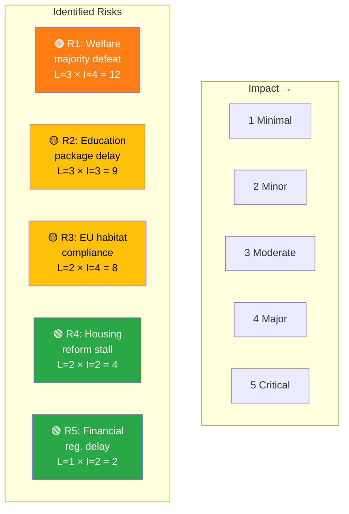
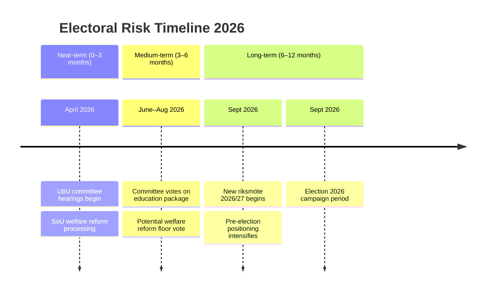
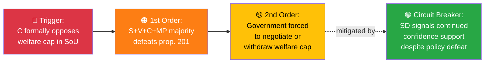

# Political Risk Assessment — 2026-04-01

**Generated**: 2026-04-02 06:30 UTC
**Risk ID**: RSK-2026-04-01-MOT
**Data Sources**: riksdag-regering-mcp (get_motioner rm=2025/26)
**Documents Analyzed**: 50
**Confidence**: HIGH
**Riksmöte**: 2025/26
**Political Context**: Tidölagen coalition (M+KD+L with SD confidence-and-supply) faces coordinated opposition response to spring legislative package. 50 opposition motions filed on 2026-04-01 across education, welfare, housing, and environmental policy.
**Overall Risk Level**: 🟡 MEDIUM

---

## 🗂️ Risk Inventory

### Risk Heat Map

### Risk Register

| Risk ID | Risk Description | L (1–5) | I (1–5) | L×I Score | Tier | Trend | Evidence |
|---------|-----------------|---------|---------|-----------|------|-------|----------|
| R1 | Opposition welfare majority defeats benefit cap reform | 3 | 4 | **12** | 🟠 HIGH | ↑ Rising | HD024017(S), HD024028(V), HD024032(C), HD024046(C), HD024051(MP) — 4 parties oppose |
| R2 | Education package delayed/weakened by 19-motion UbU battle | 3 | 3 | **9** | 🟡 MEDIUM | → Stable | 19 UbU motions from S(7), C(7), MP(5) |
| R3 | EU infringement proceedings from habitat directive exemption | 2 | 4 | **8** | 🟡 MEDIUM | → Stable | HD024047(MP), HD024009(S), HD024040(C) challenge prop. 202 |
| R4 | Housing deregulation stalled by S opposition in CU | 2 | 2 | **4** | 🟢 LOW | → Stable | HD024011(S), HD024012(S) oppose rental/hyrköp reforms |
| R5 | Financial regulation motions delay fund market reform | 1 | 2 | **2** | 🟢 LOW | → Stable | HD024034(C), HD024013(S) filed on FiU matters |

---

## 🤝 Coalition Stability Risk

| Parameter | Value |
|-----------|-------|
| **Coalition** | M + KD + L (Tidöavtalet with SD c&s) |
| **Seat Strength** | 176/349 (with SD support) |
| **Confidence Vote Risk** | LOW |
| **Opposition Majority Risk** | MEDIUM — possible on welfare reform if C joins S+V+MP |

### Risk Factors

| # | Factor | Assessment | Evidence | Confidence |
|---|--------|-----------|----------|------------|
| 1 | SD support holding | ✅ Stable | SD filed only 1 motion (copyright HD024007), no welfare challenges | [HIGH] |
| 2 | L internal cohesion | ✅ Stable | No L motions filed — party aligned with coalition | [MEDIUM] |
| 3 | C welfare positioning | ⚠️ Monitor | C filed welfare monitoring motions (HD024032, HD024046) — not outright rejection | [MEDIUM] |
| 4 | Cross-party opposition formation | ⚠️ Risk | S+V+C+MP all filed welfare motions against same propositions | [HIGH] |

**Collapse Probability (next 90 days)**: LOW (<15%) — coalition fundamentals remain stable despite policy-level opposition.

---

## 📋 Policy Implementation Risk

| Policy | Ministry | Stage | Risk Level | Blocking Factor |
|--------|----------|-------|------------|-----------------|
| Education reform (6 props.) | Utbildningsdep. | Committee review | 🟡 MEDIUM | 19 opposition motions in UbU |
| Welfare benefit cap (prop. 201) | Socialdep. | Committee review | 🟠 HIGH | 4-party opposition (S+V+C+MP) |
| Activity requirements (prop. 207) | Socialdep. | Committee review | 🟠 HIGH | Linked to prop. 201, similar opposition |
| Habitat directive exemption (prop. 202) | Klimatdep. | Committee review | 🟡 MEDIUM | EU compliance concerns from S, C, MP |
| Housing reform (props. 187–188) | Justitiedep. | Committee review | 🟢 LOW | S opposition but likely gov. majority |

---

## 💰 Budget Risk

| Parameter | Value |
|-----------|-------|
| **Budget Year** | 2026 |
| **FiU Status** | Spring budget period — welfare reform has fiscal implications |
| **Surplus/Deficit Projection** | Welfare cap projected savings vs. implementation costs unclear |
| **Risk** | 🟢 LOW — motions don't directly challenge budget framework |

---

## 🗳️ Electoral Risk Timeline

### Electoral Events

| # | Event | Timeline | Risk | Evidence |
|---|-------|----------|------|----------|
| 1 | Committee processing of welfare motions | April–May 2026 | 🟠 HIGH | Cross-party opposition pattern |
| 2 | Education package votes | May–June 2026 | 🟡 MEDIUM | 19-motion battle in UbU |
| 3 | Pre-election positioning | August–September 2026 | 🟡 MEDIUM | S builds welfare narrative for election |

**Pre-election Fragility Index**: MEDIUM — welfare reform opposition could become election issue if not resolved before summer.

---

## ⚡ Escalation & Freshness

| Risk Tier | Freshness Requirement | Re-assessment Trigger |
|-----------|----------------------|----------------------|
| 🔴 Critical | 24 hours | Committee vote announcement |
| 🟠 High | 72 hours | New cross-party coordination signals |
| 🟡 Medium | 7 days | Committee calendar updates |
| 🟢 Low | 30 days | Routine monitoring |

---

## 🔗 Section 5: Cascading Risk Chain

---

## 🌐 Section 6: Risk Interconnection Map

| Risk A | Risk B | Connection | System Impact |
|--------|--------|-----------|---------------|
| R1 (Welfare majority) | R2 (Education delay) | Welfare defeat could **embolden** education opposition | Cascading risk |
| R1 (Welfare majority) | Electoral risk | Welfare defeat becomes **election narrative** for S | Amplifying |
| R3 (EU compliance) | R2 (Education delay) | Unrelated — different committees | None |

**System Fragility Assessment**: MEDIUM — R1 (welfare majority) is the primary systemic risk. If triggered, it could cascade into R2 and electoral risk. R3 is isolated.

---

## 🔮 Section 7: Forward Indicators & Scenario Outlook

| # | Indicator | Timeline | Trigger | Priority |
|---|-----------|----------|---------|----------|
| 1 | C party leadership statement on welfare reform | April 2026 | Public statement or committee position | 🔴 HIGH |
| 2 | UbU committee schedule for education hearings | April 2026 | Committee calendar | 🟡 MEDIUM |
| 3 | SD position confirmation on welfare conditionality | April–May 2026 | Party statement or vote signal | 🟠 HIGH |

### Scenario Outlook

| Scenario | Probability | Trigger | Risk Impact |
|----------|------------|---------|-------------|
| Welfare reform passes with SD support | 55% | SD confirms support | R1 → 🟢 LOW |
| Welfare reform amended after C negotiation | 25% | C demands monitoring provisions | R1 → 🟡 MEDIUM |
| Welfare reform defeated by opposition majority | 15% | C joins S+V+MP | R1 → 🔴 CRITICAL |
| Government withdraws welfare cap provision | 5% | Pre-emptive concession | R1 → Resolved |

---

## 🔑 Risk Summary & Recommendations

### Top 3 Risks
1. **R1 — Welfare majority defeat** (L×I = 12, 🟠 HIGH): Cross-party opposition to benefit cap could command majority if Centre Party joins
2. **R2 — Education package delay** (L×I = 9, 🟡 MEDIUM): 19 motions create significant committee workload
3. **R3 — EU compliance** (L×I = 8, 🟡 MEDIUM): Habitat directive exemption faces environmental law scrutiny

### Recommended Actions
1. **Monitor C party positioning** on welfare reform — their position is decisive for majority calculation
2. **Track UbU committee calendar** for hearing dates on education package
3. **Watch for EU Commission preliminary assessment** of habitat directive exemption proposal

---

## 📂 MCP Data Files Used

| Tool | Parameters | Documents | Timestamp |
|------|-----------|-----------|-----------|
| `get_motioner` | `rm=2025/26, limit=50` | 50 | 2026-04-02T06:30Z |
| `get_sync_status` | — | Health check | 2026-04-02T06:30Z |

### Risk-Specific MCP Tool Usage

| Risk ID | Primary Evidence Source | dok_ids |
|---------|----------------------|---------|
| R1 | get_motioner (welfare motions) | HD024017, HD024028, HD024032, HD024046, HD024051 |
| R2 | get_motioner (education motions) | HD024018–025, HD024033–044, HD024050–066 |
| R3 | get_motioner (environment motions) | HD024009, HD024040, HD024047 |

---

*Document Control: Analysis by Riksdagsmonitor AI Agent | Classification: PUBLIC | Retention: 1 year*
