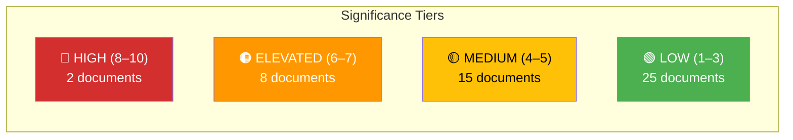

# Significance Scoring — 2026-04-01

**Generated**: 2026-04-02 06:30 UTC
**Scoring ID**: SIG-2026-04-01-MOT
**Data Sources**: riksdag-regering-mcp (get_motioner rm=2025/26)
**Documents Analyzed**: 50
**Confidence**: HIGH
**Riksmöte**: 2025/26

---

## 📊 Significance Distribution

## Top 10 Documents by Significance

| Rank | Score | dok_id | Title (abbreviated) | Party | Committee | Rationale |
|------|-------|--------|---------------------|-------|-----------|-----------|
| 1 | **8/10** | HD024017 | Reformerat försörjningsstöd — bidragstak | S | SoU | Cross-party opposition (S+V+C+MP); welfare cap impacts vulnerable citizens [HIGH] |
| 2 | **8/10** | HD024016 | Aktivitetskrav försörjningsstöd | S | SoU | Linked to HD024017; activity requirement paired with benefit cap [HIGH] |
| 3 | **7/10** | HD024019 | Förbättrat stöd i skolan | S | UbU | S demands resources accompany school support reform; part of 6-prop package [HIGH] |
| 4 | **7/10** | HD024028 | Reformerat försörjningsstöd (V) | V | SoU | V calls reform "devastating deterioration" — strongest language [HIGH] |
| 5 | **7/10** | HD024011 | En mer flexibel hyresmarknad | S | CU | Rental market deregulation; S opposes deposit increase to 3 months [MEDIUM] |
| 6 | **7/10** | HD024047 | Undantag art-/habitatdirektivet (MP) | MP | CU | EU compliance risk; MP demands full rejection [MEDIUM] |
| 7 | **6/10** | HD024025 | Ett likvärdigt betygssystem | S | UbU | Grading reform — S, C, MP each file separate motions [MEDIUM] |
| 8 | **6/10** | HD024024 | Offentlighetsprincipen i skolväsendet | S | UbU | Transparency for private schools — S opposes exemptions [MEDIUM] |
| 9 | **6/10** | HD024032 | Aktivitetskrav (C) | C | SoU | C demands implementation monitoring — softer than S/V rejection [MEDIUM] |
| 10 | **6/10** | HD024018 | Trygghet och studiero i skolan | S | UbU | S demands resources paired with discipline measures [MEDIUM] |

## Scoring Methodology

Significance is scored 0–10 based on:
- **Policy impact** (0–3): Breadth of affected population and fiscal implications
- **Political dynamics** (0–3): Cross-party alignment, coalition stress indicators
- **Strategic importance** (0–2): Election relevance, narrative value
- **Urgency** (0–2): Timeline pressure, committee scheduling

## Urgency Assessment

| Level | Count | Description | Examples |
|-------|-------|-------------|----------|
| 🔴 Immediate | 0 | Requires same-day attention | — |
| 🟠 This week | 2 | Welfare reform motions (HD024017, HD024016) — committee scheduling imminent | SoU processing |
| 🟡 This month | 8 | Education package motions — UbU hearings April 2026 | UbU education motions |
| 🟢 Routine | 40 | Standard committee processing timeline | Remaining motions |

---

## 📂 MCP Data Files Used

| Tool | Parameters | Documents | Timestamp |
|------|-----------|-----------|-----------|
| `get_motioner` | `rm=2025/26, limit=50` | 50 | 2026-04-02T06:30Z |

---

*Document Control: Analysis by Riksdagsmonitor AI Agent | Classification: PUBLIC | Retention: 1 year*
