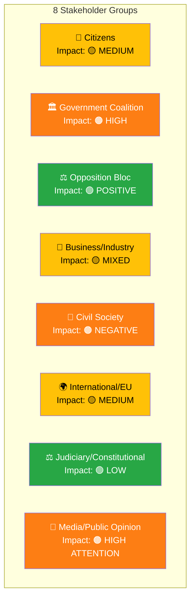

# Stakeholder Perspectives Analysis — 2026-04-01

**Generated**: 2026-04-02 06:30 UTC
**Stakeholder ID**: STK-2026-04-01-MOT
**Data Sources**: riksdag-regering-mcp (get_motioner rm=2025/26)
**Documents Analyzed**: 50
**Confidence**: HIGH
**Riksmöte**: 2025/26

---

## 👥 Multi-Stakeholder Impact Analysis

---

### 1. 👥 Citizens

| Aspect | Assessment | Evidence | Confidence |
|--------|-----------|----------|------------|
| **Welfare recipients** | 🔴 Negative — benefit caps threaten income security for vulnerable families | HD024017 (S): "avslå propositionen i de delar som avser ny beräkning" — rejects new calculation method | [HIGH] |
| **School students** | 🟡 Mixed — grading reform aims for equity but transition risks for current students | HD024025 (S), HD024044 (C): both demand transition protections for students mid-education | [HIGH] |
| **Renters** | 🟡 Mixed — rental market flexibilization may increase costs but improve mobility | HD024011 (S): opposes security deposit increase to 3 months | [MEDIUM] |
| **Rural communities** | 🟢 Positive — rural policy proposition draws constructive C alternative proposals | HD024038 (C): demands "mer ambitiös reformagenda för landsbygderna" | [MEDIUM] |

---

### 2. 🏛️ Government Coalition (M+KD+L, SD c&s)

| Aspect | Assessment | Evidence | Confidence |
|--------|-----------|----------|------------|
| **Legislative agenda** | 🟠 Challenged — 50 motions across core policy areas signal intense committee battles | 19 UbU + 6 SoU + 7 CU + 7 NU motions | [HIGH] |
| **SD relationship** | 🟢 Stable — SD filed only 1 motion (copyright), tacitly supports welfare agenda | HD024007 (SD) only motion; no SD welfare/education motions | [HIGH] |
| **Coalition discipline** | 🟢 Strong — no internal dissent visible; L absence from motions confirms alignment | No L or KD opposition motions filed | [HIGH] |
| **Policy delivery risk** | 🟠 Elevated — welfare reform faces potential opposition majority | HD024017+HD024028+HD024032+HD024046+HD024051 = S+V+C+MP alignment | [HIGH] |

---

### 3. ⚖️ Opposition Bloc

| Aspect | Assessment | Evidence | Confidence |
|--------|-----------|----------|------------|
| **S leadership** | 🟢 Strong — 19 motions demonstrate systematic policy coverage | HD024008–026: Anders Ygeman (education), Fredrik Lundh Sammeli (welfare), Joakim Järrebring (housing) | [HIGH] |
| **C engagement** | 🟢 Active — 14 motions show constructive opposition across education and welfare | HD024032–046: Niels Paarup-Petersen (education), Anders Ådahl (business), Martin Ådahl (finance) | [HIGH] |
| **MP presence** | 🟢 Active — 12 motions focus on environment and education | HD024047–066: Emma Nohrén (environment), various (education) | [HIGH] |
| **V positioning** | 🟡 Limited — 3 motions but strong on welfare opposition | HD024028 (welfare), HD024029 (NATO), HD024030 (hunting) | [MEDIUM] |
| **SD role** | 🟡 Ambiguous — 1 motion only, effectively supporting government on most issues | HD024007 (copyright) — SD as quasi-opposition/quasi-coalition | [HIGH] |

---

### 4. 💼 Business/Industry

| Aspect | Assessment | Evidence | Confidence |
|--------|-----------|----------|------------|
| **Housing market** | 🟢 Positive — rent-to-own and flexible rental market benefit property sector | S opposes (HD024011, HD024012), suggesting gov proposals favor market actors | [MEDIUM] |
| **Competition tools** | 🟡 Mixed — new competition enforcement tools affect both public and private sector | HD024015 (S), HD024057 (MP) challenge competition proposition | [MEDIUM] |
| **Vocational training** | 🟢 Positive — education reform includes vocational education improvements | HD024021 (S), HD024042 (C) engage with prop. 198 on yrkesutbildning | [MEDIUM] |
| **Private schools** | 🟠 Negative — transparency requirements increase compliance burden | HD024024 (S) demands full offentlighetsprincipen for all school operators | [HIGH] |

---

### 5. 🤝 Civil Society

| Aspect | Assessment | Evidence | Confidence |
|--------|-----------|----------|------------|
| **Social welfare organizations** | 🔴 Concerned — benefit caps threaten clients of social services | HD024028 (V): "genomgripande försämring av det yttersta" — devastating deterioration of safety net | [HIGH] |
| **Education organizations** | 🟡 Engaged — all parties show interest in school quality, but different visions | 19 UbU motions reflect diverse educational stakeholder concerns | [HIGH] |
| **Environmental groups** | 🟠 Alarmed — habitat directive exemption weakens environmental protections | HD024047 (MP): demands full rejection of prop. 202 | [HIGH] |
| **Cultural sector** | 🟡 Divided — private copying compensation debate affects creators vs. consumers | HD024007 (SD), HD024037 (C) both oppose current proposal | [MEDIUM] |

---

### 6. 🌍 International/EU

| Aspect | Assessment | Evidence | Confidence |
|--------|-----------|----------|------------|
| **EU compliance** | 🟡 Risk — habitat directive exemption could trigger infringement proceedings | HD024047 (MP), HD024009 (S): both cite EU law incompatibility | [MEDIUM] |
| **Nordic cooperation** | 🟢 Neutral — Nordic cooperation motion (HD024039) is routine annual response | HD024039: response to skr. 2025/26:90 Nordiskt samarbete | [HIGH] |
| **NATO positioning** | 🟡 Notable — V files motion on NATO activities report | HD024029 (V): response to skr. 2025/26:151 on NATO operations | [MEDIUM] |

---

### 7. ⚖️ Judiciary/Constitutional

| Aspect | Assessment | Evidence | Confidence |
|--------|-----------|----------|------------|
| **Enforcement reform** | 🟢 Normal — proportionality principle codification is standard legislative work | HD024008 (S): technical concerns on enforcement rule changes | [HIGH] |
| **Social insurance law** | 🟡 Moderate — bidragsspärr (benefit lock) raises proportionality questions | HD024031 (V), HD024052 (MP): challenge prop. 210 sanktionsavgift | [MEDIUM] |

---

### 8. 📰 Media/Public Opinion

| Aspect | Assessment | Evidence | Confidence |
|--------|-----------|----------|------------|
| **News value** | 🟠 High — welfare reform and school policy are voter-salient topics | Försörjningsstöd and education dominate the motion batch | [HIGH] |
| **Narrative framing** | 🟡 Contested — S "social protection" vs. gov "work incentives" narrative | HD024017 (S) vs. prop. 201 (gov) framing battle | [HIGH] |
| **Public attention** | 🟠 Elevated — 50 motions in single day signal intense political activity | Unusual volume suggests coordinated opposition response to spring package | [MEDIUM] |

---

## Cross-Stakeholder Impact Matrix

| Policy Area | Citizens | Gov. | Opp. | Business | Civil Soc. | Intl/EU | Judiciary | Media |
|------------|---------|------|------|----------|-----------|---------|-----------|-------|
| **Education** | 🟡 Mixed | 🟠 Challenged | 🟢 Strong | 🟡 Mixed | 🟡 Engaged | 🟢 Neutral | 🟢 Neutral | 🟠 High |
| **Welfare** | 🔴 Negative | 🟠 Threatened | 🟢 United | 🟢 Neutral | 🔴 Alarmed | 🟢 Neutral | 🟡 Watch | 🟠 High |
| **Housing** | 🟡 Mixed | 🟢 Supported | 🟡 Divided | 🟢 Positive | 🟡 Mixed | 🟢 Neutral | 🟢 Neutral | 🟡 Moderate |
| **Environment** | 🟡 Mixed | 🟡 Risk | 🟢 Active | 🟢 Positive | 🟠 Alarmed | 🟡 Risk | 🟢 Neutral | 🟡 Moderate |

---

## 📂 MCP Data Files Used

| Tool | Parameters | Documents | Timestamp |
|------|-----------|-----------|-----------|
| `get_motioner` | `rm=2025/26, limit=50` | 50 | 2026-04-02T06:30Z |

---

*Document Control: Analysis by Riksdagsmonitor AI Agent | Classification: PUBLIC | Retention: 1 year*
