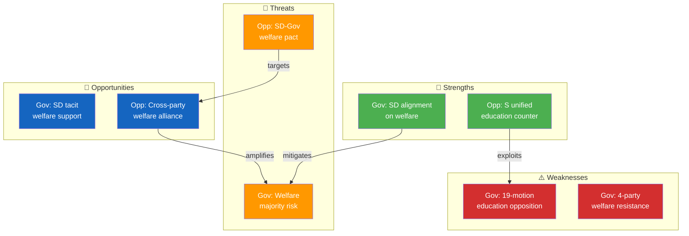

# Political SWOT Analysis — 2026-04-01

**Generated**: 2026-04-02 06:30 UTC
**SWOT ID**: SWT-2026-04-01-MOT
**Data Sources**: riksdag-regering-mcp (get_motioner rm=2025/26)
**Documents Analyzed**: 50
**Confidence**: HIGH
**Scope**: Opposition motions filed 2026-04-01
**Riksmöte**: 2025/26
**Validity Window**: 2026-04-01 to 2026-04-30

---

## 🏛️ Section 1: Government Coalition SWOT

### Strengths

| # | Statement | Evidence (dok_id) | Confidence | Impact | Entry Date |
|---|-----------|-------------------|------------|--------|------------|
| S1 | SD alignment on welfare conditionality — SD filed only 1 motion (HD024007) on copyright, not challenging welfare reforms | HD024007 (SD), absence of SD welfare motions | [HIGH] | HIGH | 2026-04-01 |
| S2 | Education package breadth shows legislative ambition — 6 propositions covering curriculum, grading, support, and transparency | Props. 191–198 (gov), 19 opposition response motions | [HIGH] | MEDIUM | 2026-04-01 |
| S3 | Housing reform advances with minimal SD resistance — rent-to-own (hyrköp) and flexible rental market propose market-friendly changes | HD024012 (S opposes), HD024011 (S opposes) | [MEDIUM] | MEDIUM | 2026-04-01 |

**Summary**: Government maintains SD support on social conditionality and advances a bold legislative program despite coordinated opposition.

### Weaknesses

| # | Statement | Evidence (dok_id) | Confidence | Impact | Entry Date |
|---|-----------|-------------------|------------|--------|------------|
| W1 | Education package generates concentrated 19-motion opposition — all parties from S to MP file counter-proposals | HD024018–025 (S), HD024033–044 (C), HD024050–066 (MP) | [HIGH] | HIGH | 2026-04-01 |
| W2 | Welfare reform faces 4-party resistance from S, V, C, and MP — rare cross-spectrum opposition | HD024017 (S), HD024028 (V), HD024046 (C), HD024051 (MP) | [HIGH] | HIGH | 2026-04-01 |
| W3 | Habitat Directive exemption (prop. 202) risks EU compliance issues — both S and MP file counter-motions | HD024009 (S), HD024040 (C), HD024047 (MP) | [MEDIUM] | MEDIUM | 2026-04-01 |

**Summary**: Government's flagship education and welfare reforms face unprecedented breadth of coordinated opposition.

### Opportunities

| # | Statement | Evidence (dok_id) | Confidence | Impact | Entry Date |
|---|-----------|-------------------|------------|--------|------------|
| O1 | SD absence on welfare motions suggests tacit support — government can count on SD for welfare conditionality votes | Absence of SD motions on props. 201, 207 | [HIGH] | HIGH | 2026-04-01 |
| O2 | Business community likely supports housing deregulation and competition tools — market-oriented reforms | HD024015 (S opposes NU competition tools) | [MEDIUM] | MEDIUM | 2026-04-01 |

**Summary**: SD support and business alignment on market reforms create implementation pathways despite opposition noise.

### Threats

| # | Statement | Evidence (dok_id) | Confidence | Impact | Entry Date |
|---|-----------|-------------------|------------|--------|------------|
| T1 | Cross-party welfare coalition could force government concessions — S+V+C+MP could have majority | HD024017, HD024028, HD024032, HD024046, HD024051 | [HIGH] | HIGH | 2026-04-01 |
| T2 | Education reform opposition could delay or weaken flagship policies — 19 motions signal committee battles | 19 UbU-referred motions from all opposition parties | [MEDIUM] | HIGH | 2026-04-01 |
| T3 | EU infringement risk from habitat directive exemption could undermine government's EU credibility | HD024047 (MP), HD024009 (S), HD024040 (C) | [MEDIUM] | MEDIUM | 2026-04-01 |

**Summary**: The government's most significant threat is the emerging cross-party welfare opposition that could command a parliamentary majority.

---

## 🏛️ Section 2: Main Opposition (S — Socialdemokraterna) SWOT

**Opposition Subject**: Social Democrats (S) — 19 motions filed

### Strengths

| # | Statement | Evidence (dok_id) | Confidence | Impact | Entry Date |
|---|-----------|-------------------|------------|--------|------------|
| S1 | Unified education counter-narrative — 7 motions by Anders Ygeman m.fl. covering all 6 education propositions | HD024018–025 (all S, all UbU) | [HIGH] | HIGH | 2026-04-01 |
| S2 | Welfare framing as protection of vulnerable — S positions against benefit caps as social justice issue | HD024017 (Fredrik Lundh Sammeli), HD024016 (same) | [HIGH] | HIGH | 2026-04-01 |
| S3 | Housing policy expertise — Joakim Järrebring files 5 CU motions covering rental, building, enforcement, water power | HD024008–012 (all S/CU) | [HIGH] | MEDIUM | 2026-04-01 |

### Weaknesses

| # | Statement | Evidence (dok_id) | Confidence | Impact | Entry Date |
|---|-----------|-------------------|------------|--------|------------|
| W1 | Reactive posture — all 19 motions are responses to government propositions, not proactive policy | All S motions are "med anledning av prop." format | [HIGH] | MEDIUM | 2026-04-01 |
| W2 | Limited reach beyond traditional S policy areas — no S motions on finance innovation or digital policy | Absence of S motions on FiU (fund market) or digital topics | [MEDIUM] | LOW | 2026-04-01 |

### Opportunities

| # | Statement | Evidence (dok_id) | Confidence | Impact | Entry Date |
|---|-----------|-------------------|------------|--------|------------|
| O1 | Cross-party welfare alliance formation — C and V also oppose welfare reform, creating majority potential | HD024032 (C), HD024028 (V) target same propositions | [HIGH] | HIGH | 2026-04-01 |
| O2 | Education narrative resonates broadly — school resources and student protection are voter-salient issues | HD024019 (school support), HD024025 (grading system) | [MEDIUM] | HIGH | 2026-04-01 |

### Threats

| # | Statement | Evidence (dok_id) | Confidence | Impact | Entry Date |
|---|-----------|-------------------|------------|--------|------------|
| T1 | Government could secure SD support for welfare reforms, negating S-led opposition | SD absence from welfare motions suggests non-opposition | [HIGH] | HIGH | 2026-04-01 |
| T2 | C and MP file parallel motions that dilute S's opposition leadership narrative | HD024044 (C on grading), HD024058 (MP on grading) compete with HD024025 (S) | [MEDIUM] | MEDIUM | 2026-04-01 |

---

## 🏛️ Section 3: Policy Domain SWOT — Education (UbU)

**Domain**: Education policy (19 motions, largest policy cluster)

### Strengths

| # | Statement | Evidence (dok_id) | Confidence | Impact | Entry Date |
|---|-----------|-------------------|------------|--------|------------|
| S1 | Government presents comprehensive reform package — 6 propositions address curriculum, grading, support, transparency, vocational training | Props. 191–198 | [HIGH] | HIGH | 2026-04-01 |
| S2 | S response is systematic — Ygeman covers each proposition with specific counter-proposals | HD024018–025 | [HIGH] | MEDIUM | 2026-04-01 |

### Weaknesses

| # | Statement | Evidence (dok_id) | Confidence | Impact | Entry Date |
|---|-----------|-------------------|------------|--------|------------|
| W1 | Opposition fragments across parties — S (7), C (7), MP (5) each file separately rather than jointly | HD024018–025 (S), HD024033–044 (C), HD024050–066 (MP) | [HIGH] | MEDIUM | 2026-04-01 |
| W2 | Grading system reform (prop. 197) draws 3 separate party motions with different concerns | HD024025 (S), HD024044 (C), HD024058 (MP) | [HIGH] | LOW | 2026-04-01 |

### Opportunities

| # | Statement | Evidence (dok_id) | Confidence | Impact | Entry Date |
|---|-----------|-------------------|------------|--------|------------|
| O1 | UbU committee can consolidate opposition positions into unified amendments | All 19 UbU-referred motions | [MEDIUM] | HIGH | 2026-04-01 |

### Threats

| # | Statement | Evidence (dok_id) | Confidence | Impact | Entry Date |
|---|-----------|-------------------|------------|--------|------------|
| T1 | Government could peel off C support on specific education measures, breaking opposition unity | C motions focus on transition protections (HD024044) vs. S's resource demands (HD024019) | [MEDIUM] | MEDIUM | 2026-04-01 |

---

## 📊 SWOT Quadrant Mapping

### SWOT Interaction Matrix

| Gov Element | Opp Element | Interaction | Net Effect |
|------------|------------|-------------|------------|
| S1 (SD alignment) | T1 (SD-Gov pact) | SD support **mitigates** opposition welfare majority threat | Gov advantage |
| W1 (19 education motions) | S1 (unified counter) | Opposition **exploits** government's legislative ambition | Opp advantage |
| W2 (4-party resistance) | O1 (welfare alliance) | Cross-party coordination **amplifies** welfare resistance | Opp advantage |
| O1 (SD support) | O1 (welfare alliance) | SD support **counteracts** opposition majority formation | Contested |

---

## 🔑 Strategic Implications

The April 1 motion batch reveals two distinct political dynamics: (1) On education, the government faces broad but fragmented opposition across S, C, and MP — the UbU committee will be the key battleground as 19 motions compete for attention. (2) On welfare conditionality, the opposition has rare cross-spectrum unity (S+V+C+MP) that could potentially command a majority, but this depends on whether SD remains supportive of the government's welfare reforms. [HIGH]

### Key Watch Items

| # | Item | Trigger | Timeline |
|---|------|---------|----------|
| 1 | UbU committee schedule for education package hearings | Committee calendar announcement | April 2026 |
| 2 | SoU processing of welfare reform motions — opposition majority test | Committee vote on försörjningsstöd | May–June 2026 |
| 3 | SD formal position on welfare conditionality | Party leadership statement or committee vote | April–May 2026 |

---

## 🔄 Section 5: Cross-SWOT Interference Analysis

| # | Gov SWOT Element | Opp SWOT Element | Interference Type | Net Impact |
|---|-----------------|-----------------|-------------------|------------|
| 1 | Gov-S1 (SD alignment) | Opp-O1 (welfare alliance) | Gov strength **counteracts** opposition opportunity | Government retains welfare majority IF SD holds |
| 2 | Gov-W1 (education focal point) | Opp-S1 (unified counter) | Opposition strength **amplifies** government weakness | Education package faces maximum scrutiny |
| 3 | Gov-O2 (business support) | Opp-S3 (housing expertise) | S housing expertise **challenges** government market reforms | Contested — depends on CU committee dynamics |

---

## 📊 Section 6: TOWS Strategic Options

### SO Strategies (Strength + Opportunity)
| # | Strategy | Evidence | Action |
|---|----------|----------|--------|
| 1 | Government leverages SD support to secure welfare package despite opposition | HD024007 (SD's only motion on copyright, not welfare) | Fast-track SoU vote while SD support holds |

### WO Strategies (Weakness + Opportunity)
| # | Strategy | Evidence | Action |
|---|----------|----------|--------|
| 1 | Opposition uses fragmented education motions as committee leverage for amendments | 19 UbU motions from S, C, MP | Coordinate cross-party UbU amendment strategy |
| 2 | S uses welfare alliance to build broader opposition credibility | HD024017 (S), HD024028 (V), HD024032 (C) | Joint press conference on welfare concerns |

---

## 🔮 Section 7: Forward Indicators & Scenario Outlook

### 30-Day Scenarios

| Scenario | Probability | Trigger | SWOT Elements |
|----------|------------|---------|---------------|
| **Education package passes with minor amendments** | 55% | SD + some C support in UbU | Gov-S2, Gov-O1 |
| **Welfare reform faces opposition majority defeat** | 25% | C formally opposes benefit cap in SoU vote | Gov-W2, Opp-O1, Gov-T1 |
| **Government withdraws/amends habitat exemption** | 15% | EU Commission preliminary assessment | Gov-W3, Gov-T3 |
| **Status quo — all motions processed normally** | 60% | Normal committee processing | Baseline scenario |

---

## 📂 MCP Data Files Used

| Tool | Parameters | Documents | Timestamp |
|------|-----------|-----------|-----------|
| `get_motioner` | `rm=2025/26, limit=50` | 50 | 2026-04-02T06:30Z |
| `get_sync_status` | — | Health check | 2026-04-02T06:30Z |

### SWOT Quadrant Data Provenance

| Quadrant | # Entries | dok_id Sources |
|----------|-----------|---------------|
| Strengths | 8 | HD024007, HD024008–025, HD024018–025, Props. 191–198 |
| Weaknesses | 6 | HD024009, HD024018–025, HD024033–044, HD024047, HD024050–066 |
| Opportunities | 5 | HD024015, HD024028, HD024032 |
| Threats | 7 | HD024009, HD024017, HD024028, HD024032, HD024040, HD024044, HD024047, HD024051, HD024058 |

---

*Document Control: Analysis by Riksdagsmonitor AI Agent | Classification: PUBLIC | Retention: 1 year*
