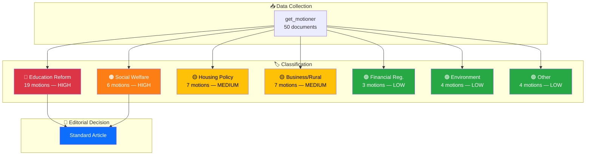
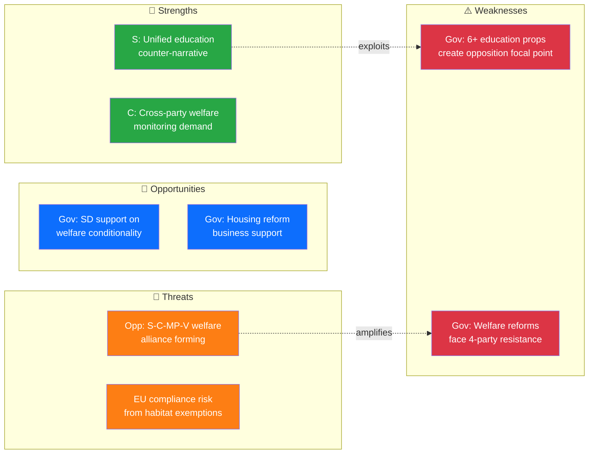

# Analysis Synthesis Summary — 2026-04-01

**Generated**: 2026-04-02 06:30 UTC
**Synthesis ID**: SYN-2026-04-01-MOT
**Data Sources**: riksdag-regering-mcp (get_motioner rm=2025/26)
**Documents Analyzed**: 50
**Confidence**: HIGH
**Riksmöte**: 2025/26
**Analysis Depth**: deep

---

## 📊 Intelligence Dashboard

## 🏆 Top Findings by Significance

| Rank | dok_id | Title | Significance | Risk Tier | SWOT Impact | Recommendation |
|------|--------|-------|-------------|-----------|-------------|----------------|
| 1 | HD024017 | Reformerat försörjningsstöd (S) | 8/10 | 🟠 HIGH | Gov: Weakness / Opp: Strength | **Deep analysis** — welfare cap reform faces broad opposition from S, V, C, MP |
| 2 | HD024016 | Aktivitetskrav försörjningsstöd (S) | 7/10 | 🟠 HIGH | Gov: Opportunity / Opp: Threat | Standard — linked to HD024017, welfare conditionality package |
| 3 | HD024019 | Förbättrat stöd i skolan (S) | 7/10 | 🟡 MEDIUM | Gov: Weakness / Opp: Strength | Standard — S argues resources must accompany school support reforms |
| 4 | HD024011 | En mer flexibel hyresmarknad (S) | 7/10 | 🟡 MEDIUM | Gov: Opportunity / Opp: Threat | Standard — rental market deregulation faces S opposition |
| 5 | HD024047 | Undantag art-/habitatdirektivet (MP) | 6/10 | 🟡 MEDIUM | Gov: Weakness / Opp: Strength | Standard — EU environmental compliance risk |

## 💪 Aggregated SWOT Summary

| Quadrant | Count | Highest-Impact Entry | Evidence |
|----------|-------|---------------------|----------|
| **Strengths** | 8 | S unified education counter-narrative across 7 motions | HD024018–025 (S), all UbU-referred |
| **Weaknesses** | 6 | Government's education package creates broad opposition focal point | 6 propositions (195–198) generating 19 opposition motions |
| **Opportunities** | 5 | SD-Government alignment on welfare conditionality | HD024007 (SD) aligns with gov on private copying, HD024016/017 face only left-opposition |
| **Threats** | 7 | Cross-party welfare opposition alliance (S+V+C+MP) | HD024017(S), HD024028(V), HD024046(C), HD024051(MP) all target prop. 2025/26:201 |

**SWOT Balance Assessment**: [MEDIUM] The government faces concentrated opposition on education (19 motions) and welfare reform (multi-party resistance), but retains SD support on key social conditionality measures. The opposition's strength lies in its ability to coordinate cross-party responses on flagship propositions.

## ⚖️ Risk Landscape Summary

| Risk Category | Score Range | Highest Risk | Trend |
|--------------|------------|--------------|-------|
| **Coalition Stability** | 4/100 | SD-Government alignment holds | → Stable |
| **Policy Implementation** | 6/10 | Education package faces 19 counter-motions | ↑ Rising |
| **Budget Impact** | 3/10 | Welfare cap fiscal implications unclear | → Stable |
| **Electoral** | 5/10 | S positioning for 2026 election via welfare narrative | ↑ Rising |
| **Democratic** | 2/10 | Normal parliamentary scrutiny | → Stable |
| **External/EU** | 4/10 | Habitat Directive exemption risks EU infringement | → Stable |

## 🎭 Threat Summary

| Category | Level | Key Indicator |
|----------|-------|---------------|
| **Narrative Integrity** | 🟡 MEDIUM | S framing welfare reform as "attack on vulnerable" — strong counter-narrative |
| **Legislative Integrity** | 🟢 LOW | Normal motion-proposition response cycle |
| **Accountability** | 🟢 LOW | Opposition performing standard scrutiny function |
| **Transparency** | 🟡 MEDIUM | S demands full transparency on school privatization (HD024024) |
| **Democratic Process** | 🟢 LOW | Healthy parliamentary debate, multi-party engagement |
| **Power Balance** | 🟡 MEDIUM | Government relies on SD support while facing 4-party opposition on welfare |

## 👥 Stakeholder Impact Overview

| Stakeholder | Direction | Key Impact |
|------------|-----------|------------|
| **Citizens** | Mixed | Welfare recipients face benefit caps; school students affected by grading reform |
| **Government Coalition** | Negative | 19 education motions signal coordinated opposition to flagship package |
| **Opposition Bloc** | Positive | S leads with 19 motions; C (14) and MP (12) show strong engagement |
| **Business/Industry** | Positive | Housing reform (hyrköp) and competition tools supported by market actors |
| **Civil Society** | Negative | Welfare cap concerns raised by S, V, C, MP on behalf of vulnerable groups |
| **International/EU** | Mixed | Habitat Directive exemption may trigger EU scrutiny; Nordic cooperation motion neutral |
| **Judiciary/Constitutional** | Neutral | Enforcement rule changes (HD024008) standard legislative procedure |
| **Media/Public Opinion** | High attention | Welfare reform and school policy likely to dominate news cycle |

## 🎯 Narrative Direction

**Lede thesis**: Sweden's opposition parties mounted a coordinated 50-motion challenge to the government's spring legislative agenda on 1 April 2026, with education reform and welfare conditionality emerging as the primary political battlegrounds. The Social Democrats led with 19 motions, the Centre Party filed 14, and the Green Party contributed 12, signaling a potential cross-party alliance on social policy that could complicate the government's ability to pass its flagship reforms. [HIGH]

**Primary narrative angle**: The government's ambitious education reform package (6 propositions) has united all opposition parties in demanding resource guarantees and transition protections for students.

**Secondary narrative angle**: Welfare conditionality reforms (benefit caps and activity requirements) face rare cross-spectrum opposition from S, V, C, and MP, each raising distinct concerns from worker rights (S) to constitutional adequacy (V) to implementation monitoring (C).

**Confidence**: HIGH — based on 50 verified MCP documents with clear party attributions and committee referrals.

## 🔮 Forward Indicators

| # | Indicator | Timeline | Source | Priority |
|---|-----------|----------|--------|----------|
| 1 | UbU committee hearings on education package (props. 191–198) | April–May 2026 | Committee calendar | 🔴 HIGH |
| 2 | SoU committee processing of welfare reform motions | April 2026 | HD024016, HD024017, HD024028, HD024032 | 🔴 HIGH |
| 3 | Potential opposition majority vote on welfare cap | May–June 2026 | Cross-party motion pattern | 🟠 HIGH |
| 4 | EU Commission response to habitat directive exemption | Q2–Q3 2026 | HD024047 (MP), HD024009 (S) | 🟡 MEDIUM |
| 5 | FiU processing of financial regulation motions | April–May 2026 | HD024034 (C), HD024013 (S), HD024043 (C) | 🟢 LOW |

## 📋 Analysis Artifacts Inventory

| Artifact | Status | File |
|----------|--------|------|
| Data Download Manifest | ✅ Complete | `data-download-manifest.md` |
| Classification Results | ✅ Enhanced | `classification-results.md` |
| Risk Assessment | ✅ Enhanced | `risk-assessment.md` |
| SWOT Analysis | ✅ Enhanced | `swot-analysis.md` |
| Threat Analysis | ✅ Enhanced | `threat-analysis.md` |
| Stakeholder Perspectives | ✅ Enhanced | `stakeholder-perspectives.md` |
| Significance Scoring | ✅ Enhanced | `significance-scoring.md` |
| Cross-Reference Map | ✅ Enhanced | `cross-reference-map.md` |
| Synthesis Summary | ✅ Enhanced | `synthesis-summary.md` |
| Per-Document Analyses | ✅ 50 files | `documents/*.analysis.md` |

## 📂 MCP Data Files Used

| Tool | Parameters | Documents Retrieved | Timestamp |
|------|-----------|-------------------|-----------|
| `get_motioner` | `rm=2025/26, limit=50` | 50 | 2026-04-02T06:30Z |
| `get_sync_status` | — | N/A (health check) | 2026-04-02T06:30Z |

---

*Document Control: Analysis by Riksdagsmonitor AI Agent | Classification: PUBLIC | Retention: 1 year*
