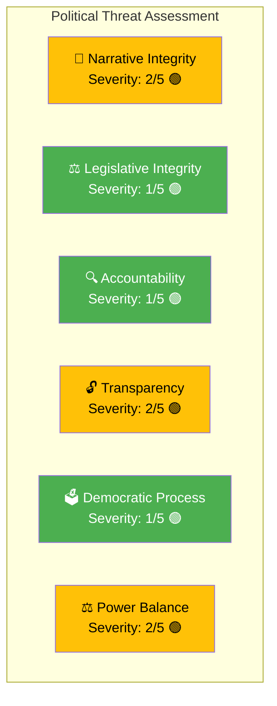

# Political Threat Analysis — 2026-04-01

**Generated**: 2026-04-02 06:30 UTC
**Threat ID**: THR-2026-04-01-MOT
**Data Sources**: riksdag-regering-mcp (get_motioner rm=2025/26)
**Documents Analyzed**: 50
**Confidence**: HIGH
**Riksmöte**: 2025/26
**Overall Threat Level**: 🟢 LOW — Normal parliamentary opposition activity

---

## 🎭 Political Threat Taxonomy

## Detailed Threat Assessment

| Category | Severity (1–5) | Indicator | Evidence | Confidence |
|----------|----------------|-----------|----------|------------|
| **Narrative Integrity** | 2/5 🟢 | S framing welfare reform as "attack on vulnerable" — effective counter-narrative but within normal political discourse | HD024017 (S rejects benefit cap as harmful), HD024028 (V calls it "devastating deterioration") | [HIGH] |
| **Legislative Integrity** | 1/5 🟢 | Normal motion-proposition response cycle — all 50 motions follow standard parliamentary procedure | All motions are "med anledning av prop." format | [HIGH] |
| **Accountability** | 1/5 🟢 | Opposition performing expected scrutiny function — systematic coverage of government proposals | 19 education motions ensure thorough committee examination | [HIGH] |
| **Transparency** | 2/5 🟢 | S demands offentlighetsprincipen (freedom of information) apply fully to private schools (HD024024) — transparency improvement initiative | HD024024 (S) opposes exemptions for small private school operators | [HIGH] |
| **Democratic Process** | 1/5 🟢 | Healthy multi-party parliamentary engagement — 5 parties (S, C, MP, V, SD) actively participating | 50 motions from diverse parties and policy areas | [HIGH] |
| **Power Balance** | 2/5 🟢 | Government relies on SD confidence-and-supply while facing 4-party opposition on welfare — creates asymmetric power dynamic | SD silence on welfare = tacit support; S+V+C+MP = potential majority | [HIGH] |

## Threat Summary

The 50 opposition motions represent **healthy democratic functioning**, not a systemic threat. All activities fall within normal parliamentary procedure. The most noteworthy dynamic is the **cross-party welfare opposition** (S+V+C+MP), which could test the government's reliance on SD support, but this represents a **policy-level challenge** rather than a democratic threat.

### Key Threat Indicators to Monitor

| # | Indicator | Threshold | Current Status |
|---|-----------|-----------|---------------|
| 1 | Cross-party coordination escalation | Formal alliance announcement | 🟡 Informal alignment observed |
| 2 | SD confidence-and-supply strain | SD public criticism of coalition | 🟢 No signals |
| 3 | Constitutional challenge to welfare reforms | Court referral or constitutional committee inquiry | 🟢 Not observed |

---

## 📂 MCP Data Files Used

| Tool | Parameters | Documents | Timestamp |
|------|-----------|-----------|-----------|
| `get_motioner` | `rm=2025/26, limit=50` | 50 | 2026-04-02T06:30Z |

---

*Document Control: Analysis by Riksdagsmonitor AI Agent | Classification: PUBLIC | Retention: 1 year*
