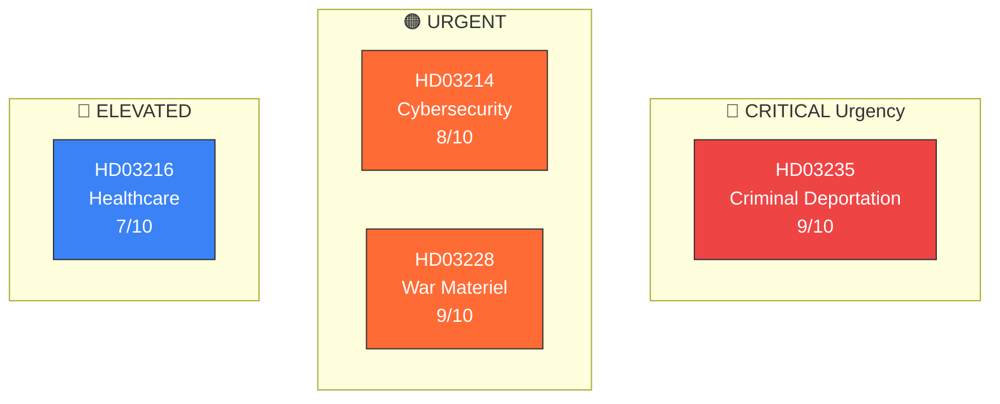

# Political Classification Results — 2026-04-01

**Generated**: 2026-04-02 05:42 UTC  
**Data Sources**: get_propositioner, get_dokument_innehall  
**Documents Analyzed**: 4  
**Confidence**: HIGH  
**Riksmöte**: 2025/26

## Summary

Classified **4** government propositions by sensitivity, domain, urgency, and significance. Three of four carry SENSITIVE classification due to national security, defence trade, or human rights implications.

## Classification Heat Map

## Detailed Analysis

| dok_id | Title | Sensitivity | Domain | Urgency | Significance | Committee |
|--------|-------|:-----------:|--------|:-------:|:------------:|:---------:|
| HD03235 | Skärpta regler om utvisning på grund av brott | �� SENSITIVE | Immigration, Criminal Law, Human Rights | 🔴 CRITICAL | 9/10 | SfU |
| HD03228 | Ett modernt och anpassat regelverk för krigsmateriel | 🟡 SENSITIVE | Defence Industry, Foreign Policy, Trade | 🟠 URGENT | 9/10 | UU |
| HD03214 | Lagändringar för ett stärkt nationellt cybersäkerhetscenter | 🟡 SENSITIVE | Defence, Cybersecurity, Digital Infrastructure | 🟠 URGENT | 8/10 | FöU |
| HD03216 | Stärkt medicinsk kompetens i kommunal hälso- och sjukvård | 🟢 PUBLIC | Healthcare, Elderly Care, Municipal Governance | 🔵 ELEVATED | 7/10 | SoU |

## Key Findings

1. **3 of 4 propositions** classified as SENSITIVE — unusual concentration for a single day
2. **Defence/security cluster**: HD03214 + HD03228 form a coherent defence modernisation package
3. **Immigration pillar**: HD03235 is the highest-significance Tidö Agreement delivery this session
4. **Healthcare positioning**: HD03216, while lower urgency, targets a top-3 voter issue (elderly care)

## Implications

Classification drives article prioritisation. HD03235 and HD03228 merit lead coverage as the most politically consequential propositions.
