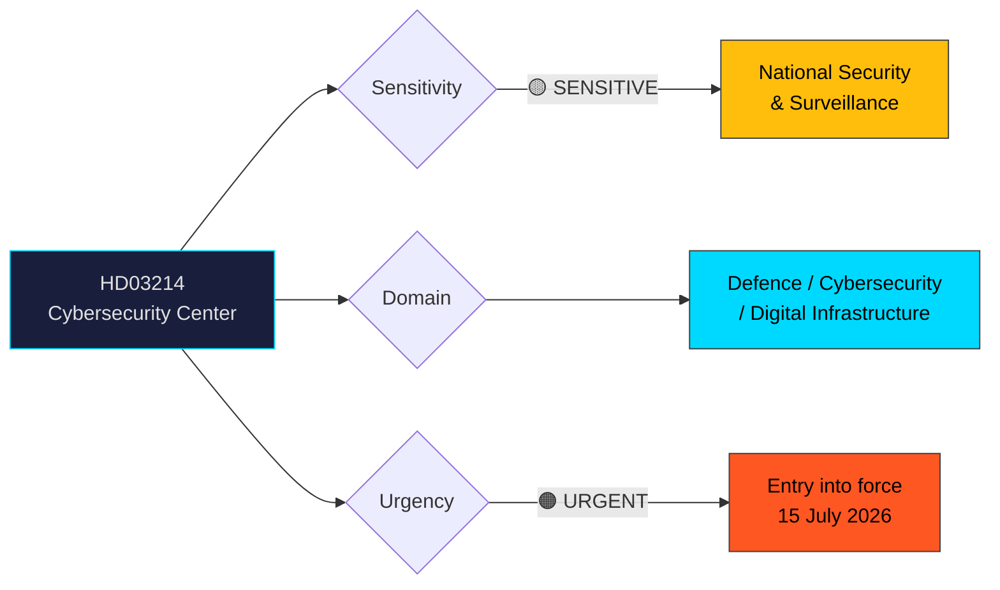

# Per-File Political Intelligence Analysis: HD03214

## 📋 Document Identity

| Field | Value |
|-------|-------|
| **Document ID** | HD03214 |
| **Document Type** | Proposition (Government Bill) |
| **Title** | Lagändringar för ett stärkt nationellt cybersäkerhetscenter |
| **Date** | 2026-04-01 |
| **Riksmöte** | 2025/26 |
| **Committee** | FöU (Försvarsutskottet — Defence Committee) |
| **Ministry** | Försvarsdepartementet |
| **Responsible Minister** | Carl-Oskar Bohlin (M) |
| **Source MCP Tool** | get_propositioner, get_dokument_innehall |
| **Analysis Timestamp** | 2026-04-02 05:40 UTC |
| **Analyst** | news-propositions workflow |

## 🎯 Executive Summary

The government proposes three new laws to strengthen the National Cybersecurity Center (NCSC) within FRA (Försvarets radioanstalt). The proposition addresses a critical gap: current secrecy regulations prevent effective information sharing between NCSC's cooperating agencies — FRA, MSB, Säpo, and Polismyndigheten. The proposal introduces mandatory information-sharing obligations, a new personal data processing framework for FRA within NCSC operations, and new secrecy provisions to protect individuals. Entry into force: 15 July 2026. **[HIGH confidence]**

This represents a significant escalation of Sweden's cyber defence posture, directly linked to the deteriorating threat landscape following Russia's full-scale invasion of Ukraine and increasing state-sponsored cyber operations targeting Nordic critical infrastructure.

## 📊 Political Classification

| Field | Value |
|-------|-------|
| **Sensitivity** | 🟡 SENSITIVE — National security and surveillance implications |
| **Domain** | Defence, Cybersecurity, Digital Infrastructure, Privacy |
| **Urgency** | 🟠 URGENT — Fast-track timeline (15 July 2026 entry) |
| **Significance** | 8/10 — Major expansion of state cybersecurity authority |

## 💼 SWOT Analysis

### ✅ Strengths — Government Coalition

| # | Statement | Evidence (dok_id) | Confidence | Impact |
|---|-----------|-------------------|:----------:|:------:|
| S1 | Addresses critical information-sharing gap between NCSC agencies | HD03214 (main proposal) | HIGH | HIGH |
| S2 | Cross-party consensus likely — defence/security enjoys broad support | Tidö Agreement, historical FöU voting patterns | MEDIUM | HIGH |
| S3 | Aligns with EU NIS2 directive compliance requirements | HD03214 (EU alignment section) | HIGH | MEDIUM |

### ⚠️ Weaknesses

| # | Statement | Evidence (dok_id) | Confidence | Impact |
|---|-----------|-------------------|:----------:|:------:|
| W1 | FRA's expanded personal data processing may draw privacy criticism | HD03214 (Chapter 6, personal data) | HIGH | MEDIUM |
| W2 | Short implementation timeline (2.5 months) strains agency readiness | HD03214 (entry July 15, 2026) | MEDIUM | MEDIUM |

### 🌍 Opportunities

| # | Statement | Evidence (dok_id) | Confidence | Impact |
|---|-----------|-------------------|:----------:|:------:|
| O1 | Positions Sweden as Nordic cybersecurity leader alongside Finland | HD03214 | MEDIUM | HIGH |
| O2 | Strengthens Sweden's NATO contribution in cyber domain | NATO accession context | MEDIUM | HIGH |

### 🔴 Threats

| # | Statement | Evidence (dok_id) | Confidence | Impact |
|---|-----------|-------------------|:----------:|:------:|
| T1 | Risk of mission creep in FRA surveillance powers | HD03214 (scope provisions) | MEDIUM | HIGH |
| T2 | Opposition may question adequacy of privacy safeguards | Historical V/MP stance on FRA | MEDIUM | MEDIUM |

## ⚠️ Risk Assessment (5×5 Matrix)

| Risk | Likelihood (1-5) | Impact (1-5) | Score | Level |
|------|:-----------------:|:------------:|:-----:|:-----:|
| Privacy rights challenge | 3 | 3 | 9 | 🟡 MEDIUM |
| Implementation delay | 2 | 3 | 6 | 🟢 LOW |
| Agency resistance to info-sharing | 2 | 4 | 8 | 🟡 MEDIUM |

## 👥 Stakeholder Impact

| Stakeholder | Impact | Direction | Confidence |
|-------------|--------|-----------|:----------:|
| Citizens | MEDIUM — enhanced cyber protection but expanded surveillance | Mixed | MEDIUM |
| Government Coalition (M/KD/L + SD) | HIGH — fulfils Tidö Agreement security commitments | Positive | HIGH |
| Opposition (S/V/MP) | MEDIUM — S likely supportive on defence, V/MP may challenge privacy aspects | Mixed | MEDIUM |
| Business/Industry | HIGH — improved critical infrastructure protection | Positive | HIGH |
| International/EU/NATO | HIGH — NIS2 compliance, NATO cyber capability | Positive | HIGH |
| Judiciary | MEDIUM — new secrecy provisions to interpret | Neutral | MEDIUM |

## 🔮 Forward Indicators

1. **FöU committee hearing** — Watch for committee schedule within 2 weeks [HIGH confidence]
2. **V/MP privacy objections** — Monitor for reservation motions challenging FRA data processing [MEDIUM confidence]
3. **July 15 implementation** — Track agency preparedness for new information-sharing obligations [HIGH confidence]
4. **NIS2 transposition deadline** — Cross-reference with broader NIS2 implementation (EU deadline October 2024, Swedish implementation ongoing) [HIGH confidence]
