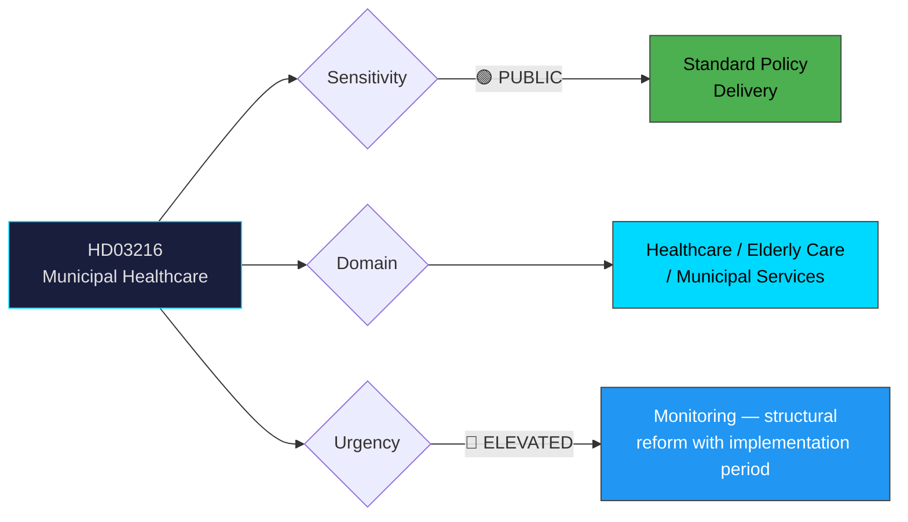

# Per-File Political Intelligence Analysis: HD03216

## 📋 Document Identity

| Field | Value |
|-------|-------|
| **Document ID** | HD03216 |
| **Document Type** | Proposition (Government Bill) |
| **Title** | Stärkt medicinsk kompetens i kommunal hälso- och sjukvård |
| **Date** | 2026-04-01 |
| **Riksmöte** | 2025/26 |
| **Committee** | SoU (Socialutskottet — Social Affairs Committee) |
| **Ministry** | Socialdepartementet |
| **Responsible Minister** | Anna Tenje (M) |
| **Source MCP Tool** | get_propositioner, get_dokument_innehall |
| **Analysis Timestamp** | 2026-04-02 05:40 UTC |
| **Analyst** | news-propositions workflow |

## 🎯 Executive Summary

The government proposes strengthening medical competence in municipal healthcare by introducing new requirements for physicians and specialist medical knowledge at the municipal level. Sweden's ageing population and the shift of care from hospitals to municipalities have exposed critical gaps in medical oversight in municipal healthcare services (kommunal hälso- och sjukvård). The proposition addresses long-standing criticism from IVO (Inspektionen för vård och omsorg) about inadequate medical leadership in elderly care and home healthcare. **[HIGH confidence]**

This is a structurally significant reform targeting one of Sweden's most politically sensitive areas — elderly care quality — which became a national crisis issue during COVID-19.

## 📊 Political Classification

| Field | Value |
|-------|-------|
| **Sensitivity** | 🟢 PUBLIC — Standard healthcare policy delivery |
| **Domain** | Healthcare, Elderly Care, Municipal Governance |
| **Urgency** | 🔵 ELEVATED — Structural reform with phased implementation |
| **Significance** | 7/10 — Major structural reform in electorally sensitive area |

## 💼 SWOT Analysis

### ✅ Strengths — Government Coalition

| # | Statement | Evidence (dok_id) | Confidence | Impact |
|---|-----------|-------------------|:----------:|:------:|
| S1 | Addresses post-COVID elderly care quality crisis — high voter salience | HD03216, IVO criticism reports | HIGH | HIGH |
| S2 | Cross-party consensus on need for better medical oversight in municipalities | Historical SoU debates | MEDIUM | HIGH |
| S3 | Fulfils Tidö Agreement healthcare quality commitments | Tidö Agreement section on healthcare | MEDIUM | MEDIUM |

### ⚠️ Weaknesses

| # | Statement | Evidence (dok_id) | Confidence | Impact |
|---|-----------|-------------------|:----------:|:------:|
| W1 | Municipalities face physician shortage — may struggle to implement | SKR workforce reports | HIGH | HIGH |
| W2 | Cost burden on municipalities without guaranteed central funding | HD03216 (municipal implementation) | MEDIUM | HIGH |
| W3 | Sweden already has 290 municipalities with highly uneven capacity | Municipal statistics | HIGH | MEDIUM |

### 🌍 Opportunities

| # | Statement | Evidence (dok_id) | Confidence | Impact |
|---|-----------|-------------------|:----------:|:------:|
| O1 | Improved elderly care quality could reduce hospital admissions | Health economics research | MEDIUM | HIGH |
| O2 | Election 2026 positioning — demonstrates delivery on healthcare | Electoral context | HIGH | HIGH |

### 🔴 Threats

| # | Statement | Evidence (dok_id) | Confidence | Impact |
|---|-----------|-------------------|:----------:|:------:|
| T1 | SKR (municipalities) may resist unfunded mandates | Historical pattern | HIGH | MEDIUM |
| T2 | Opposition can argue insufficient funding while mandating competence | S/V healthcare policy | MEDIUM | MEDIUM |

## ⚠️ Risk Assessment (5×5 Matrix)

| Risk | Likelihood (1-5) | Impact (1-5) | Score | Level |
|------|:-----------------:|:------------:|:-----:|:-----:|
| Physician shortage blocks implementation | 4 | 4 | 16 | 🔴 HIGH |
| Municipal funding dispute | 3 | 3 | 9 | 🟡 MEDIUM |
| Uneven implementation across municipalities | 4 | 3 | 12 | 🟡 MEDIUM |

## 👥 Stakeholder Impact

| Stakeholder | Impact | Direction | Confidence |
|-------------|--------|-----------|:----------:|
| Citizens (especially elderly) | HIGH — improved medical oversight in care | Positive | HIGH |
| Government Coalition | HIGH — delivers on healthcare quality pledge | Positive | HIGH |
| Opposition (S/V/MP) | MEDIUM — may demand more funding alongside mandates | Mixed | MEDIUM |
| SKR / Municipalities | HIGH — new obligations with implementation challenges | Mixed | HIGH |
| Healthcare Professionals | HIGH — expanded roles, new career paths | Positive | MEDIUM |
| Media/Public Opinion | HIGH — elderly care consistently top voter concern | Positive | HIGH |

## 🔮 Forward Indicators

1. **SoU committee referral** — Watch for committee schedule and potential expert hearings [HIGH confidence]
2. **SKR response** — Municipal association position on funding and implementation timeline [HIGH confidence]
3. **Physician workforce data** — Monitor Socialstyrelsen staffing projections [MEDIUM confidence]
4. **Election 2026 impact** — Healthcare quality likely key campaign theme [HIGH confidence]
