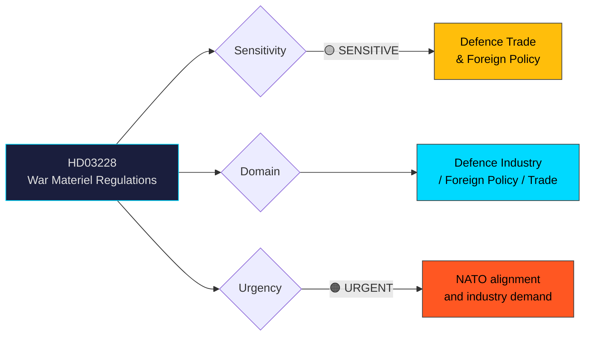

# Per-File Political Intelligence Analysis: HD03228

## 📋 Document Identity

| Field | Value |
|-------|-------|
| **Document ID** | HD03228 |
| **Document Type** | Proposition (Government Bill) |
| **Title** | Ett modernt och anpassat regelverk för krigsmateriel |
| **Date** | 2026-04-01 |
| **Riksmöte** | 2025/26 |
| **Committee** | UU (Utrikesutskottet — Foreign Affairs Committee) |
| **Ministry** | Utrikesdepartementet |
| **Responsible Minister** | Benjamin Dousa (M) |
| **Source MCP Tool** | get_propositioner, get_dokument_innehall |
| **Analysis Timestamp** | 2026-04-02 05:40 UTC |
| **Analyst** | news-propositions workflow |

## 🎯 Executive Summary

The government proposes a modernised regulatory framework for war materiel (krigsmateriel) exports and production. In the context of Sweden's NATO membership, the war in Ukraine, and a rapidly expanding domestic defence industry, the current framework (based on 1992 legislation) is deemed outdated. The proposition aims to streamline export licensing, adapt to NATO interoperability requirements, and balance security interests with Sweden's humanitarian foreign policy principles. Benjamin Dousa (M), as the responsible minister at UD, signals the government's prioritisation of defence industry competitiveness alongside security policy. **[HIGH confidence]**

This is one of the most politically consequential propositions of the session, touching on Sweden's identity as a peace-promoting nation versus its new role as a NATO ally with a significant defence industrial base (Saab, BAE Systems Bofors, Nammo).

## 📊 Political Classification

| Field | Value |
|-------|-------|
| **Sensitivity** | 🟡 SENSITIVE — Defence trade and foreign policy intersection |
| **Domain** | Defence Industry, Foreign Policy, International Trade, NATO |
| **Urgency** | 🟠 URGENT — NATO operational alignment and industry competitiveness |
| **Significance** | 9/10 — Fundamental shift in Sweden's defence trade posture |

## 💼 SWOT Analysis

### ✅ Strengths — Government Coalition

| # | Statement | Evidence (dok_id) | Confidence | Impact |
|---|-----------|-------------------|:----------:|:------:|
| S1 | NATO membership creates strong mandate for defence trade modernisation | HD03228, NATO accession | HIGH | HIGH |
| S2 | Defence industry growth creates jobs and export revenue | Saab/BAE Bofors order books | HIGH | HIGH |
| S3 | SD support secured through Tidö Agreement security provisions | Tidö Agreement | HIGH | MEDIUM |

### ⚠️ Weaknesses

| # | Statement | Evidence (dok_id) | Confidence | Impact |
|---|-----------|-------------------|:----------:|:------:|
| W1 | Potentially weakens export controls to authoritarian regimes | HD03228 (framework relaxation) | MEDIUM | HIGH |
| W2 | May conflict with Sweden's self-image as peace-promoting nation | Historical identity tension | HIGH | MEDIUM |

### 🌍 Opportunities

| # | Statement | Evidence (dok_id) | Confidence | Impact |
|---|-----------|-------------------|:----------:|:------:|
| O1 | Expanded NATO defence cooperation and joint procurement | NATO membership context | HIGH | HIGH |
| O2 | Increased defence exports strengthen Sweden's industrial base | Defence industry economics | HIGH | HIGH |

### 🔴 Threats

| # | Statement | Evidence (dok_id) | Confidence | Impact |
|---|-----------|-------------------|:----------:|:------:|
| T1 | V and MP will forcefully oppose — risk of sustained media debate | V/MP historical arms export stance | HIGH | MEDIUM |
| T2 | International NGO scrutiny of export destination changes | Arms trade monitoring orgs | MEDIUM | MEDIUM |
| T3 | Potential future arms reaching conflict zones could create scandal | Historical Swedish arms export controversies | LOW | HIGH |

## ⚠️ Risk Assessment (5×5 Matrix)

| Risk | Likelihood (1-5) | Impact (1-5) | Score | Level |
|------|:-----------------:|:------------:|:-----:|:-----:|
| Opposition campaign on "arms to dictators" | 3 | 4 | 12 | 🟡 MEDIUM |
| International reputational risk | 2 | 4 | 8 | 🟡 MEDIUM |
| NATO pressure for faster liberalisation | 3 | 3 | 9 | 🟡 MEDIUM |

## 👥 Stakeholder Impact

| Stakeholder | Impact | Direction | Confidence |
|-------------|--------|-----------|:----------:|
| Citizens | MEDIUM — security benefits vs ethical concerns | Mixed | MEDIUM |
| Government Coalition | HIGH — fulfils NATO and industry commitments | Positive | HIGH |
| Opposition (V/MP) | HIGH — expected strong opposition on ethical grounds | Negative | HIGH |
| Opposition (S) | MEDIUM — historically pragmatic on defence, but may critique specifics | Mixed | MEDIUM |
| Defence Industry (Saab, BAE) | HIGH — regulatory simplification, expanded markets | Positive | HIGH |
| International/NATO | HIGH — improved interoperability and alliance contribution | Positive | HIGH |
| Civil Society/NGOs | HIGH — arms trade transparency and control concerns | Negative | HIGH |

## 🔮 Forward Indicators

1. **UU committee hearing** — Watch for expert witnesses from defence industry and peace NGOs [HIGH confidence]
2. **V/MP reservation motions** — Expected within 2-3 weeks of referral [HIGH confidence]
3. **Defence industry reaction** — SOFF (Säkerhets- och Försvarsföretagen) statements [HIGH confidence]
4. **NATO Defence Planning Process** — Cross-reference with Sweden's capability commitments [MEDIUM confidence]
