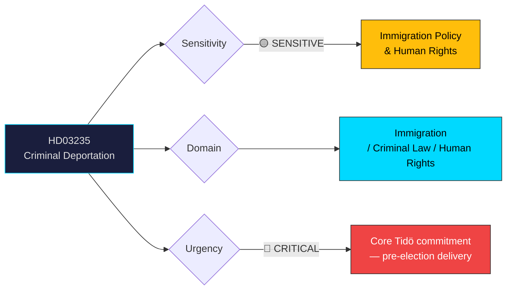

# Per-File Political Intelligence Analysis: HD03235

## 📋 Document Identity

| Field | Value |
|-------|-------|
| **Document ID** | HD03235 |
| **Document Type** | Proposition (Government Bill) |
| **Title** | Skärpta regler om utvisning på grund av brott |
| **Date** | 2026-04-01 |
| **Riksmöte** | 2025/26 |
| **Committee** | SfU (Socialförsäkringsutskottet — Social Insurance Committee) |
| **Ministry** | Justitiedepartementet |
| **Responsible Minister** | Johan Forssell (M) |
| **Source MCP Tool** | get_propositioner, get_dokument_innehall |
| **Analysis Timestamp** | 2026-04-02 05:40 UTC |
| **Analyst** | news-propositions workflow |

## 🎯 Executive Summary

The government proposes stricter rules for deportation of foreign nationals convicted of crimes. This is a cornerstone Tidö Agreement commitment, driven by SD's demand for tougher immigration enforcement. Minister Johan Forssell (M) presents measures that lower thresholds for deportation following criminal conviction, expand the categories of crimes triggering deportation, and strengthen the presumption in favour of deportation. The proposition is politically explosive — it directly addresses the coalition's core electoral promise on law-and-order immigration policy while raising fundamental human rights questions about proportionality and non-refoulement obligations. **[HIGH confidence]**

## 📊 Political Classification

| Field | Value |
|-------|-------|
| **Sensitivity** | 🟡 SENSITIVE — Immigration and human rights intersection |
| **Domain** | Immigration, Criminal Law, Human Rights, Tidö Agreement |
| **Urgency** | 🔴 CRITICAL — Core coalition deliverable before 2026 election |
| **Significance** | 9/10 — Defines government's immigration policy legacy |

## 💼 SWOT Analysis

### ✅ Strengths — Government Coalition

| # | Statement | Evidence (dok_id) | Confidence | Impact |
|---|-----------|-------------------|:----------:|:------:|
| S1 | Fulfils key Tidö Agreement commitment — maintains SD cooperation | HD03235, Tidö Agreement | HIGH | HIGH |
| S2 | High public support for stricter deportation of convicted criminals | Novus/Ipsos polling data | HIGH | HIGH |
| S3 | Demonstrates government delivery capability on law-and-order | HD03235 in context of multiple justice propositions | HIGH | HIGH |

### ⚠️ Weaknesses

| # | Statement | Evidence (dok_id) | Confidence | Impact |
|---|-----------|-------------------|:----------:|:------:|
| W1 | Risk of ECHR incompatibility — proportionality concerns | HD03235, ECHR Article 8 case law | HIGH | HIGH |
| W2 | Enforcement capacity constraints — deportation execution gaps | Polismyndigheten/Migrationsverket statistics | MEDIUM | HIGH |
| W3 | May increase statelessness and irregular stay if countries refuse returnees | Historical deportation execution data | MEDIUM | MEDIUM |

### 🌍 Opportunities

| # | Statement | Evidence (dok_id) | Confidence | Impact |
|---|-----------|-------------------|:----------:|:------:|
| O1 | Electoral mobilisation for M/SD voter base | Pre-election timing | HIGH | HIGH |
| O2 | Bilateral return agreements with origin countries | Ongoing diplomatic efforts | MEDIUM | HIGH |

### 🔴 Threats

| # | Statement | Evidence (dok_id) | Confidence | Impact |
|---|-----------|-------------------|:----------:|:------:|
| T1 | ECHR challenge could embarrass government with adverse ruling | ECtHR case law trends | MEDIUM | HIGH |
| T2 | V/MP/civil society will mount sustained opposition campaign | Historical pattern | HIGH | MEDIUM |
| T3 | International criticism from UN human rights bodies | UNHCR/OHCHR monitoring | MEDIUM | MEDIUM |

## ⚠️ Risk Assessment (5×5 Matrix)

| Risk | Likelihood (1-5) | Impact (1-5) | Score | Level |
|------|:-----------------:|:------------:|:-----:|:-----:|
| ECHR proportionality challenge | 3 | 5 | 15 | 🔴 HIGH |
| Opposition human rights campaign | 4 | 3 | 12 | 🟡 MEDIUM |
| Enforcement execution failure | 3 | 4 | 12 | 🟡 MEDIUM |
| International diplomatic friction | 2 | 3 | 6 | 🟢 LOW |

## 👥 Stakeholder Impact

| Stakeholder | Impact | Direction | Confidence |
|-------------|--------|-----------|:----------:|
| Citizens | HIGH — enhanced public safety (supporters) / rights erosion (critics) | Divided | HIGH |
| Government Coalition (M/KD/L + SD) | HIGH — delivers core Tidö promise | Positive | HIGH |
| SD (Sverigedemokraterna) | VERY HIGH — signature policy achievement | Positive | HIGH |
| Opposition (S) | MEDIUM — difficult position: tough-on-crime vs human rights | Mixed | HIGH |
| Opposition (V/MP) | HIGH — will strongly oppose on human rights grounds | Negative | HIGH |
| Civil Society / Legal Profession | HIGH — constitutional and ECHR concerns | Negative | HIGH |
| International/EU/ECHR | HIGH — human rights compliance scrutiny | Negative | MEDIUM |
| Media | HIGH — highly newsworthy, polarising public debate expected | Amplifying | HIGH |

## 🔮 Forward Indicators

1. **SfU committee debate** — Watch for expert hearings with legal scholars on ECHR compatibility [HIGH confidence]
2. **SD victory rhetoric** — Monitor SD communications claiming credit for delivery [HIGH confidence]
3. **Civil society legal challenges** — Watch for constitutional law professors' statements [HIGH confidence]
4. **Enforcement statistics** — Track Migrationsverket execution rates for deportation orders [MEDIUM confidence]
5. **Election 2026 debate** — Immigration/deportation likely dominant campaign theme [HIGH confidence]
