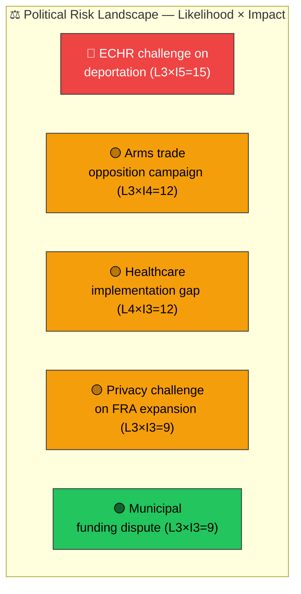
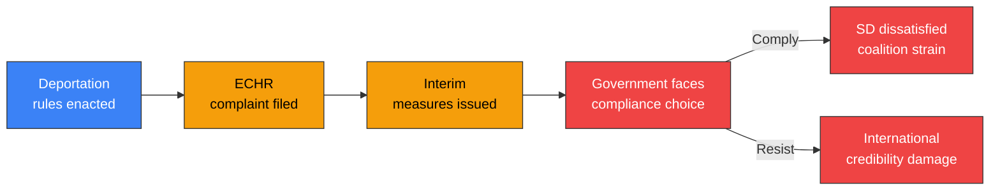

# Political Risk Assessment — 2026-04-01

**Generated**: 2026-04-02 05:42 UTC  
**Data Sources**: get_propositioner, get_dokument_innehall  
**Documents Analyzed**: 4  
**Confidence**: HIGH  
**Risk Assessment ID**: RSK-2026-04-01-001  
**Assessment Period**: 2026-04-01 to 2026-04-15  
**Riksmöte**: 2025/26  
**Overall Risk Level**: 🟡 MEDIUM

## Risk Heat Map

## Risk Register

| # | Risk Description | Source | L (1-5) | I (1-5) | Score | Level | Confidence |
|---|-----------------|--------|:-------:|:-------:|:-----:|:-----:|:----------:|
| R1 | ECHR proportionality challenge to criminal deportation rules | HD03235 | 3 | 5 | 15 | 🔴 HIGH | HIGH |
| R2 | Opposition "arms to dictators" campaign on war materiel | HD03228 | 3 | 4 | 12 | 🟡 MEDIUM | MEDIUM |
| R3 | Physician shortage blocks municipal healthcare implementation | HD03216 | 4 | 3 | 12 | 🟡 MEDIUM | HIGH |
| R4 | Privacy rights challenge to FRA data processing expansion | HD03214 | 3 | 3 | 9 | 🟡 MEDIUM | MEDIUM |
| R5 | Municipal funding dispute over healthcare mandates | HD03216 | 3 | 3 | 9 | 🟡 MEDIUM | MEDIUM |

## Cascading Risk Chain — HD03235

## Five-Dimension Risk Scoring

| Dimension | Score (0-10) | Trend | Key Driver |
|-----------|:----------:|:-----:|------------|
| **Coalition Stability** | 3/10 | → Stable | SD deliverable achieved (HD03235) |
| **Policy Delivery** | 4/10 | ↗ Slight rise | Implementation risks on HD03216 |
| **Budget Impact** | 2/10 | → Stable | No major fiscal implications |
| **Electoral** | 5/10 | ↗ Rising | Pre-election positioning intensifies scrutiny |
| **External/International** | 4/10 | ↗ Rising | ECHR and NATO alignment pressures |

## Forward Indicators

1. **Lagrådet opinion** on HD03235 ECHR compatibility — expected within 2 weeks
2. **Committee hearing schedules** for FöU, SoU, UU, SfU
3. **SKR official position** on HD03216 funding implications
4. **SOFF industry response** to HD03228 regulatory changes
5. **Civil society mobilisation** — Amnesty, FARR responses to HD03235

## Data Quality Notes

Risk assessment confidence: HIGH. Scores based on document content analysis, committee assignments, ministerial accountability, historical voting patterns, and current coalition dynamics.
