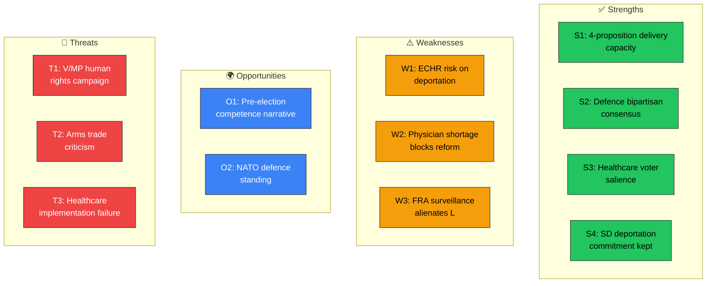

# Political SWOT Analysis — 2026-04-01

**Generated**: 2026-04-02 05:42 UTC  
**Data Sources**: get_propositioner, get_dokument_innehall  
**Documents Analyzed**: 4  
**Confidence**: HIGH  
**SWOT ID**: SWT-2026-04-01-001  
**Analysis Scope**: Government Coalition (M+KD+L, SD confidence-and-supply)  
**Reference Period**: 2026-Q2  

## 🏛️ Government Coalition SWOT

### ✅ Strengths

| # | Statement | Evidence (dok_id) | Confidence | Impact |
|---|-----------|-------------------|:----------:|:------:|
| S1 | Coordinated 4-proposition push demonstrates legislative delivery capacity | HD03214, HD03216, HD03228, HD03235 | HIGH | HIGH |
| S2 | Defence modernisation aligns with bipartisan security consensus post-NATO | HD03214, HD03228 | HIGH | HIGH |
| S3 | Healthcare reform targets top voter concern pre-election | HD03216 | HIGH | HIGH |
| S4 | SD signature policy delivered (criminal deportation) — secures supply arrangement | HD03235 | HIGH | HIGH |

### ⚠️ Weaknesses

| # | Statement | Evidence (dok_id) | Confidence | Impact |
|---|-----------|-------------------|:----------:|:------:|
| W1 | ECHR compatibility risk on deportation lowers international credibility | HD03235 | HIGH | HIGH |
| W2 | Municipal physician shortage may undermine healthcare reform delivery | HD03216 | HIGH | MEDIUM |
| W3 | FRA surveillance expansion may alienate liberal coalition partner L | HD03214 | MEDIUM | MEDIUM |

### 🌍 Opportunities

| # | Statement | Evidence (dok_id) | Confidence | Impact |
|---|-----------|-------------------|:----------:|:------:|
| O1 | Pre-election legislative sprint builds narrative of competent governance | All 4 propositions | HIGH | HIGH |
| O2 | NATO-aligned defence reforms strengthen international standing | HD03214, HD03228 | HIGH | HIGH |
| O3 | Healthcare quality improvement resonates across party lines | HD03216 | MEDIUM | HIGH |

### 🔴 Threats

| # | Statement | Evidence (dok_id) | Confidence | Impact |
|---|-----------|-------------------|:----------:|:------:|
| T1 | V/MP/civil society sustained campaign on human rights could dominate media | HD03235 | HIGH | MEDIUM |
| T2 | Defence trade liberalisation may revive "arms to dictators" criticism | HD03228 | MEDIUM | MEDIUM |
| T3 | Implementation failures in healthcare could backfire before election | HD03216 | MEDIUM | HIGH |

## SWOT Quadrant Map

## TOWS Strategic Options

| Strategy | Combination | Action |
|----------|-------------|--------|
| **SO: Maximise** | S2+O2 | Leverage NATO membership to build defence industrial partnerships |
| **WO: Overcome** | W2+O3 | Pair healthcare mandates with dedicated physician training funding |
| **ST: Counter** | S4+T1 | Pre-empt rights criticism with robust ECHR compliance argumentation |
| **WT: Avoid** | W1+T1 | Prepare contingency for adverse ECHR ruling; build proportionality defences early |

## Strategic Implications

**Key Watch Items:**
1. Committee schedules for all 4 propositions — timeline to plenary vote
2. ECHR compatibility analysis for HD03235 from Lagrådet
3. SKR position on municipal healthcare funding
4. Defence industry response to HD03228 from SOFF

## Data Quality Notes

SWOT confidence: HIGH. Based on full document analysis with ministerial attribution, committee assignments, and policy domain context.
