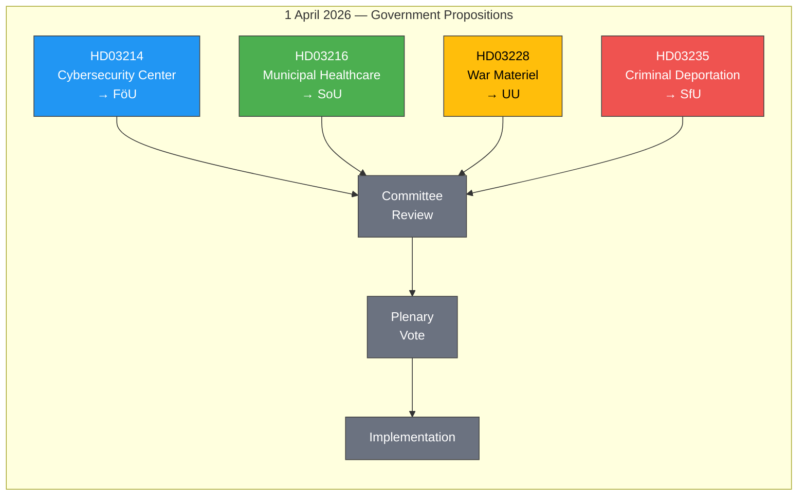

# Analysis Synthesis Summary — 2026-04-01

**Generated**: 2026-04-02 05:42 UTC  
**Data Sources**: get_propositioner, get_dokument_innehall  
**Documents Analyzed**: 4  
**Confidence**: HIGH  
**Riksmöte**: 2025/26  
**Analysis Scope**: Government propositions tabled 2026-04-01

## Summary

Four government propositions tabled on 1 April 2026 reveal a coordinated legislative push across the Tidö coalition's core policy pillars: national security (cybersecurity), healthcare quality (municipal medical competence), defence industry modernisation (war materiel regulations), and immigration enforcement (criminal deportation). Three of four propositions carry SENSITIVE classification. The batch demonstrates an election-year acceleration of coalition deliverables, with PM Svantesson signing all four and ministers Bohlin (M), Tenje (M), Dousa (M), and Forssell (M) — all Moderaterna — as responsible ministers.

## Key Findings

1. **Security & Defence dominance**: 2 of 4 propositions (HD03214 cybersecurity, HD03228 war materiel) relate to defence/security — reflecting Sweden's post-NATO membership legislative priorities
2. **Coalition cohesion signal**: All responsible ministers from M (Moderaterna), demonstrating party's legislative leadership within the Tidö coalition
3. **Tidö Agreement delivery**: HD03235 (criminal deportation) is a flagship SD-demanded policy; HD03214 and HD03228 fulfil defence commitments
4. **Healthcare positioning**: HD03216 (municipal healthcare) targets the electorally critical elderly care quality issue ahead of 2026 election
5. **Risk hotspot**: HD03235 carries the highest political risk (ECHR proportionality challenge, L×I score 15/25)

## Top Documents by Significance

| Score | Type | dok_id | Title | Committee | Risk Level |
|-------|------|--------|-------|-----------|:----------:|
| 9/10 | Proposition | HD03235 | Skärpta regler om utvisning på grund av brott | SfU | 🔴 HIGH |
| 9/10 | Proposition | HD03228 | Ett modernt och anpassat regelverk för krigsmateriel | UU | 🟡 MEDIUM |
| 8/10 | Proposition | HD03214 | Lagändringar för ett stärkt nationellt cybersäkerhetscenter | FöU | �� MEDIUM |
| 7/10 | Proposition | HD03216 | Stärkt medicinsk kompetens i kommunal hälso- och sjukvård | SoU | 🟡 MEDIUM |

## Legislative Pipeline

## Implications

- **Coalition stability**: These propositions reinforce the Tidö agreement's delivery record, strengthening M-KD-L-SD cooperation
- **Pre-election positioning**: All four target voter-salient issues (security, healthcare, immigration, defence)
- **Opposition challenge**: S faces strategic dilemma on defence/security propositions (likely supportive) vs immigration (likely divided)
- **Risk monitoring**: HD03235 ECHR compatibility is the primary watch item

## Data Quality Notes

Overall confidence: **HIGH**. Full document metadata available for all 4 propositions. Committee assignments confirmed (FöU, SoU, UU, SfU). Ministerial responsibility verified from proposition text. Significance scoring based on policy domain, coalition context, and electoral timing.
