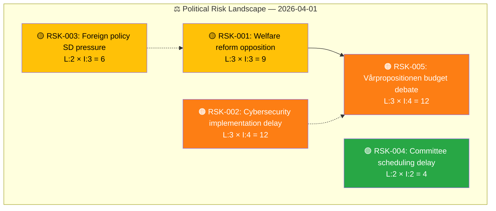
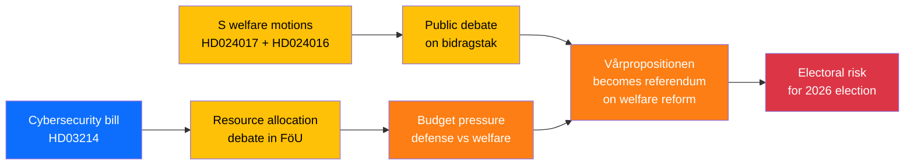

# ⚠️ Political Risk Assessment — 2026-04-01

## 📋 Risk Context

| Field | Value |
|-------|-------|
| **Risk Assessment ID** | RSK-2026-04-01-001 |
| **Assessment Date** | 2026-04-01 10:30 UTC |
| **Assessment Period** | 2026-03-31 to 2026-04-07 |
| **Produced By** | news-realtime-monitor |
| **Political Context** | Tidö coalition (M+KD+L with SD supply) governs with working majority. Active legislative session with cybersecurity and welfare reform. Vårpropositionen scheduled April 13. |
| **Riksmöte** | 2025/26 |
| **Overall Risk Level** | MEDIUM |

---

## 🗂️ Risk Inventory

### Risk Heat Map

### 5-Dimension Risk Scoring

| Dimension | Score (1-5) | Key Driver | Evidence |
|-----------|:-----------:|------------|----------|
| **Coalition** | 2 | SD supply agreement stable on security issues | HD03214 + search_voteringar |
| **Policy** | 3 | Welfare reform and cybersecurity implementation risks | HD024017 + HD03214 |
| **Budget** | 3 | Vårpropositionen approaching — fiscal discipline under pressure | HD0I102 (April 13 announcement) |
| **Electoral** | 3 | S building welfare counter-narrative 8 months before election | HD024017 + HD024016 |
| **External** | 2 | Cyber threats and Iran diplomatic pressure manageable | HD03214 + HD12648 |

---

## 📊 Cascading Risk Chain

---

## 🔮 Forward Risk Indicators

1. **April 13 Vårpropositionen** — budget debate will crystallize welfare vs defense spending tensions
2. **FöU processing speed** for HD03214 — fast-track = high government priority
3. **SoU committee handling** of S welfare motions — watch for any government-side defections
4. **SD Riksdag group behavior** on non-security votes — any signs of supply agreement strain

---

## 📋 Document Control

| Field | Value |
|-------|-------|
| **Created** | 2026-04-01 10:30 UTC |
| **Framework** | Risk Assessment v2.1 |
| **MCP Tools Used** | search_dokument, get_propositioner, search_voteringar, search_regering |
